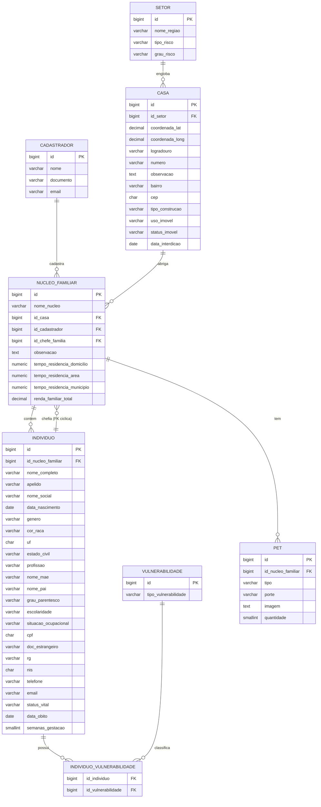

### 3.6.3 Modelagem Física do Banco de Dados

```mermaid
erDiagram
    SETOR {
        bigint id PK
        varchar nome_regiao
        varchar tipo_risco
        varchar grau_risco
    }

    CADASTRADOR {
        bigint id PK
        varchar nome
        varchar documento
        varchar email
    }

    CASA {
        bigint id PK
        bigint id_setor FK
        decimal coordenada_lat
        decimal coordenada_long
        varchar logradouro
        varchar numero
        text observacao
        varchar bairro
        char cep
        varchar tipo_construcao
        varchar uso_imovel
        varchar status_imovel
        date data_interdicao
    }

    NUCLEO_FAMILIAR {
        bigint id PK
        varchar nome_nucleo
        bigint id_casa FK
        bigint id_cadastrador FK
        bigint id_chefe_familia FK
        text observacao
        numeric tempo_residencia_domicilio
        numeric tempo_residencia_area
        numeric tempo_residencia_municipio
        decimal renda_familiar_total
    }

    INDIVIDUO {
        bigint id PK
        bigint id_nucleo_familiar FK
        varchar nome_completo
        varchar apelido
        varchar nome_social
        date data_nascimento
        varchar genero
        varchar cor_raca
        char uf
        varchar estado_civil
        varchar profissao
        varchar nome_mae
        varchar nome_pai
        varchar grau_parentesco
        varchar escolaridade
        varchar situacao_ocupacional
        char cpf
        varchar doc_estrangeiro
        varchar rg
        char nis
        varchar telefone
        varchar email
        varchar status_vital
        date data_obito
        smallint semanas_gestacao
    }

    VULNERABILIDADE {
        bigint id PK
        varchar tipo_vulnerabilidade
    }

    INDIVIDUO_VULNERABILIDADE {
        bigint id_individuo FK
        bigint id_vulnerabilidade FK
    }

    PET {
        bigint id PK
        bigint id_nucleo_familiar FK
        varchar tipo
        varchar porte
        text imagem
        smallint quantidade
    }

    SETOR ||--o{ CASA : "engloba"
    CADASTRADOR ||--o{ NUCLEO_FAMILIAR : "cadastra"
    CASA ||--o{ NUCLEO_FAMILIAR : "abriga"
    NUCLEO_FAMILIAR ||--o{ INDIVIDUO : "contem"
    NUCLEO_FAMILIAR ||--o{ PET : "tem"
    INDIVIDUO ||--o{ NUCLEO_FAMILIAR : "chefia (FK ciclica)"
    INDIVIDUO ||--o{ INDIVIDUO_VULNERABILIDADE : "possui"
    VULNERABILIDADE ||--o{ INDIVIDUO_VULNERABILIDADE : "classifica"
```
