# WAD - Web Application Document - Módulo 2 - Inteli

> **Nota sobre a implementação atual:** o contrato vigente do banco está em
> `documentos/outros/mapeamento-supabase-models.md` e
> `documentos/migrations/001_completar_requisitos_funcionais.sql`, complementado por
> `documentos/migrations/002_exigir_documento_cadastrador.sql`.
>
> **Como interpretar este documento:** o estado de cada requisito indica se ele está implementado ou planejado.

## Nome do Grupo

#### Nomes dos integrantes do grupo

- <a href="https://www.linkedin.com/in/ricardo-nelken-77153a3a9/">Ricardo Nelken</a>
- <a href="https://www.linkedin.com/in/paulo-roberto-amorim/">Paulo Roberto Amorim de Sousa</a>
- <a href="https://www.linkedin.com/in/rodriguesgabrieleng/?locale=pt">Gabriel Rodrigues</a>
- <a href="https://www.linkedin.com/in/guilherme-d-elia-251855272/">Guilherme D'Elia</a>
- <a href="https://www.linkedin.com/in/isaac-nicolas-alves-da-silva-9787592a4/">Isaac Nicolas Alves da Silva</a>
- <a href="https://www.linkedin.com/in/lucaslevivaz/">Lucas Levi Vaz</a>
- <a href="https://www.linkedin.com/in/anita-fratelli-258398314/">Anita Fratelli</a>
- <a href="https://www.linkedin.com/in/gabrielly-mendes-bb94683b9/">Gabrielly Mendes</a>


## Sumário

[1. Introdução](#c1)

[2. Visão Geral da Aplicação Web](#c2)

[3. Projeto Técnico da Aplicação Web](#c3)

[4. Desenvolvimento da Aplicação Web](#c4)

[5. Testes da Aplicação Web](#c5)

[6. Estudo de Mercado e Plano de Marketing](#c6)

[7. Conclusões e trabalhos futuros](#c7)

[8. Referências](#c8)

[Anexos](#c9)

<br>

# <a name="c1"></a>1. Introdução
A gestão de riscos e desastres em áreas urbanas constitui um desafio crescente, especialmente em função do aumento de eventos climáticos extremos e da presença de populações em situação de vulnerabilidade. Nesse contexto, a Defesa Civil de Santo André enfrenta dificuldades relacionadas à descentralização das informações, uma vez que dados sobre cadastro de famílias, acolhimento emergencial e logística humanitária encontram-se distribuídos em sistemas não integrados ou, em alguns casos, em registros físicos, comprometendo a eficiência das ações em situações de emergência.

Diante desse cenário, evidencia-se a necessidade de uma solução capaz de centralizar e integrar essas informações, contribuindo para a melhoria dos processos de gestão. O projeto GeoRisco Santo André propõe o desenvolvimento de uma aplicação web com recursos de georreferenciamento, voltada à consolidação de dados socioestruturais de áreas de risco, ao apoio à gestão do acolhimento emergencial e ao controle da logística de assistência humanitária.

A solução utiliza a tecnologia como ferramenta estratégica de apoio à tomada de decisão, permitindo a identificação de perfis de vulnerabilidade, a priorização de atendimentos e a otimização da alocação de recursos em contextos críticos. Além disso, busca promover a integração entre diferentes setores da administração pública, contribuindo para uma atuação mais coordenada e eficiente. Dessa forma, o projeto visa otimizar processos operacionais e fortalecer a capacidade de resposta do município, gerando valor público por meio da proteção de vidas e do aumento da resiliência urbana.

# <a name="c2"></a>2. Visão Geral da Aplicação Web

### 2.1.1. Modelo de 5 Forças de Porter
O Modelo das 5 Forças de Porter é uma ferramenta estratégica utilizada para analisar a estrutura competitiva de um setor, permitindo compreender os fatores que influenciam a competitividade e a criação de valor de uma solução (Porter, 2008). No contexto do projeto GeoRisco Santo André, a aplicação desse modelo possibilita avaliar não apenas a concorrência direta, mas também a influência de substitutos, fornecedores, clientes e possíveis novos entrantes no desenvolvimento e adoção da solução.

Dessa forma, a análise das cinco forças contribui para identificar oportunidades e desafios no cenário da gestão pública de riscos, evidenciando como o projeto se posiciona estrategicamente diante das limitações atuais e das possibilidades de inovação no setor.

<div align="center">
  <p>Figura 01: 5 Forças de Porter</p>
  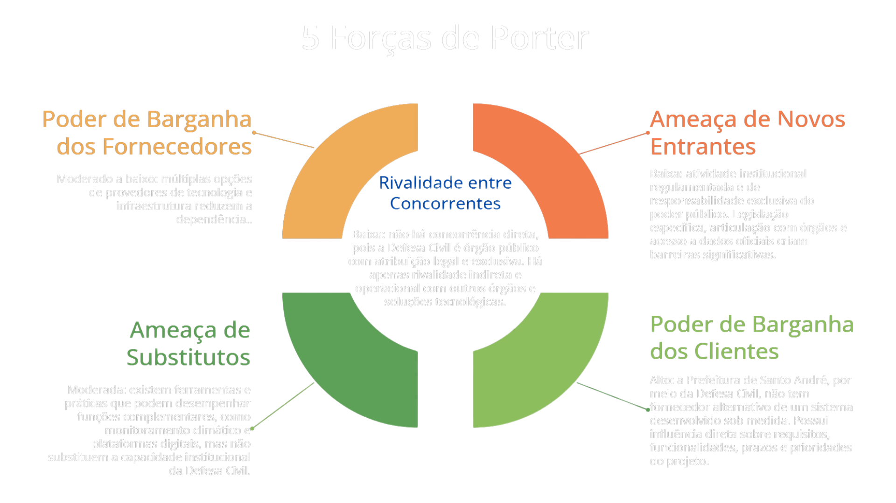
  <p>Fonte: Material produzido pelos autores (2026)</p>
</div>

#### Análise da Ameaça de Novos Entrantes
 A ameaça de novos entrantes no contexto da atuação da Defesa Civil é considerada baixa, uma vez que se trata de uma atividade institucional regulamentada e de responsabilidade exclusiva do poder público (PORTER, 2008). A atuação em gestão de riscos e desastres é definida por legislações específicas, como a Política Nacional de Proteção e Defesa Civil, o que limita a entrada de novos agentes com a mesma função e autoridade. Além disso, a necessidade de articulação com diferentes órgãos governamentais e acesso a dados oficiais reforça essas barreiras. Dessa forma, embora possam surgir iniciativas privadas ou tecnológicas de apoio, estas não substituem o papel institucional da Defesa Civil, mantendo baixa a ameaça de novos entrantes (Prefeitura de Santo André, 2026; PORTER, 2008).

 #### Análise da Ameaça de Produtos ou Serviços Substitutos

 A ameaça de produtos ou serviços substitutos é considerada moderada, pois, embora não existam substitutos diretos para a atuação da Defesa Civil, algumas ferramentas e práticas podem desempenhar funções complementares ou parciais (PORTER, 2008). Entre elas, destacam-se sistemas privados de monitoramento climático, plataformas de geolocalização e ferramentas digitais de gestão de dados. No entanto, tais soluções não possuem a capacidade institucional, legal e operacional para coordenar ações emergenciais, acolhimento de famílias e articulação intersetorial. Assim, apesar de contribuírem para a gestão de riscos, esses substitutos não eliminam a necessidade da atuação da Defesa Civil, mantendo a ameaça em nível moderado (Prefeitura de Santo André, 2026; PORTER, 2008).

 #### Análise da Rivalidade entre Concorrentes
 A rivalidade entre concorrentes é considerada baixa, uma vez que a Defesa Civil não atua em um mercado competitivo tradicional, mas sim como órgão público com atribuição legal específica (PORTER, 2008). Não há concorrentes diretos que disputem sua função institucional, pois sua atuação é exclusiva no âmbito municipal. Entretanto, pode-se observar uma forma indireta de rivalidade com soluções tecnológicas privadas ou sistemas desenvolvidos por outros municípios, que oferecem abordagens alternativas para a gestão de riscos. Ainda assim, essa concorrência é limitada, pois tais soluções não substituem a autoridade e a responsabilidade da Defesa Civil. Dessa forma, a baixa rivalidade reforça a necessidade de inovação interna e modernização dos processos, em vez de competição direta (Prefeitura de Santo André, 2026; PORTER, 2008).
 #### Análise do Poder de Barganha dos Clientes
O poder de barganha dos clientes é considerado baixo, pois as principais ações da Defesa Civil são destinadas à população e realizadas em conjunto com outros órgãos públicos, os quais não possuem influência direta sobre a prestação do serviço, uma vez que este constitui uma responsabilidade obrigatória do município (PORTER, 2008). Além disso, a atuação da Defesa Civil está vinculada à proteção da população e à gestão de riscos, não sendo baseada em relações comerciais. Embora existam demandas da sociedade por maior eficiência e rapidez, os usuários não podem substituir ou negociar o serviço prestado. Dessa forma, o poder de barganha dos clientes é reduzido, ainda que a satisfação da população seja relevante para a melhoria contínua das operações (PREFEITURA DE SANTO ANDRÉ, 2026; PORTER, 2008).
#### Análise do Poder de Barganha dos Fornecedores
O poder de barganha dos fornecedores é considerado moderado, pois a Defesa Civil depende de fornecedores de tecnologia, equipamentos, sistemas de monitoramento, comunicação e de outros órgãos para apoiar suas operações (PORTER, 2008). Empresas responsáveis por softwares, serviços em nuvem, sensores climáticos e plataformas digitais possuem certa influência, especialmente quando oferecem soluções especializadas. Entretanto, como os órgãos públicos geralmente possuem a possibilidade de contratar diferentes fornecedores, esse poder é parcialmente limitado. Assim, embora exista dependência tecnológica em alguns recursos específicos, o poder de barganha dos fornecedores permanece em nível moderado (PREFEITURA DE SANTO ANDRÉ, 2026; PORTER, 2008).

### 2.1.2. Análise SWOT da Instituição Parceira

<div align="center">
  <p>Figura 02: Análise Swot</p>
  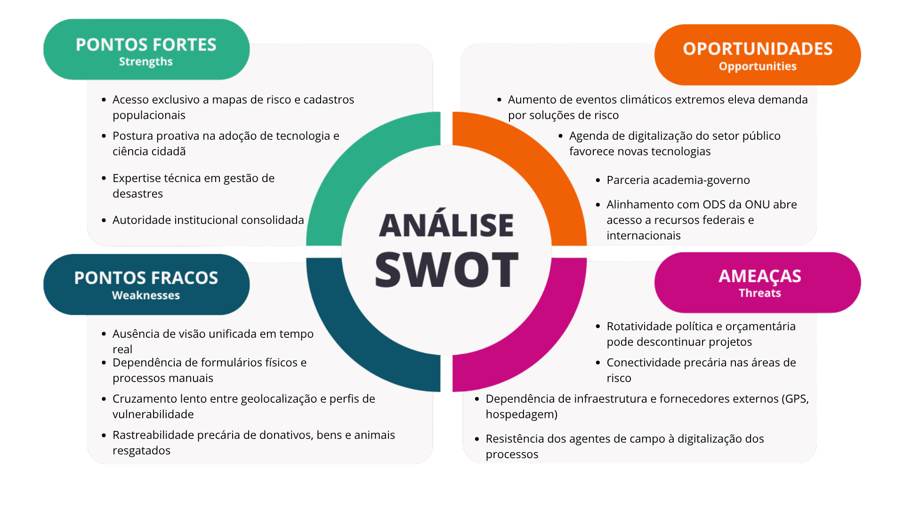
  <p>Fonte: Material produzido pelos autores (2026)</p>
</div>

A análise evidenciou que a Defesa Civil de Santo André detém monopólio legal e vanguarda setorial, sem concorrentes diretos, embora dispute espaço indiretamente com plataformas privadas de geolocalização e monitoramento climático. Verificou-se que sua autoridade é sustentada por dados exclusivos e pela integração ao Consórcio Intermunicipal Grande ABC. Entretanto, constatou-se que a manutenção de processos manuais e a resistência à digitalização fragilizam a operação. Para assegurar a liderança estratégica frente aos eventos climáticos extremos, conclui-se que a modernização, impulsionada por projetos acadêmicos e alinhada aos ODS, é necessária na mitigação das vulnerabilidades estruturais.

### 2.1.3. Solução (sprints 1 a 5)

#### Problema a ser resolvido
A Defesa Civil de Santo André enfrenta dificuldades na organização e centralização dos registros de ocorrências e informações operacionais. Muitos dados ficam dispersos, dificultando consultas, acompanhamento histórico e a gestão eficiente das informações utilizadas pela equipe no dia a dia.

#### Dados disponíveis
As informações e dados serão fornecidas diretamente pela própria Defesa Civil de Santo André para utilização e organização dentro da plataforma.

#### Solução proposta
Desenvolvimento de uma plataforma integrada composta por três componentes principais:

1. **Banco de Dados Centralizado**: Sistema que armazena e organiza todos os cadastros de ocorrências e dados da Defesa Civil em um único repositório, garantindo integridade, confiabilidade e acesso em tempo real às informações.

2. **Formulário Digital**: Interface utilizada pelos agentes de campo para cadastrar ocorrências, informações de famílias, dados de vulnerabilidade e coordenadas GPS. Os dados preenchidos no formulário são automaticamente integrados e persistidos no banco de dados centralizado.

3. **Site Integrado**: Plataforma web para gestão e consulta dos dados, permitindo busca por nome, CPF ou setor de risco, filtros por perfil de vulnerabilidade, visualização clara de todos os cadastros e acesso de forma organizada e prática.

A integração entre esses componentes garante que os dados coletados em campo fluam automaticamente para o banco de dados centralizado e fiquem imediatamente disponíveis no site para consulta e gestão.

#### Forma de utilização da solução
Os agentes da Defesa Civil utilizarão o formulário digital em campo para cadastrar ocorrências, informações familiares e dados operacionais. Esses dados são automaticamente armazenados no banco de dados centralizado. Em seguida, na sede, gestores e administradores acessarão o site integrado para consultar, filtrar, atualizar informações e gerar relatórios, tendo uma visão consolidada e em tempo real de todas as ocorrências e cadastros registrados.

#### Benefícios esperados
A solução deve melhorar a organização das informações, facilitar consultas e otimizar o acompanhamento das ocorrências, permitindo maior eficiência operacional e mais agilidade no acesso às informações necessárias para o trabalho da Defesa Civil.

#### Critério de sucesso e como será avaliado
O sucesso será avaliado pela facilidade de uso da plataforma, organização dos registros,     melhoria na gestão das informações, por meio de feedback dos funcionários.


### 2.1.4. Value Proposition Canvas:

O Canvas de Proposta de Valor é um modelo amplamente utilizado para conectar as necessidades reais dos clientes à solução oferecida. Ele é dividido em dois quadrantes: à esquerda, a proposta de valor da solução; à direita, o perfil do cliente suas dores, tarefas e ganhos esperados.

Abaixo, está apresentado o Canvas desenvolvido para o Departamento de Proteção e Defesa Civil de Santo André, representando como o GeoRisco Santo André se propõe a resolver os desafios de gestão de risco, acolhimento emergencial e logística humanitária. Em seguida, cada componente é descrito em detalhes.

<div align="center">
  <p>Figura 03: Value Proposition Canvas</p>
  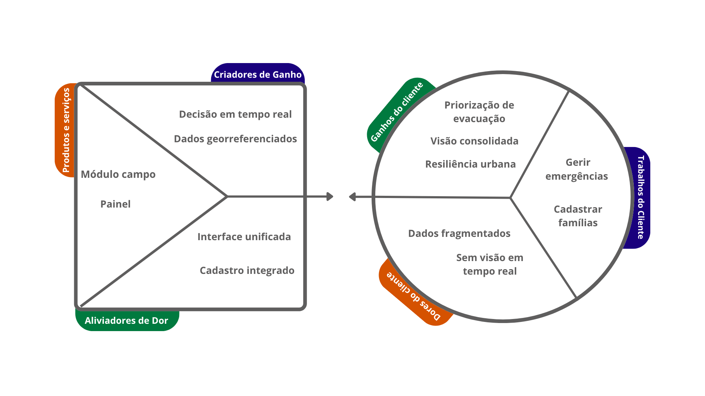
  <p>Fonte: Material produzido pelos autores (2026)</p>
</div>

### PERFIL DO CLIENTE

#### Trabalhos do Cliente

Gerir emergências: Coordenar toda a resposta a desastres naturais e tecnológicos no município de Santo André, acionando protocolos de evacuação, abrigo e assistência humanitária de forma ágil e organizada.

Cadastrar famílias: Registrar moradores de áreas de risco com dados socioestruturais completos, composição familiar, perfil de vulnerabilidade, doenças crônicas, animais de estimação e localização exata do imóvel.

#### Dores

Dados fragmentados: As informações de cadastro, abrigo e logística existem em papéis, planilhas e sistemas separados, sem integração. Isso torna impossível cruzar dados de geolocalização com perfis de vulnerabilidade no momento crítico da evacuação.

Sem visão em tempo real: A ausência de uma interface única impede que gestores vejam o cenário de crise consolidado, dificultando o planejamento preventivo e a tomada de decisão durante eventos extremos.

#### Ganhos

Priorização de evacuação: Com dados cruzados de geolocalização e perfil de vulnerabilidade, a Defesa Civil consegue identificar imediatamente quais famílias: Idosos, crianças, gestantes, PCDs devem ser atendidas primeiro nos protocolos de evacuação.

Visão consolidada: Todos os dados de campo, abrigo e logística acessíveis em uma única interface, permitindo que gestores acompanhem o cenário de crise em tempo real e ajustem recursos conforme a demanda evolui.

Resiliência urbana: A capacidade de resposta mais eficiente a desastres fortalece a cidade como um todo, reduzindo impactos humanos e patrimoniais e contribuindo diretamente com os objetivos da Agenda 2030 da ONU.


### PROPOSTA DE VALOR

#### Produtos e Serviços

 Módulo de campo: Aplicação otimizada para tablets e celulares usada pelos agentes em campo. Permite o cadastro completo de famílias com captura obrigatória de GPS, registro fotográfico do imóvel, identificação de vulnerabilidades e logística de emergência (animais, veículo, destino de evacuação).

 Painel: Interface desktop com pontos georreferenciados, filtros dinâmicos por setor de risco, bairro, idade e perfil de vulnerabilidade.

#### Aliviadores de Dor

Interface unificada: Substitui papéis, planilhas e sistemas isolados por uma única plataforma digital, eliminando a retrabalho e a perda de informação entre as etapas de campo, acolhimento e logística.

Cadastro integrado: O registro feito em campo alimenta automaticamente o módulo de abrigo e o painel de visualização, garantindo que todos os setores da Defesa Civil e secretarias parceiras trabalhem com os mesmos dados atualizados.

#### Criadores de Ganho

Decisão em tempo real: Com todos os dados centralizados e atualizados continuamente, gestores conseguem alocar equipes, redirecionar recursos e acionar protocolos com base em informações confiáveis e não em estimativas ou dados desatualizados.

Dados georreferenciados: A captura obrigatória de coordenadas GPS no momento do cadastro transforma cada família em um ponto no mapa, permitindo análise espacial de densidade de vulnerabilidade, planejamento de rotas de evacuação e identificação de áreas críticas por região.

### 2.1.5. Matriz de Riscos do Projeto

Nesta seção é apresentada a matriz de riscos do projeto de plataforma de gestão de riscos e desastres para a Defesa Civil de Santo André, desenvolvida com o objetivo de identificar, analisar e mitigar possíveis ameaças que possam impactar o desenvolvimento e a entrega da solução, bem como destacar oportunidades estratégicas associadas ao produto.

A análise considera não apenas aspectos técnicos do desenvolvimento da plataforma, mas também fatores relacionados à experiência dos agentes de campo, à credibilidade e confiabilidade das informações de risco, e ao alinhamento com os objetivos e requisitos da Defesa Civil de Santo André. Cada risco e oportunidade foi avaliado com base em sua probabilidade de ocorrência e impacto no projeto, sendo classificado qualitativamente como baixo, médio ou alto.

Essa abordagem permite priorizar ações de mitigação e potencialização, contribuindo para uma gestão mais eficiente do projeto ao longo das sprints.

### Ameaças

| ID  | Ameaça | Descrição | Probabilidade | Impacto | Justificativa da Pontuação | Ação de Mitigação |
|-----|--------|----------|---------------|---------|-----------------------------|-------------------|
| A01 | **Interface pouco intuitiva** | Compreensão difícil da View do site | Média | Alta | Probabilidade média pois depende de experiência do cliente com tecnologia, impacto alto pois afeta diretamente a experiência e tempo gasto | Ajustar duração com testes de usuário |
| A02 | **Confusão com tela inicial** | Usuário não compreende dinâmica, interface da tela inicial | Média | Alta | Muitos sites falham nisso, impacto alto pois define o usuário pode ficar insatisfeito com a perda de tempo | Testes de usabilidade e simplificação |
| A03 | **Queda do servidor** | Limitações de infraestrutura | Baixa | Alta | Baixa probabilidade por ser incomum a queda de um servidor estável, impacto alto pois é crítico o funcionamento | Ter um servidor estável |
| A04 | **Falta de acessibilidade** | Exclusão de parte dos usuários | Média | Média | Necessidade importante de inclusão, impacto relevante em inclusão | Aplicar princípios básicos de UX |
| A05 | **Baixa satisfação com o Design** | Visual, Áudio, Animação desagrádavel | Alta | Média | Alta probabilidade devido à subjetividade , Média importância com a satisfação do usuário | Adicionar visuais, sons, animações agrádaveis |
| A06 | **Falha de segurança** | Baixa proteção dos dados, processo de verificação | Média | Alta | Probabilidade média de acordo com as medidas estabelecidas, impacto alto por quebra de confiança com o usuário e empresa | Estabelecer diversas medidas de proteção de dados, segurança |
| A07 | **Atraso no projeto** | Entrega fora do prazo | Média | Alta | Comum em projetos de software, impacto alto para avaliação e cliente | Planejamento e acompanhamento |
| A08 | **Interpretação incorreta** | Usuário entende errado as possíveis interações | Alta | Alta | Alta probabilidade em sites B2B devido ao gasto de tempo, impacto direto no uso do site | Reforçar feedback interativo |
| A09 | **Bugs críticos** | Quebra da experiência do site | Alta | Alta | Muito comum em desenvolvimento, impacto direto na usabilidade | Testes frequentes |
| A10 | **Problemas com assets** | Questões visuais e de desempenho | Média | Média | Pode ocorrer mas é controlável, impacto moderado | Otimização e padronização |
| A11 | **Desalinhamento com Defesa Cívil** | Produto não atende expectativas | Média | Alta | Probabilidade média sem validação contínua, impacto alto no sucesso do projeto | Reuniões frequentes |
| A12 | **Baixa adesão do público** | Usuários não visualizam o uso do produto como ágradavel | Média | Alta | Público pode não buscar reutilizar o site, impacto alto na utilidade | Testes com usuários |
| A13 | **Conteúdo pouco confiável** | Informações superficiais ou inválidas | Baixa | Alta | Pode ser evitado, mas impacto alto na credibilidade | Revisão com fontes providas pela Defesa Cívil |
| A14 | **Falta de integração** | Dificuldade com canais da Defesa Cívil | Média | Média | Integração não é trivial, impacto moderado | Planejar integrações |
| A15 | **Valor pouco claro** | Usuário não entende o benefício | Média | Média | Comum em produtos novos, impacto médio | Melhorar comunicação |
| A16 | **Desalinhamento de objetivo** | Crescimento desordenado do projeto | Alta | Média | Muito comum em desenvolvimento, impacto médio pois afeta prazo | Definir escopo, objetivo claro |
| A17 | **Dependência da equipe** | Poucas pessoas concentram conhecimento | Média | Média | Probabilidade média, impacto moderado | Documentação e divisão de tarefas |

---

### Oportunidades

| ID | Oportunidade | Descrição | Probabilidade | Impacto | Justificativa da Pontuação | Ação de Potencialização |
|-----|-------------|-----------|---------------|---------|----------------------------|--------------------------|
| O01 | **Integração com alertas automáticos** | Enviar notificações automáticas para famílias em zonas de risco quando um evento climático for detectado. | Média | Alta | A análise de dados georreferenciados permite identificar áreas de maior vulnerabilidade; a integração com alertas meteorológicos pode ser explorada futuramente. | Prever na arquitetura uma camada de notificações e documentar a API que poderia ser integrada futuramente. |
| O02 | **Expansão para outros municípios** | Replicar a solução para outras prefeituras que enfrentam o mesmo problema de gestão de desastres. | Alta | Alta | O problema de dados fragmentados em emergências é universal no contexto municipal brasileiro. | Evitar hardcode de dados específicos de Santo André; documentar a arquitetura de forma parametrizável. |
| O03 | **Atualização em tempo real do mapa de calor** | O mapa seria atualizado automaticamente conforme novos cadastros são feitos em campo. | Alta | Alta | Agentes cadastrando em tempo real tornariam o painel muito mais útil durante uma crise ativa. | Implementar websockets ou polling para atualização automática do dashboard durante emergências. |
| O04 | **Módulo de histórico e evolução de risco** | Registrar como as zonas de risco evoluem ao longo do tempo, permitindo comparar situações antes e depois de intervenções. | Média | Alta | A Defesa Civil poderia usar esse histórico para embasar políticas públicas e relatórios governamentais. | Estruturar o banco de dados com timestamps em todos os registros desde o início para viabilizar análise histórica. |
| O05 | **Geração de relatórios automáticos para órgãos federais** | Exportar relatórios nos formatos exigidos pelo governo federal automaticamente, sem trabalho manual. | Média | Alta | Hoje esses relatórios são feitos manualmente; automatizar economizaria horas de trabalho da equipe. | Levantar com o parceiro os formatos obrigatórios de reporte e prever campos compatíveis desde o cadastro. |
| O06 | **Aplicativo móvel dedicado para agentes de campo** | Evoluir a interface mobile para um app nativo com funcionamento offline completo. | Média | Alta | Um app nativo lidaria melhor com conectividade intermitente em áreas de risco. | Desenvolver o front-end atual como PWA para facilitar a migração futura para app nativo. |
| O07 | **Integração com dados de saúde pública** | Cruzar os dados de vulnerabilidade do cadastro com informações do sistema de saúde municipal. | Baixa | Alta | Pessoas com doenças crônicas já são cadastradas; integrar com saúde tornaria a triagem mais assertiva. | Prever campos compatíveis com o prontuário SUAS e documentar os pontos de integração possíveis. |
| O08 | **Dashboard público de transparência** | Publicar versão simplificada e anonimizada do mapa para a população acompanhar a gestão de riscos. | Média | Média | Transparência em gestão de riscos aumenta engajamento comunitário e confiança na prefeitura. | Separar desde o início dados sensíveis dos dados agregados para viabilizar uma visão pública. |

### Critério de Priorização

A priorização dos riscos foi realizada com base na combinação entre probabilidade e impacto, considerando uma abordagem qualitativa. Riscos com alta probabilidade e alto impacto são tratados como críticos e recebem maior atenção no planejamento e nas ações de mitigação.

Já riscos com impacto elevado, mesmo que com menor probabilidade, também são considerados prioritários devido ao seu potencial de comprometer os objetivos do projeto, especialmente no que diz respeito à confiabilidade da informação, à experiência operacional dos agentes de campo e ao cumprimento dos requisitos da Defesa Civil de Santo André.

No caso das oportunidades, aquelas com alta probabilidade e alto impacto são priorizadas como estratégicas, devendo ser exploradas ativamente ao longo do desenvolvimento. O foco está em maximizar o valor entregue tanto para os usuários finais (agentes e gestores da Defesa Civil) quanto para a instituição parceira, garantindo que o projeto não apenas funcione tecnicamente, mas também gere impacto real na gestão de riscos de desastres naturais e na proteção da população de Santo André.

## 2.2. Personas (sprint 1)

### Persona 1: O Agente de Campo
**Info Demográfica:** Josias, 34 anos

<div align="center">
  <p>Figura 04: Persona - Josias</p>
  
  <p>Fonte: Imagem criada via IA (2026)</p>
</div>

**Contexto:** Atua presencialmente na linha de frente das áreas de risco de Santo André (encostas, áreas de alagamento e ocupações). Atualmente, faz o cadastro das populações vulneráveis utilizando papel e prancheta, muitas vezes enfrentando condições climáticas adversas, terrenos irregulares e conexão de internet móvel intermitente.

### Dores
1. Fazer o cadastro no papel é ineficaz e arriscado; os documentos físicos estão sujeitos a danos (chuva, umidade, perda) e a busca manual por essas fichas posteriormente é extremamente demorada.
2. O preenchimento manual de formulários extensos gera fadiga e lentidão, impactando diretamente na quantidade de famílias que ele consegue atender e mapear por dia.
3. Em ocupações irregulares, muitas moradias não possuem nome de rua oficial, número ou CEP, o que impossibilita o registro exato de onde a família reside através dos métodos tradicionais.
4. O medo de perder o trabalho feito caso a internet móvel oscile ou caia no meio de um atendimento digital.

### Necessidades
1. Uma ferramenta digital para realizar os cadastros com um fluxo simples, direto e com botões de fácil acesso, minimizando a digitação excessiva em campo.
2. Uma forma de registrar com precisão a localização da moradia da família em tempo real, sem depender de um endereço formal, rua ou CEP.
3. Garantia de que o sistema funcionará e guardará as informações coletadas mesmo quando ele estiver em um "ponto cego" de sinal de internet.

### Solução
Uma interface web focada na usabilidade móvel que possibilita que os cadastros sejam realizados de maneira ágil, substituindo o papel por formulários digitais de preenchimento rápido. Para contornar a falta de endereços formais, a interface utiliza o georreferenciamento nativo do dispositivo para capturar automaticamente as coordenadas exatas (latitude e longitude) do local no momento do cadastro. Além disso, a aplicação conta com resiliência offline, utilizando o armazenamento local do navegador para guardar os dados temporariamente caso a conexão caia, sincronizando tudo com o banco de dados centralizado assim que o sinal de internet for restabelecido. Isso garante a segurança do dado coletado e facilita a localização rápida de qualquer pessoa atingida.

### Persona 2: A Gestora Administrativa

**Info Demográfica:** Cláudia, 41 anos

<div align="center">
  <p>Figura 05: Persona - Cláudia</p>
  
  <p>Fonte: Imagem criada via IA (2026)</p>
</div>

**Contexto:** Trabalha na sede da Defesa Civil de Santo André, coordenando o fluxo de informações entre os agentes de campo, as secretarias e a diretoria. Não vai a campo, sua atuação é inteiramente baseada nos dados que chegam até ela, e é responsável por gerar relatórios, tomar decisões operacionais e responder a demandas da gestão municipal.

#### Dores

1. As informações chegam fragmentadas trazidas pelos agentes em papel, parte em planilhas.
2. Quando uma autoridade ou secretaria pede um número ("quantas famílias em risco alto têm idosos no setor B?"), Cláudia precisa garimpar manualmente em múltiplas fontes para responder, o que pode levar horas ou dias.
3. Sem dados organizados, as decisões de alocação de recursos (onde mandar agentes, quais abrigos acionar, quais donativos priorizar) são tomadas com base na experiência e intuição, não em evidências.
4. É impossível saber em tempo real quantas pessoas já foram cadastradas, quais regiões ainda não foram visitadas ou quais famílias estão com cadastro incompleto.
5. A cada nova emergência, o histórico de cadastros anteriores se perde ou fica inacessível, obrigando o time a recomeçar do zero.
6. De forma geral, não há uma visão clara e confiável do que está acontecendo em campo.

#### Necessidades

1. Todos os dados cadastrados pelos agentes de campo centralizados em um único lugar, atualizados em tempo real, sem depender de repasse manual.
2. Filtros que permitam segmentar os cadastros por setor de risco, bairro, perfil de vulnerabilidade (idosos, PCDs, gestantes) e status do cadastro, de forma rápida e sem precisar de apoio técnico.
3. Uma ferramenta visual que transforme os dados em informação acionável: quantas famílias, onde estão, qual o nível de risco, quem tem prioridade de evacuação.
4. Poder exportar relatórios prontos para apresentar à diretoria ou às secretarias parceiras, sem precisar montar planilhas manualmente.
5. Rastrear a completude dos cadastros, saber quais famílias têm dados faltando para acionar os agentes certos.

#### Solução

Um banco de dados centralizado que reúne todos os cadastros feitos pelos agentes de campo em um único lugar, estruturado de forma que Cláudia consiga buscar, filtrar e consultar qualquer informação em segundos (por nome, CPF, setor de risco, bairro ou perfil de vulnerabilidade) sem precisar garimpar planilhas ou esperar repasse manual. A base de dados garante que nenhuma informação se perca e que todos os cadastros sigam um padrão único, confiável e consultável a qualquer momento. Futuramente, essa mesma base poderá alimentar dashboards visuais, gráficos de distribuição de risco, tabelas de prioridade de evacuação e relatórios automáticos para a diretoria e as secretarias parceiras.

## 2.3. User Stories

As *User Stories* são descrições concisas e em linguagem simples de uma funcionalidade do sistema, contadas a partir da perspectiva de quem executará a ação. Elas têm como objetivo principal focar no valor que a funcionalidade entrega ao negócio, facilitando a comunicação entre a equipe de desenvolvimento e os stakeholders, e servindo como um guia claro para a implementação.

Para garantir a qualidade, as histórias deste documento foram validadas utilizando o acrônimo INVEST (Independentes, Negociáveis, Valorosas, Estimáveis, Pequenas/Small e Testáveis) e possuem Critérios de Aceite.

**Nota sobre a Priorização:** A ordem de prioridade foi definida com base no impacto operacional e nas
dependências lógicas. As histórias de **Alta prioridade (US01 a US05)** compõem o núcleo do sistema. As histórias
de **Média prioridade (US06 a US08)** tratam de continuidade, busca e exportação. A história de **Baixa prioridade
(US09)** representa o acompanhamento de completude.

| Prioridade | ID | Resumo |
|------------|----|--------|
| Alta | US01 | Cadastrar indivíduos com dados biográficos |
| Alta | US02 | Impedir cadastros duplicados por CPF/NIS |
| Alta | US03 | Registrar localização via GPS |
| Alta | US04 | Registrar dados de vulnerabilidade |
| Alta | US05 | Visualizar distribuição geográfica em mapa |
| Média | US06 | Salvar cadastros parciais automaticamente |
| Média | US07 | Buscar e filtrar cadastros por múltiplos critérios |
| Média | US08 | Exportar dados em formato estruturado |
| Baixa | US09 | Acompanhar status de completude dos cadastros |

---

### US01

| Identificação | US01 |
|---|---|
| Persona | Josias (Agente de Campo) |
| User Story | Como agente de campo, posso cadastrar indivíduos com seus dados biográficos e socioeconômicos, para garantir que as informações sejam coletadas diretamente na fonte de forma estruturada |
| Critério de aceite 1 | CR1: Dado que o agente acessa o formulário de cadastro, quando preencher todos os campos obrigatórios válidos e submeter, então o sistema deve persistir o registro com ID único e retornar confirmação de sucesso |
| Critério de aceite 2 | CR2: Dado que o agente insere uma data de nascimento futura, quando tentar salvar o cadastro, então o sistema deve bloquear a ação e exibir mensagem de erro em até 500ms |
| Critério de aceite 3 | CR3: Dado que o agente insere um CPF inválido, quando submeter o formulário, então o sistema deve validar o dígito verificador e impedir o salvamento |
| Critério de aceite 4 | CR4: Dado que o agente preenche o nome com acentuação, quando salvar, então o sistema deve armazenar o nome em caixa alta e sem acentos |
| Critérios INVEST | Independente: A história foi estruturada de forma desacoplada de outras funcionalidades centrais. <br>Negociável: A forma de persistência e validação poderá ser ajustada conforme arquitetura. <br>Valorosa: Foi identificado alto valor na coleta estruturada de dados na origem. <br>Estimável: A complexidade foi considerada mensurável com base em formulários e validações padrão. <br>Pequena: O escopo foi limitado ao cadastro inicial de indivíduos. <br>Testável: Os critérios foram definidos com cenários claros de validação e erro. |

---

### US02

| Identificação | US02 |
|---|---|
| Persona | Josias (Agente de Campo) |
| User Story | Como agente de campo, posso validar a unicidade por CPF ou NIS durante o registro, para evitar inconsistência nos dados coletados |
| Critério de aceite 1 | CR1: Dado que um CPF já está cadastrado como ativo, quando tentar registrar um novo indivíduo com o mesmo CPF, então o sistema deve bloquear o cadastro e informar duplicidade |
| Critério de aceite 2 | CR2: Dado que um cadastro foi inativado, quando um novo cadastro com o mesmo CPF for realizado, então o sistema deve permitir a criação |
| Critério de aceite 3 | CR3: Dado que o agente insere CPF ou NIS com formatação (pontos ou traços), quando o sistema processar o cadastro, então deve normalizar os dados e validar considerando apenas os dígitos |
| Critérios INVEST | Independente: A funcionalidade foi definida sem dependência direta de outras histórias. <br>Negociável: A lógica de comparação poderá ser ajustada para diferentes chaves únicas. <br>Valorosa: Foi identificado valor crítico na integridade e unicidade dos dados. <br>Estimável: A implementação foi considerada clara com validações conhecidas. <br>Pequena: O escopo foi restrito à verificação de duplicidade. <br>Testável: Os cenários de bloqueio e permissão foram explicitamente definidos. |

---

### US03

| Identificação | US03 |
|---|---|
| Persona | Josias (Agente de Campo) |
| User Story | Como agente de campo, posso registrar a localização da residência por meio de coordenadas GPS, para identificar corretamente a moradia mesmo em locais sem endereço formal |
| Critério de aceite 1 | CR1: Dado que o agente acessa o formulário em campo, quando iniciar o cadastro, então o sistema deve capturar automaticamente latitude e longitude via GPS |
| Critério de aceite 2 | CR2: Dado que o dispositivo não possui sinal de GPS ativo, quando o agente tentar capturar a localização, então o sistema deve solicitar a ativação do serviço |
| Critério de aceite 3 | CR3: Dado que a localização foi capturada, quando o cadastro for salvo, então as coordenadas devem ser armazenadas junto ao registro |
| Critérios INVEST | Independente: A funcionalidade foi estruturada sem dependência direta de outras histórias. <br>Negociável: A forma de captura (automática ou manual) pode ser ajustada. <br>Valorosa: Foi identificado valor na precisão da localização em áreas irregulares. <br>Estimável: A implementação foi considerada previsível com uso de APIs de geolocalização. <br>Pequena: O escopo foi limitado ao registro de coordenadas. <br>Testável: Os critérios permitem validação da captura e persistência da localização. |

---

### US04

| Identificação | US04 |
|---|---|
| Persona | Josias (Agente de Campo) |
| User Story | Como agente de campo, posso registrar informações de vulnerabilidade dos indivíduos, para permitir a priorização de atendimento em situações de risco |
| Critério de aceite 1 | CR1: Dado que o agente preenche o cadastro, quando informar idade, deficiência ou condição especial, então o sistema deve classificar automaticamente o nível de vulnerabilidade |
| Critério de aceite 2 | CR2: Dado que os dados de vulnerabilidade foram registrados, quando o cadastro for salvo, então o sistema deve vincular essa informação ao perfil do indivíduo |
| Critério de aceite 3 | CR3: Dado que os critérios de vulnerabilidade não forem atendidos, quando o cadastro for salvo, então o sistema deve classificar como baixa prioridade |
| Critérios INVEST | Independente: A funcionalidade foi definida sem dependência de módulos externos. <br>Negociável: Os critérios de classificação de vulnerabilidade podem ser ajustados. <br>Valorosa: Foi identificado valor na priorização de indivíduos em situação de risco. <br>Estimável: A implementação foi considerada clara com base em regras de negócio definidas. <br>Pequena: O escopo foi limitado ao registro e classificação de vulnerabilidade. <br>Testável: Os critérios permitem validar a correta classificação com base nos dados inseridos. |

---

### US05

| Identificação | US05 |
|---|---|
| Persona | Cláudia (Gestora Administrativa) |
| User Story | Como gestora administrativa, posso visualizar a distribuição geográfica dos cadastros em um mapa, para identificar áreas com maior concentração de vulnerabilidade |
| Critério de aceite 1 | CR1: Dado que a gestora acessa o painel, quando visualizar o mapa, então os cadastros devem ser exibidos como pontos georreferenciados |
| Critério de aceite 2 | CR2: Dado que existem múltiplos registros próximos, quando o mapa for exibido, então o sistema deve agrupar os pontos (clusters) para melhor visualização |
| Critério de aceite 3 | CR3: Dado que a gestora seleciona uma região no mapa, quando interagir com os dados, então o sistema deve exibir informações resumidas daquela área |
| Critérios INVEST | Independente: A funcionalidade foi projetada separadamente da coleta de dados. <br>Negociável: A forma de visualização no mapa pode ser ajustada (clusters, heatmap, etc.). <br>Valorosa: Foi identificado valor na visualização estratégica das áreas de risco. <br>Estimável: A complexidade foi considerada controlável com bibliotecas de mapas. <br>Pequena: O escopo foi limitado à exibição dos dados georreferenciados. <br>Testável: Os critérios permitem validar renderização, agrupamento e interação com os dados. |

---

### US06

| Identificação | US06 |
|---|---|
| Persona | Josias (Agente de Campo) |
| User Story | Como agente de campo, posso salvar cadastros parciais automaticamente, para não perder dados em caso de falha de conexão ou interrupção |
| Critério de aceite 1 | CR1: Dado que o agente está preenchendo o formulário, quando houver intervalo de 30 segundos, então o sistema deve salvar automaticamente o rascunho |
| Critério de aceite 2 | CR2: Dado que a conexão é perdida durante o cadastro, quando o agente retornar ao sistema, então os dados previamente inseridos devem ser recuperados |
| Critério de aceite 3 | CR3: Dado que o cadastro está incompleto, quando salvo, então o sistema deve marcar o status como "Incompleto" |
| Critério de aceite 4 | CR4: Dado que o usuário fecha o navegador inesperadamente, quando reabrir o sistema, então o rascunho deve estar disponível para continuidade |
| Critério de aceite 5 | CR5: Dado que a conexão é restabelecida, quando houver dados pendentes, então o sistema deve sincronizar automaticamente com o servidor |
| Critérios INVEST | Independente: A funcionalidade foi isolada da persistência definitiva. <br>Negociável: A estratégia de armazenamento local poderá ser alterada. <br>Valorosa: Foi identificado valor na confiabilidade e continuidade do trabalho em campo. <br>Estimável: A complexidade foi considerada moderada e mensurável. <br>Pequena: O escopo foi focado em autosave e recuperação. <br>Testável: Os cenários de perda e recuperação foram claramente definidos. |

---

### US07

| Identificação | US07 |
|---|---|
| Persona | Cláudia (Gestora Administrativa) |
| User Story | Como gestora administrativa, posso buscar e filtrar cadastros por múltiplos critérios, para obter informações rapidamente e tomar decisões baseadas em dados |
| Critério de aceite 1 | CR1: Dado que a gestora acessa a base de dados, quando aplicar filtros por nome, CPF ou bairro, então o sistema deve retornar os registros correspondentes em até 5 segundos |
| Critério de aceite 2 | CR2: Dado que a gestora realiza busca com variação de acentuação, quando pesquisar um nome, então o sistema deve retornar resultados foneticamente similares |
| Critério de aceite 3 | CR3: Dado que a gestora filtra por vulnerabilidade, quando aplicar o critério, então o sistema deve considerar renda per capita conforme regra definida |
| Critério de aceite 4 | CR4: Dado que múltiplos filtros são aplicados simultaneamente, quando executada a busca, então o sistema deve combinar corretamente os critérios |
| Critérios INVEST | Independente: A funcionalidade foi projetada sem dependência de outras consultas específicas. <br>Negociável: Os critérios de filtro poderão ser expandidos ou refinados. <br>Valorosa: Foi identificado valor direto na tomada de decisão operacional. <br>Estimável: A implementação foi considerada previsível com uso de índices e queries. <br>Pequena: O escopo foi limitado à busca e filtragem. <br>Testável: Os critérios foram definidos com métricas de desempenho e precisão. |

---

### US08

| Identificação | US08 |
|---|---|
| Persona | Cláudia (Gestora Administrativa) |
| User Story | Como gestora administrativa, posso exportar os dados cadastrados em formato estruturado, para gerar relatórios e compartilhar informações com outras áreas |
| Critério de aceite 1 | CR1: Dado que a gestora seleciona os registros, quando solicitar exportação, então o sistema deve gerar arquivo em formato CSV ou PDF |
| Critério de aceite 2 | CR2: Dado que filtros estão aplicados, quando exportar os dados, então o arquivo deve conter apenas os registros filtrados |
| Critério de aceite 3 | CR3: Dado que o arquivo é gerado, quando concluída a exportação, então o sistema deve disponibilizar download imediato |
| Critérios INVEST | Independente: A funcionalidade foi definida sem dependência direta da visualização dos dados. <br>Negociável: Os formatos de exportação podem ser ajustados conforme necessidade. <br>Valorosa: Foi identificado valor na geração de relatórios para tomada de decisão. <br>Estimável: A implementação foi considerada previsível com geração de arquivos estruturados. <br>Pequena: O escopo foi limitado à exportação de dados filtrados. <br>Testável: Os critérios permitem validar geração e conteúdo do arquivo exportado. |

---

### US09

| Identificação | US09 |
|---|---|
| Persona | Cláudia (Gestora Administrativa) |
| User Story | Como gestora administrativa, posso acompanhar o status de completude dos cadastros, para identificar registros incompletos e direcionar ações de correção |
| Critério de aceite 1 | CR1: Dado que existem cadastros no sistema, quando acessados pela gestora, então cada registro deve indicar seu status (completo ou incompleto) |
| Critério de aceite 2 | CR2: Dado que a gestora aplica filtro por status, quando selecionar “incompleto”, então o sistema deve listar apenas os registros pendentes |
| Critério de aceite 3 | CR3: Dado que um cadastro é atualizado, quando todos os campos obrigatórios forem preenchidos, então o status deve ser alterado automaticamente para “completo” |
| Critérios INVEST | Independente: A funcionalidade foi estruturada de forma isolada da edição de cadastros. <br>Negociável: Os critérios de completude podem ser refinados conforme regras futuras. <br>Valorosa: Foi identificado valor na melhoria da qualidade e confiabilidade dos dados. <br>Estimável: A complexidade foi considerada baixa com base em validações existentes. <br>Pequena: O escopo foi limitado ao status de completude dos registros. <br>Testável: Os critérios permitem validar a transição de status conforme o preenchimento de campos. |

# <a name="c3"></a>3. Projeto da Aplicação Web (sprints 1 a 5)

## 3.1. Requisitos do Sistema (sprints 1 a 5)

*Esta seção formaliza o que o sistema deve fazer, sob quais regras e com quais qualidades. Atualize a cada sprint conforme os requisitos evoluem.*

> **Estado atual dos requisitos:** o backend implementa CRUD e validações para cadastradores, setores, casas,
> núcleos familiares, indivíduos e vulnerabilidades, além da rastreabilidade simples pelo cadastrador responsável.
> Busca multicritério, inativação lógica, cadastro completo transacional, atualização específica da composição
> familiar, gestão de documentos, exportação anonimizada, paginação, mapa, indicadores e rascunhos permanecem
> planejados. Notificações e busca fuzzy estão fora do escopo aprovado.

### 3.1.1. Requisitos Funcionais (sprint 1, refinar até sprint 5)

Os requisitos funcionais oficiais abaixo representam o escopo aprovado do produto. A coluna de estado diferencia
as capacidades implementadas no backend vigente das evoluções planejadas.

| ID | Nome | Descrição | Endpoint principal | Estado |
|---|---|---|---|---|
| RF001 | Gestão de Cadastradores | Criar, consultar, atualizar e remover cadastradores responsáveis pelos registros de campo, validando nome e IF no formato `123.456-7`. | `/api/v1/cadastradores` | Implementado |
| RF002 | Gestão de Setores | Criar, consultar, atualizar e remover regiões classificadas por grau de risco. | `/api/v1/setores` | Implementado |
| RF003 | Gestão de Casas | Registrar e manter endereço, coordenadas, características físicas, uso, situação e fotos armazenadas no registro da casa. | `/api/v1/casas` | Implementado |
| RF004 | Gestão de Núcleos Familiares | Manter núcleos familiares vinculados a uma casa e ao cadastrador responsável. | `/api/v1/nucleos-familiares` | Implementado |
| RF005 | Gestão de Indivíduos | Manter indivíduos pertencentes a um núcleo, incluindo dados pessoais, documentos, contato, renda e status vital. | `/api/v1/individuos` | Implementado |
| RF006 | Definição do Chefe Familiar | Definir ou remover o chefe de um núcleo, exigindo pertencimento ao núcleo e idade mínima de 18 anos. | `PUT /api/v1/nucleos-familiares/:id` | Implementado |
| RF007 | Gestão de Vulnerabilidades | Manter o catálogo de vulnerabilidades e associar ou desassociar vulnerabilidades de indivíduos. | `/api/v1/vulnerabilidades` | Implementado |
| RF008 | Consultas Relacionais | Consultar indivíduos, casas, setores e vulnerabilidades a partir dos relacionamentos existentes. | Rotas relacionais de casas, setores, indivíduos e vulnerabilidades | Implementado parcialmente |
| RF009 | Validação e Padronização de Dados | Validar payloads, aplicar regras de negócio e padronizar dados antes da persistência. | Interno nos endpoints de escrita | Implementado parcialmente |
| RF010 | Prevenção de Duplicidade | Impedir a criação ou atualização de indivíduos com CPF ou NIS já utilizado por outro registro. | Interno em `POST` e `PUT /api/v1/individuos` | Implementado |
| RF011 | Consulta e Atualização de Dados | Consultar registros por ID e atualizar parcialmente os dados editáveis dos recursos existentes. | Rotas `GET /:id` e `PUT /:id` dos recursos | Implementado |
| RF012 | Rastreabilidade do Cadastro | Identificar o cadastrador responsável pela criação de cada núcleo e manter esse vínculo imutável, por meio do vínculo com o cadastrador. | `GET /api/v1/nucleos-familiares/:id` | Implementado |
| RF013 | Gestão de Fotos de Casas | Registrar, consultar, substituir ou remover as fotos de fachada e detalhe armazenadas junto ao registro da casa. | `POST`, `GET` e `PUT /api/v1/casas` | Implementado |
| RF014 | Busca Multicritério | Pesquisar cadastros por nome, CPF, ficha, bairro, setor, vulnerabilidade e outros filtros combináveis. | `GET /api/v1/consultas/cadastros` | Planejado |
| RF015 | Inativação de Registros | Inativar indivíduos e núcleos sem exclusão física, preservando seus dados para consultas futuras. | `PATCH /api/v1/individuos/:id/inativacao` e `PATCH /api/v1/nucleos-familiares/:id/inativacao` | Planejado |
| RF016 | Cadastro Completo em Fluxo Único | Criar casa, núcleo, indivíduos e associações de vulnerabilidade em uma operação atômica. | `POST /api/v1/cadastros-completos` | Planejado |
| RF017 | Atualização da Composição Familiar | Transferir indivíduo entre núcleos, definir novo chefe e registrar mudanças na composição familiar. | `PATCH /api/v1/individuos/:id/vinculo-familiar` | Planejado |
| RF018 | Gestão de Documentos | Enviar, consultar e remover documentos vinculados aos indivíduos. | `/api/v1/individuos/:id/documentos` | Planejado |
| RF019 | Exportação Anonimizada | Exportar dados estatísticos sem identificadores pessoais diretos. | `GET /api/v1/relatorios/cadastros-anonimizados` | Planejado |
| RF020 | Paginação e Ordenação | Permitir que listagens sejam retornadas em páginas e ordenadas por campos aceitos pela API. | Query params `page`, `limit`, `orderBy` e `order` nas listagens | Planejado |
| RF021 | Painel Georreferenciado | Fornecer casas, núcleos e graus de risco necessários para visualização em mapa. | `GET /api/v1/mapa-risco/casas` | Planejado |
| RF022 | Indicadores e Relatórios | Consolidar totais por setor, grau de risco, vulnerabilidade e composição familiar. | `GET /api/v1/indicadores` | Planejado |
| RF023 | Rascunho e Sincronização | Salvar cadastros incompletos e permitir sua retomada ou sincronização posterior. | `/api/v1/rascunhos` | Planejado |


### 3.1.2. Regras de Negócio (sprint 1, refinar até sprint 5)

> **Estado atual:** estão implementadas a unicidade global de CPF/NIS, validação matemática de CPF,
> validação de datas, maioridade do chefe familiar, vínculo único do indivíduo por FK, sanitização de entradas,
> enums e integridade referencial. Regras ligadas a inativação, completude, upload e exportação
> permanecem planejadas. Para o cadastrador, o IF é obrigatório e armazenado com máscara no formato `123.456-7`;
> portanto, a RN009 genérica não se aplica ao campo `cadastrador.documento`.

| ID | Descrição da Regra de Negócio | Prioridade | RF Associado |
|:---|:---|:---:|:---|
| RN001 | **IF obrigatório:** todo cadastrador deve possuir nome e IF no formato `123.456-7`. | Alta | RF001 |
| RN002 | **Rastreabilidade simples:** todo núcleo deve registrar `id_cadastrador`, e esse vínculo não pode ser alterado após a criação. | Alta | RF004, RF012 |
| RN003 | **Casa e setor obrigatórios:** toda casa pertence a um setor e todo núcleo pertence a uma casa. | Alta | RF002, RF003, RF004 |
| RN004 | **Coordenadas válidas:** latitude deve estar entre -90 e 90; longitude entre -180 e 180. | Alta | RF003 |
| RN005 | **Consistência de interdição:** data de interdição somente pode ser informada para imóvel interditado. | Média | RF003 |
| RN006 | **Vínculo familiar único:** todo indivíduo pertence diretamente a exatamente um núcleo familiar. | Alta | RF005 |
| RN007 | **Unicidade documental:** CPF e NIS, quando informados, não podem se repetir entre indivíduos. | Alta | RF005, RF010 |
| RN008 | **Validação individual:** CPF deve ser matematicamente válido, datas não podem estar no futuro e rendas não podem ser negativas. | Alta | RF005, RF009 |
| RN009 | **Consistência do status vital:** `data_obito` é obrigatória para status `Óbito` e proibida para os demais status. | Alta | RF005 |
| RN010 | **Chefe familiar válido:** o chefe deve pertencer ao próprio núcleo e possuir pelo menos 18 anos. | Alta | RF006 |
| RN011 | **Vulnerabilidade catalogada:** associações somente podem utilizar indivíduos e vulnerabilidades existentes, sem duplicidade. | Média | RF007 |
| RN012 | **Integridade referencial:** exclusões devem respeitar as regras `RESTRICT`, `CASCADE` e `SET NULL` definidas no banco. | Alta | RF001 a RF008 |
| RN013 | **Padronização:** nomes e campos textuais definidos são normalizados; CPF, NIS, CEP e telefone são persistidos sem máscara; o IF mantém a máscara `123.456-7`. | Média | RF009 |

### 3.1.3. Requisitos Não Funcionais (sprints 1 a 5)

> **Estado atual:** requisitos não funcionais desta tabela representam metas do produto, não evidências automáticas
> de implementação. Atualmente estão comprovados no backend: variáveis de ambiente obrigatórias, respostas JSON
> padronizadas, validação em Zod/Service/banco, documentação Swagger/OpenAPI, CORS e health check básico.
> Não foram comprovados criptografia de campos, backups, cache Redis ou testes de carga,
> disponibilidade de 99%, operação offline ou cobertura mínima global.
>

| Eixo | ID | Requisito | Métrica Mensurável | Como Verificar | Componente que Atende |
|------|----|-----------|--------------------|----------------|----------------------|
| **USAB — Usabilidade** | RNF001 | Formulário de cadastro operável com uma mão em tela ≥ 5 polegadas, sem scroll excessivo. | ≤ 5 campos por tela; botões com altura mínima de 48px; nenhum alvo de toque menor que 44×44px. | DevTools → Toggle device toolbar (375px) → inspecionar altura dos botões e número de campos visíveis por tela. | `src/views/agente-cadastro.ejs` — Planejado |
| **USAB — Usabilidade** | RNF002 | Feedback visual imediato para erros de validação nos formulários. | Mensagem de erro exibida em < 500ms após submissão inválida; campo destacado em vermelho com contraste ≥ 4.5:1 (WCAG AA). | DevTools → Performance → gravar submit inválido → medir delta entre evento e renderização do erro; verificar contraste via WebAIM Contrast Checker. | `public/js/agente-cadastro.js` — Planejado |
| **USAB — Usabilidade** | RNF003 | Campos obrigatórios e opcionais claramente identificados em 100% dos formulários. | Asterisco `*` em 100% dos campos obrigatórios; texto `(opcional)` em 100% dos opcionais; zero campos sem indicação. | Inspecionar cada campo dos formulários `/agente/cadastro` e `/familias` e confirmar presença do marcador correto. | `src/views/agente-cadastro.ejs`, `src/views/familias.ejs` — Planejado |
| **CONF — Confiabilidade** | RNF004 | Dados inseridos em campo preservados em caso de queda de conexão. | Zero campos perdidos em sessões com queda de rede; sincronização automática ao reconectar em ≤ 60s. | DevTools → Network → Offline → preencher formulário → reconectar → confirmar todos os campos preservados e enviados. | `public/js/` — localStorage/IndexedDB (Planejado) |
| **CONF — Confiabilidade** | RNF005 | Rascunhos de cadastros recuperáveis após fechamento acidental do navegador. | Rascunho salvo automaticamente a cada 30s; persistência mínima 7 dias; indicador visual de "salvo". | Preencher formulário → fechar aba sem salvar → reabrir sistema → verificar dados recuperados automaticamente. | `public/js/` — auto-save (Planejado — aguarda RF023) |
| **CONF — Confiabilidade** | RNF006 | Disponibilidade mínima de 99% durante horário comercial. | Uptime ≥ 99% medido mensalmente via `/health`; p99 de resposta < 2s; RTO ≤ 1h, RPO ≤ 15min. | Monitorar `GET /health` ao longo de uma sprint; medir downtime acumulado vs. tempo total de operação. | `src/server.ts` — `GET /health` (parcial); infraestrutura Supabase |
| **DES — Desempenho** | RNF007 | Carregamento inicial do formulário em ≤ 5s em redes 3G. | p95 < 5s em 3G (1,6 Mbps); p50 < 2s em 4G; bundle JS < 200KB gzipped. | DevTools → Network → throttling "Slow 3G" → recarregar `/agente/cadastro` → medir tempo até `DOMContentLoaded`. | `public/` — assets e bundle JS (Planejado) |
| **DES — Desempenho** | RNF008 | Interface responsiva a interações sem travamentos. | Resposta a cliques e inputs < 300ms; sem long tasks > 50ms na thread principal. | DevTools → Performance → gravar interação → verificar ausência de bloqueios de thread principal > 50ms. | `public/js/` — interações UI (Planejado) |
| **DES — Desempenho** | RNF009 | Buscas multicritério retornam resultados em ≤ 5s com 10.000+ registros. | p95 < 5s com 10k registros; índices em `cpf`, `nis`, `bairro`, `id_setor`. | Popular BD com 1.000 núcleos e executar `GET /api/v1/consultas/cadastros?nome=X`; medir com `curl -w "%{time_total}"`. | `src/repositories/` + índices no BD (Planejado — aguarda RF014) |
| **SUP — Suportabilidade** | RNF010 | Sistema funcional nos principais navegadores usados pelos agentes. | Compatível com Chrome 110+, Firefox 110+ e Safari 15+ em desktop e mobile. | Abrir a aplicação em cada browser listado e executar fluxo de cadastro completo sem erros de console. | Verificação manual cross-browser — a verificar na sprint |
| **SUP — Suportabilidade** | RNF011 | Código documentado para manutenção por terceiros sem dependência do time original. | README com clone→install→run em ≤ 5 passos; Swagger documentando 100% dos endpoints; WAD com arquitetura atualizada. | Clonar repositório em máquina limpa e seguir apenas o README → `npm run dev` deve funcionar sem consultar o time. | `README.md`, `documentos/wad.md`, `/api-docs` — Implementado |
| **SUP — Suportabilidade** | RNF012 | Deploy de novas versões sem interrupção de serviço. | Zero downtime em deploy; rollback automático se `/health` falhar pós-deploy. | Deployar nova versão enquanto sessão ativa está em uso e verificar ausência de interrupção. | CI/CD pipeline (Planejado) |
| **SEG — Segurança** | RNF013 | 100% das requisições HTTP via HTTPS com TLS ≥ 1.2. | Redirecionamento HTTP→HTTPS ativo; header `Strict-Transport-Security` presente; cipher suites TLS 1.2+. | `curl -I http://<host>` → verificar redirect; `curl -I https://<host>` → verificar header `Strict-Transport-Security`. | Supabase hosting (HTTPS gerenciado automaticamente) |
| **SEG — Segurança** | RNF014 | Dados sensíveis (CPF, renda) nunca expostos em URLs, query params ou logs. | 0 ocorrências de CPF/NIS em query params ou logs do servidor; dados sensíveis somente em body POST/PUT. | Enviar `GET /api/v1/individuos?cpf=12345678900` → servidor deve ignorar o param; inspecionar logs e confirmar ausência de CPF. | `src/helpers/sanitizers.ts`, rotas `src/routes/` — Implementado parcialmente |
| **SEG — Segurança** | RNF019 | Dados exportados por RF019 anonimizados de forma irreversível. | 0 campos CPF/NIS/RG na resposta; identificadores substituídos por hash; sem possibilidade de reversão. | Chamar `GET /api/v1/relatorios/cadastros-anonimizados` → inspecionar JSON e confirmar ausência de identificadores pessoais. | A implementar com RF019 (Planejado) |
| **SEG — Segurança** | RNF021 | Campos sensíveis (CPF, renda, saúde) criptografados em repouso com AES-256. | 100% dos campos sensíveis cifrados; chave mestra em secret manager; dado ilegível sem chave. | Consultar BD diretamente no Supabase → verificar colunas sensíveis exibindo valor cifrado, não o dado original. | A implementar via pgcrypto ou application-level encryption (Planejado) |
| **SEG — Segurança** | RNF022 | Backup automático do BD a cada 15min, criptografado e armazenado offline. | Backup incremental a cada 15min; backup full diário; RPO = 15min, RTO = 1h; restore testado mensalmente. | Verificar configuração de backup no painel Supabase; confirmar restore bem-sucedido em ambiente de teste. | Supabase backup automático (verificar configuração no painel) |
| **CAP — Capacidade** | RNF023 | Sistema suporta até 10.000 núcleos (40.000 indivíduos) sem degradação. | p95 de busca < 5s com 10k registros; sem timeout em listagens com 40k indivíduos. | Popular BD com 1.000 núcleos via script de seed e executar `GET /api/v1/individuos`; medir tempo com `curl -w "%{time_total}"`. | `src/repositories/` + índices no BD (Planejado) |
| **CAP — Capacidade** | RNF024 | Upload de documentos (RF018) com limite de quantidade e tamanho por cadastro. | Limites a definir com o parceiro antes da implementação do RF018. | Tentar upload de arquivo acima do limite → verificar HTTP 413 e mensagem de erro descritiva. | A implementar junto ao RF018 (Planejado) |
| **REST — Restrições Design** | RNF025 | Interface comunica nível de urgência/prioridade de cada família visualmente. | 100% das listagens com badge de prioridade (vermelho=MUITO_ALTO, amarelo=ALTO, verde=MÉDIO); zero famílias sem indicador. | Acessar `/familias` com registros de alta vulnerabilidade cadastrados → verificar presença e distinção visual dos badges. | `src/views/familias.ejs` (Planejado) |
| **REST — Restrições Design** | RNF026 | Dashboard legível em ambientes com alta luminosidade. | Contraste ≥ 4.5:1 entre texto e fundo (WCAG AA); fonte ≥ 16px em mobile; nenhuma informação transmitida só por cor. | Verificar paleta de cores atual com WebAIM Contrast Checker; testar em tela com brilho máximo ao sol. | `public/css/styles.css` — a verificar |
| **ORG — Organizacionais** | RNF027 | Nenhuma dependência de serviços externos pagos para funcionamento crítico. | 0 SDKs pagos nas dependências de produção do `package.json`. | `cat package.json` → inspecionar `dependencies` e confirmar ausência de serviços pagos essenciais. | `package.json` — stack open-source (Node.js, Express, Supabase free tier) |
| **ORG — Organizacionais** | RNF028 | Conformidade com LGPD: dados reais de munícipes não utilizados em desenvolvimento. | 0 dados reais no repositório; seeds e testes com dados fictícios; `.env` no `.gitignore`. | `git log --all -- "*.env*"` → confirmar zero commits com `.env`; inspecionar `src/test/` e confirmar dados fictícios. | `.gitignore`, `src/test/setupEnv.ts`, `src/test/factories.ts` — Implementado |
| **ORG — Organizacionais** | RNF029 | Sistema mantível por terceiros sem dependência do time original. | README suficiente para clone→run sem intervenção; testes documentados; `/api-docs` descrevendo 100% dos endpoints. | Clonar repositório em máquina limpa → seguir README → `npm run dev` deve funcionar; `npm test` deve passar sem configuração adicional. | `README.md`, `/api-docs`, `src/test/` — Implementado |
| **API — Validação** | RNF030 | Validações em múltiplas camadas (service, banco) para garantir integridade. | 100% dos campos críticos com assert no Service + constraint no BD; payload inválido via curl (bypassing frontend) deve ser rejeitado. | Enviar payload com CPF inválido direto via `curl -X POST /api/v1/individuos -d '{"cpf":"000"}'` → verificar HTTP 422. | `src/helpers/validators.ts`, `src/services/`, `src/database/SupabaseSchema.ts` — Implementado |
| **API — Tratamento de Erros** | RNF031 | Erros padronizados com status HTTP correto e envelope JSON consistente. | 100% dos erros retornam `{ success: false, error: string, statusCode: number }` com código HTTP correspondente (400, 404, 409, 422). | `curl -X POST /api/v1/individuos -d '{}'` → verificar envelope e status; `curl /api/v1/individuos/99999` → verificar HTTP 404. | `src/helpers/errors.ts`, `src/helpers/responseFormatter.ts` — Implementado |
| **API — Sanitização** | RNF034 | 100% dos inputs sanitizados na entrada (normalização, remoção de máscaras, trim). | Nome com espaços e acentos (`" joão "`) persistido como `"JOAO"`; CPF com máscara (`123.456.789-09`) armazenado como `"12345678909"`. | `POST /api/v1/individuos` com `{ "nome_completo": " joão gonçalves " }` → consultar BD e verificar `"JOAO GONCALVES"`. | `src/helpers/sanitizers.ts` — Implementado |
| **BD — Integridade Referencial** | RNF035 | FKs, CHECK constraints e regras de cascade/restrict garantem integridade no banco. | Tentativa de deletar setor com casas vinculadas retorna erro de FK; `renda_familiar_total < 0` rejeitado por CHECK. | `DELETE /api/v1/setores/:id` com casas vinculadas → BD retorna erro; `POST /api/v1/nucleos-familiares` com `renda_familiar_total: -1` → HTTP 400. | `src/database/SupabaseSchema.ts` — Implementado |
| **BD — Índices e Performance** | RNF036 | Índices nas colunas de busca frequente quando RF014 for implementado. | `EXPLAIN SELECT * FROM individuo WHERE cpf = '...'` deve usar index scan, não seq scan. | Executar `EXPLAIN` no Supabase SQL editor após criação dos índices; confirmar `Index Scan` no plano de execução. | Migrations futuras (Planejado — aguarda RF014) |
| **Infra — Monitoramento** | RNF037 | Health check disponível e respondendo 200 OK. | `GET /health` retorna HTTP 200 com `{ "status": "ok" }` em ≤ 200ms. | `curl -w "%{http_code} %{time_total}" http://localhost:3000/health` → verificar `200` e tempo < 200ms. | `src/server.ts` — `GET /health` — Implementado |
| **API — Formato de Resposta** | RNF038 | Todas as respostas seguem envelope `{ success, data, message }`. | 100% das respostas com campos `success`, `data` (ou `error`) e `message`; listagens retornam array em `data`. | `curl http://localhost:3000/api/v1/individuos` → inspecionar JSON e confirmar presença de `success`, `data`, `message`. | `src/helpers/responseFormatter.ts` — Implementado |
| **Segurança — Configuração** | RNF039 | Credenciais carregadas exclusivamente de variáveis de ambiente, nunca hardcoded. | 0 credenciais no código-fonte; servidor falha explicitamente ao iniciar sem `SUPABASE_URL` ou `SUPABASE_SERVICE_ROLE_KEY`. | Remover `SUPABASE_URL` do `.env` e executar `npm run dev` → deve falhar com mensagem de erro explícita antes de aceitar requisições. | `src/config/env.ts`, `src/test/setupEnv.ts` — Implementado |
| **Testes — Cobertura** | RNF040 | Cobertura de testes ≥ 80% em statements dos Services e Repositories. | `npm run test:cov` reporta ≥ 80% statements, ≥ 80% functions, ≥ 80% lines, ≥ 70% branches. | Executar `npm run test:cov` → abrir relatório em `coverage/lcov-report/index.html` → verificar thresholds por arquivo. | `src/test/`, `jest.config.js` — Implementado (verificar cobertura atual) |

### 3.1.4. Matriz de Rastreabilidade Completa: RF ↔ US ↔ RN ↔ Endpoint (sprints 1 a 5)

**Objetivo:** Demonstrar que cada Requisito Funcional (RF) está rastreado até User Stories (US), ligado a Regras de Negócio (RN) com suas descrições concretas, mapeado para o Endpoint da API e ao arquivo que o implementa.

**Legenda de status:**
- `Implementado` — endpoint funcional, service com validações e testes cobrindo o fluxo principal
- `Parcial` — endpoint existe, mas parte das regras ou validações ainda não está completa
- `Planejado` — rota ou funcionalidade ainda não implementada no backend atual

| RF | US | Regras de Negócio (RN e descrição resumida) | Endpoint principal | Método | Status | Arquivo principal |
|---|---|---|---|---|---|---|
| RF001 | US01 | **RN001** — nome e IF no formato `123.456-7` obrigatórios; **RN013** — strings normalizadas (trim, uppercase); **RN012** — FK `id_cadastrador` na criação de núcleos | `/api/v1/cadastradores` | CRUD | Implementado | `src/services/CadastradorService.ts` |
| RF002 | — | **RN003** — setor é pré-requisito para casa; **RN013** — nome normalizado; grau de risco aceita apenas `Baixo`, `Médio`, `Alto` ou `Muito Alto` | `/api/v1/setores` | CRUD | Implementado | `src/services/SetorService.ts` |
| RF003 | — | **RN003** — toda casa pertence a um setor (FK obrigatória); **RN004** — latitude entre -90 e 90, longitude entre -180 e 180; **RN005** — `data_interdicao` só pode ser informada se `interditado = true`; tipo de construção aceita apenas `Madeira`, `Alvenaria` ou `Misto` | `/api/v1/casas` | CRUD | Implementado | `src/services/CasaService.ts` |
| RF004 | US01 | **RN002** — `id_cadastrador` registrado na criação e imutável; **RN003** — casa (FK) obrigatória; **RN013** — `nome_nucleo` normalizado; renda familiar não pode ser negativa | `/api/v1/nucleos-familiares` | CRUD | Implementado | `src/services/NucleoFamiliarService.ts` |
| RF005 | US01, US04 | **RN006** — indivíduo pertence a exatamente um núcleo (FK `id_nucleo_familiar`); **RN007** — CPF e NIS únicos entre todos os indivíduos; **RN008** — CPF validado matematicamente (`assertCpf`), datas não futuras (`assertPastOrTodayDate`), renda ≥ 0; **RN009** — `data_obito` obrigatória para `status_vital = 'Obito'` e proibida nos demais; **RN013** — nome e campos texto normalizados; enums validados: genero, cor_raca, estado_civil, status_vital | `/api/v1/individuos` | CRUD | Implementado | `src/services/IndividuoService.ts` |
| RF006 | — | **RN010** — chefe deve pertencer ao próprio núcleo (verificado por FK) e ter idade mínima de 18 anos (`assertMinimumAge`); bloqueado se indivíduo não existir | `PUT /api/v1/nucleos-familiares/:id` | PUT | Implementado | `src/services/NucleoFamiliarService.ts` |
| RF007 | US04 | **RN011** — associação somente entre indivíduos e vulnerabilidades existentes, sem duplicidade; **RN013** — `tipo_vulnerabilidade` não pode ser string vazia | `/api/v1/vulnerabilidades` | CRUD | Implementado | `src/services/VulnerabilidadeService.ts` |
| RF008 | US05 | **RN012** — consultas relacionais respeitam FKs; alguns relacionamentos ainda não validam existência do núcleo antes de retornar dados vinculados | Rotas relacionais de casas, setores, indivíduos e vulnerabilidades | GET | Parcial | `src/repositories/` (múltiplos) |
| RF009 | — | **RN013** — `sanitizeObject()` aplicado em todos os endpoints de escrita; **RN008** — assert functions tipadas (`assertCpf`, `assertNis`, `assertPastOrTodayDate`) executadas antes da persistência; sanitização ainda não é uniforme em 100% dos recursos | Interno em todos os endpoints de escrita | — | Parcial | `src/helpers/sanitizers.ts` |
| RF010 | US02 | **RN007** — `ensureUniqueDocuments()` consulta CPF e NIS ativos antes de criar ou atualizar; retorna `ConflictError` se duplicado | Interno em `POST` e `PUT /api/v1/individuos` | — | Implementado | `src/services/IndividuoService.ts` |
| RF011 | — | **RN012** — `GET /:id` retorna 404 se não encontrado; `PUT /:id` valida ao menos um campo informado; campos imutáveis (id, data de criação) não são aceitos no payload | `GET` e `PUT /:id` de todos os recursos | GET/PUT | Implementado | `src/services/` (todos os services) |
| RF012 | — | **RN002** — `id_cadastrador` persiste na criação do núcleo e é retornado na consulta; campo não pode ser sobrescrito em atualizações | `GET /api/v1/nucleos-familiares/:id` | GET | Implementado | `src/repositories/NucleoFamiliarRepository.ts` |
| RF013 | — | **RN003** — foto vinculada à casa existente; campos `foto_fachada_bytes` e `foto_detalhe_bytes` aceitos em POST e PUT; **RN012** — casa deve existir antes do upload | `POST`, `GET` e `PUT /api/v1/casas` | POST/GET/PUT | Implementado | `src/services/CasaService.ts` |
| RF014 | US07 | **RN008** — busca por CPF deve normalizar entrada (remover máscara) antes de comparar; filtros combináveis por nome, CPF, bairro, setor e vulnerabilidade | `GET /api/v1/consultas/cadastros` | GET | Planejado | — |
| RF015 | — | **RN006** — inativação não remove dados físicos; `status_vital` do indivíduo passa a `Inativo`; **RN009** — data_obito não obrigatória na inativação simples | `PATCH /api/v1/individuos/:id/inativacao` | PATCH | Planejado | — |
| RF016 | US01 | **RN003**, **RN006**, **RN007**, **RN011** — operação atômica: falha em qualquer validação deve reverter toda a criação; maioridade e unicidade de documentos verificadas antes do commit | `POST /api/v1/cadastros-completos` | POST | Planejado | — |
| RF017 | — | **RN006** — indivíduo só pode pertencer a um núcleo; transferência exige desvinculação antes do novo vínculo; **RN010** — novo chefe deve ter 18+ anos | `PATCH /api/v1/individuos/:id/vinculo-familiar` | PATCH | Planejado | — |
| RF018 | — | Tipo de arquivo aceito (PDF, JPG, PNG) e tamanho máximo por arquivo a definir com o parceiro | `/api/v1/individuos/:id/documentos` | CRUD | Planejado | — |
| RF019 | — | CPF, NIS e RG removidos antes da exportação; dados estatísticos (faixa de renda, vulnerabilidades, região) mantidos | `GET /api/v1/relatorios/cadastros-anonimizados` | GET | Planejado | — |
| RF020 | US07 | Query params `page`, `limit`, `orderBy` e `order` em todas as listagens; valor padrão: `page=1`, `limit=20`, `orderBy=id`, `order=asc` | Query params das listagens | GET | Planejado | — |
| RF021 | US05 | **RN004** — retorna casas com coordenadas válidas; **RN003** — vincula setor e grau de risco para coloração no mapa | `GET /api/v1/mapa-risco/casas` | GET | Planejado | — |
| RF022 | — | Agrega totais por setor, grau de risco, composição familiar e tipo de vulnerabilidade; sem dados pessoais na resposta | `GET /api/v1/indicadores` | GET | Planejado | — |
| RF023 | US06 | **RN013** — rascunho normalizado como qualquer payload; status `incompleto` gravado explicitamente; retomada via ID do rascunho | `/api/v1/rascunhos` | CRUD | Planejado | — |

---

## 3.2. Arquitetura

### 3.2.1. Diagrama de Arquitetura

A arquitetura do sistema segue o padrão **Layered Architecture** no estilo Route → Controller → Service → Repository → Supabase. Cada camada tem responsabilidade única e bem delimitada, tornando o sistema testável, seguro e fácil de manter.

<div align="center">
  <p>Diagrama de Arquitetura em Camadas</p>
  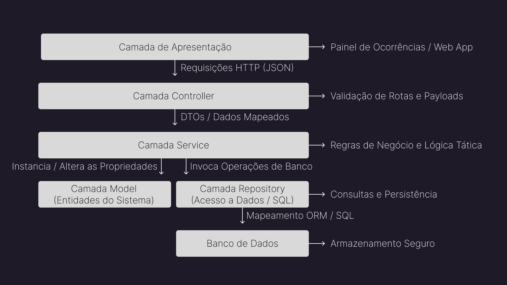
  <p>Fonte: Material produzido pelos autores (2026)</p>
</div>

#### Fluxo interno de uma requisição

Toda requisição percorre as camadas abaixo em sequência. Uma falha em qualquer etapa interrompe o fluxo e retorna o erro ao cliente sem avançar para a próxima camada.

```
Cliente (browser / fetch)
      │
      ▼
[1] Route          — define método HTTP e path; repassa para o Controller
      │
      ▼
[2] Middleware     — authMiddleware valida JWT; sanitizeRequestBody normaliza o body
      │
      ▼
[3] Controller     — extrai params/body, chama Service, formata resposta com formatSuccess/formatError
      │
      ▼
[4] Service        — valida regras de negócio, sanitiza com sanitizeObject(), chama Repository
      │
      ▼
[5] Repository     — executa query no Supabase; em erro chama throwDatabaseError()
      │
      ▼
[6] Supabase       — persiste ou consulta dados no PostgreSQL
      │
      ▼
[retorno] Repository → Service → Controller → resposta HTTP ao cliente
```

#### Exemplo concreto: `POST /api/v1/individuos`

| Etapa | Arquivo | Responsabilidade |
|-------|---------|-----------------|
| Route | `src/routes/individuoRoutes.ts` | Registra `POST /` e aponta para `IndividuoController.create` |
| Middleware | `src/helpers/authMiddleware.ts` + `src/helpers/sanitizers.ts` | Valida JWT; normaliza body |
| Controller | `src/controllers/IndividuoController.ts` | Extrai body, chama `IndividuoService.create()`, retorna HTTP 201 |
| Service | `src/services/IndividuoService.ts` | Valida CPF, data, enums e unicidade; chama `IndividuoRepository.create()` |
| Repository | `src/repositories/IndividuoRepository.ts` | Executa `INSERT` via `supabase.from('individuo').insert()` |
| Model | `src/models/domain/Individuo.ts` + `src/database/SupabaseSchema.ts` | Tipagem de domínio e schema do banco |

#### Módulos × Endpoints implementados

| Módulo (Route file) | Prefixo(s) registrado(s) | Endpoints implementados |
|---|---|---|
| `cadastradorRoutes.ts` | `/api/v1/cadastradores` | `GET /`, `GET /:id`, `POST /`, `PUT /:id`, `DELETE /:id` |
| `setorRoutes.ts` | `/api/v1/setores`, `/api/v1/setores-risco` | `GET /`, `GET /:id`, `POST /`, `PUT /:id`, `DELETE /:id` |
| `casaRoutes.ts` | `/api/v1/casas`, `/api/v1/imoveis` | `GET /`, `GET /:id`, `GET /nucleos-familiares/:id`, `POST /`, `PUT /:id`, `DELETE /:id` |
| `nucleoFamiliarRoutes.ts` | `/api/v1/nucleos-familiares`, `/api/v1/familias` | `GET /`, `GET /:id`, `POST /`, `PUT /:id`, `DELETE /:id` |
| `individuoRoutes.ts` | `/api/v1/individuos`, `/api/v1/pessoas` | `GET /`, `GET /:id`, `GET /nucleos-familiares/:id`, `POST /`, `PUT /:id`, `DELETE /:id` |
| `vulnerabilidadeRoutes.ts` | `/api/v1/vulnerabilidades` | `GET /`, `GET /:id`, `POST /`, `PUT /:id`, `DELETE /:id` |
| `petRoutes.ts` | `/api/v1/pets` | `GET /`, `GET /:id`, `POST /`, `PUT /:id`, `DELETE /:id` |
| `authRoutes.ts` | `/api/v1/auth` | `POST /login`, `POST /logout` |

#### Camada Route

Registra os métodos HTTP e caminhos de cada recurso, delegando ao Controller correspondente. Nenhuma lógica de negócio ou validação ocorre aqui. Todos os prefixos são montados em `src/routes/index.ts` sob `/api/v1/`.

#### Camada Controller

Porta de entrada da API. Extrai `params`, `query` e `body` da requisição, aciona o Service e devolve a resposta no envelope `{ success, data, message }` via `formatSuccess()` / `formatError()`. Não executa regras de negócio nem acessa o banco diretamente.

Arquivos: `src/controllers/CadastradorController.ts`, `CasaController.ts`, `IndividuoController.ts`, `NucleoFamiliarController.ts`, `PetController.ts`, `SetorController.ts`, `VulnerabilidadeController.ts`.

#### Camada Service

Núcleo das regras de negócio. Aplica `sanitizeObject()` no payload e executa validações concretas: CPF matemático (`assertCpf`), data não futura (`assertPastOrTodayDate`), enums de genero/estado_civil/status_vital, renda ≥ 0, maioridade do chefe (`assertMinimumAge`), unicidade de CPF/NIS (`ensureUniqueDocuments`). Lança `BadRequestError`, `NotFoundError` ou `ConflictError` em caso de violação.

Arquivos: `src/services/CadastradorService.ts`, `CasaService.ts`, `IndividuoService.ts`, `NucleoFamiliarService.ts`, `PetService.ts`, `SetorService.ts`, `VulnerabilidadeService.ts`.

#### Camada Repository

Responsável exclusivamente por operações no Supabase. Executa `select`, `insert`, `update` e `delete` via Supabase JS SDK. Em caso de erro do banco, chama `throwDatabaseError(error)` — nunca lança erros brutos para a camada superior.

Arquivos: `src/repositories/CadastradorRepository.ts`, `CasaRepository.ts`, `IndividuoRepository.ts`, `NucleoFamiliarRepository.ts`, `PetRepository.ts`, `SetorRepository.ts`, `VulnerabilidadeRepository.ts`.

#### Camada Model

Define os tipos de domínio e o contrato das tabelas do banco. Modelos em `src/models/domain/` (`Cadastrador`, `Setor`, `Casa`, `NucleoFamiliar`, `Individuo`, `Vulnerabilidade`). DTOs de entrada em `src/models/dto/`. Tipagem completa do schema Supabase em `src/database/SupabaseSchema.ts`.

### 3.2.2. Diagrama de Casos de Uso (sprint 1)

### Descrição

> **Escopo dos casos de uso:** os casos de uso representam a visão funcional planejada do produto. Pré-requisitos
> de relatórios, mapa e exportação ainda não correspondem a funcionalidades executáveis.

### UC01: Cadastrar Família em Área de Vulnerabilidade
Este caso de uso é o alicerce do mapeamento socioestrutural.

- Atores: Agentes da Defesa Civil.

- Atores Secundários: API de Geolocalização (ex: Google Maps/Mapbox).

- Pré-requisitos: o agente deve estar em campo ou possuir os dados coletados.

- Pós-requisitos: Registro da família vinculado a uma coordenada geográfica e perfil de vulnerabilidade gerado.

- Relações:

  - << include >>: Validar Localização Geográfica.


<div align="center">
  <p>Figura 06: Diagrama do Caso de Uso 1</p>
  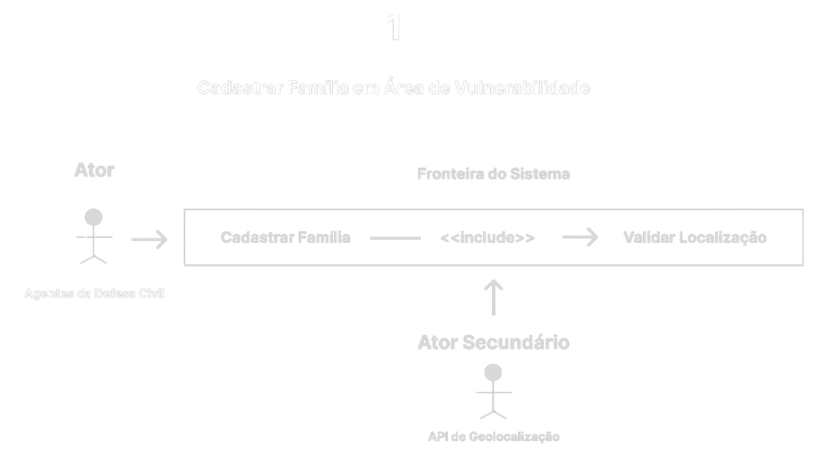
  <p>Fonte: Material produzido pelos autores (2026)</p>
</div>


### UC02: Cadastrar Área de Risco Socioestrutural
Este caso de uso é o coração do sistema, permitindo que a Defesa Civil alimente a base de dados com as informações coletadas em campo.

- Atores: Agentes da Defesa Civil.

- Atores Secundários: API de Geolocalização (para conversão de endereço/coordenada).

- Pré-requisitos: o agente deve possuir os dados da área de risco.

- Pós-requisitos: Ponto de risco registrado no banco de dados.

- Relações:

  - << include >>: Validar Coordenadas GPS (obrigatório para georreferenciamento).

  - << extend >>: Anexar Fotos da Ocorrência (opcional, ocorre conforme a disponibilidade de mídia).

<div align="center">
  <p>Figura 07: Diagrama do Caso de Uso 2</p>
  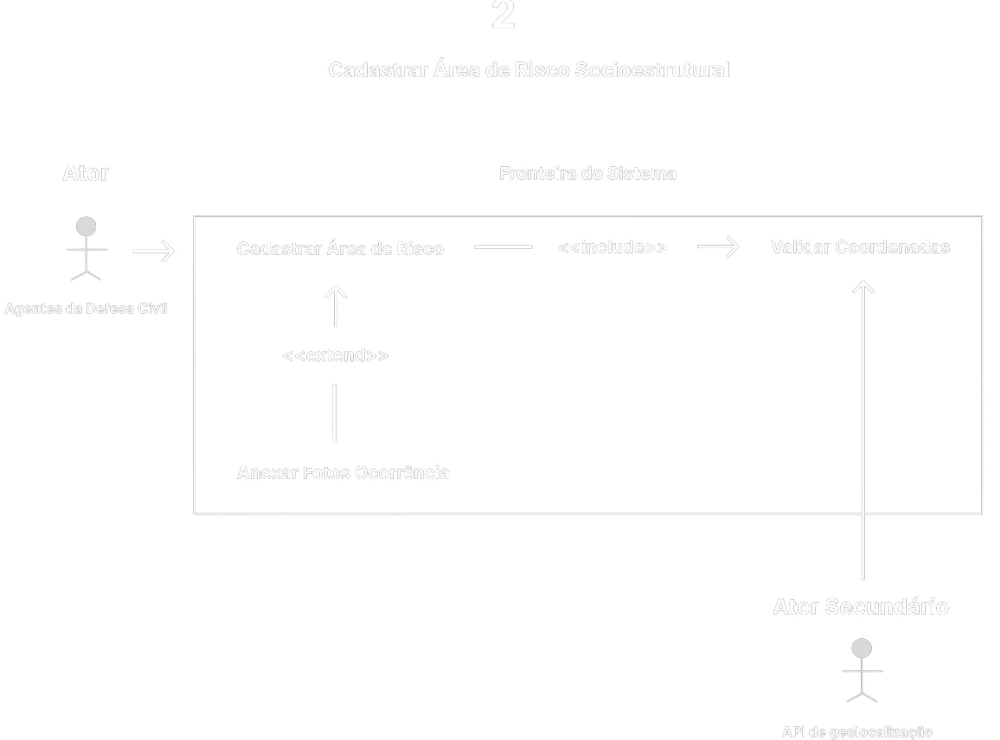
  <p>Fonte: Material produzido pelos autores (2026)</p>
</div>

### UC03: Gerar Relatório de Vulnerabilidade e Logística
Este caso de uso transforma os dados brutos em inteligência estratégica para a tomada de decisão da gestão municipal.

- Atores: Gestores administrativos da Defesa Civil.

- Atores Secundários: Não se aplica.

- Pré-requisitos: Existência de dados populacionais e de risco previamente cadastrados.

- Pós-requisitos: Relatório gerado em tela ou arquivo para subsídio de tomada de decisões.

- Relações:

  - << include >>: Filtrar por Critérios (obrigatório selecionar período, região ou tipo de risco para o processamento).

  - << extend >>: Exportar para PDF/Excel (opcional, caso o gestor precise do documento fora do sistema).

<div align="center">
  <p>Figura 08: Diagrama do Caso de Uso 3</p>
  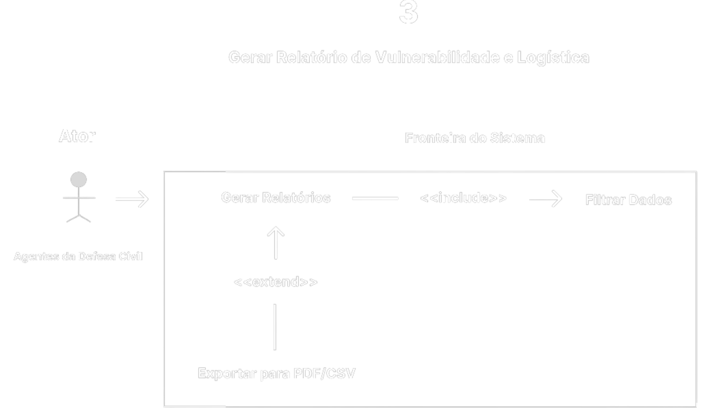
  <p>Fonte: Material produzido pelos autores (2026)</p>
</div>

### 3.2.3. Diagrama de Classes do Domínio

O domínio executável é formado por `Cadastrador`, `Setor`, `Casa`, `NucleoFamiliar`, `Individuo` e
`Vulnerabilidade`. A associação N:N entre indivíduos e vulnerabilidades é representada por
`IndividuoVulnerabilidade`.

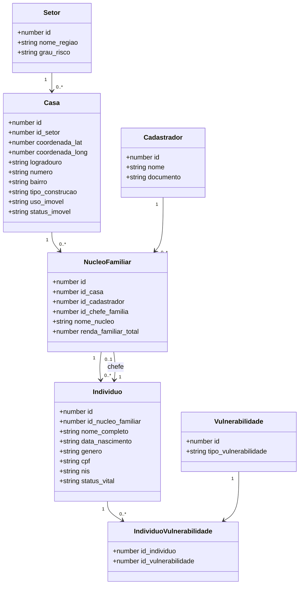
```mermaid
classDiagram
    class Cadastrador {
        +number id
        +string nome
        +string documento
    }
    class Setor {
        +number id
        +string nome_regiao
        +string grau_risco
    }
    class Casa {
        +number id
        +number id_setor
        +number coordenada_lat
        +number coordenada_long
        +string logradouro
        +string numero
        +string bairro
        +string tipo_construcao
        +string uso_imovel
        +string status_imovel
    }
    class NucleoFamiliar {
        +number id
        +number id_casa
        +number id_cadastrador
        +number id_chefe_familia
        +string nome_nucleo
        +number renda_familiar_total
    }
    class Individuo {
        +number id
        +number id_nucleo_familiar
        +string nome_completo
        +string data_nascimento
        +string genero
        +string cpf
        +string nis
        +string status_vital
    }
    class Vulnerabilidade {
        +number id
        +string tipo_vulnerabilidade
    }
    class IndividuoVulnerabilidade {
        +number id_individuo
        +number id_vulnerabilidade
    }

    Setor "1" --> "0..*" Casa
    Casa "1" --> "0..*" NucleoFamiliar
    Cadastrador "1" --> "0..*" NucleoFamiliar
    NucleoFamiliar "1" --> "0..*" Individuo
    NucleoFamiliar "0..1" --> "1" Individuo : chefe
    Individuo "1" --> "0..*" IndividuoVulnerabilidade
    Vulnerabilidade "1" --> "0..*" IndividuoVulnerabilidade
```

As coordenadas e o endereço pertencem à casa. Cada indivíduo possui diretamente `id_nucleo_familiar`,
`grau_parentesco`, escolaridade, situação ocupacional e renda individual. O núcleo registra diretamente a casa,
o cadastrador responsável e, opcionalmente, o indivíduo definido como chefe familiar.

### 3.2.3.1. Diagrama de Classes Arquitetural

O backend segue o fluxo `Route -> Controller -> Service -> Repository -> Supabase`. Cada recurso possui DTOs de
criação e atualização, modelo de domínio, Controller, Service e Repository. Zod valida o corpo das requisições;
os Services aplicam regras de negócio; e os Repositories acessam exclusivamente as sete tabelas vigentes.

### 3.2.4. Diagrama de Sequência UML

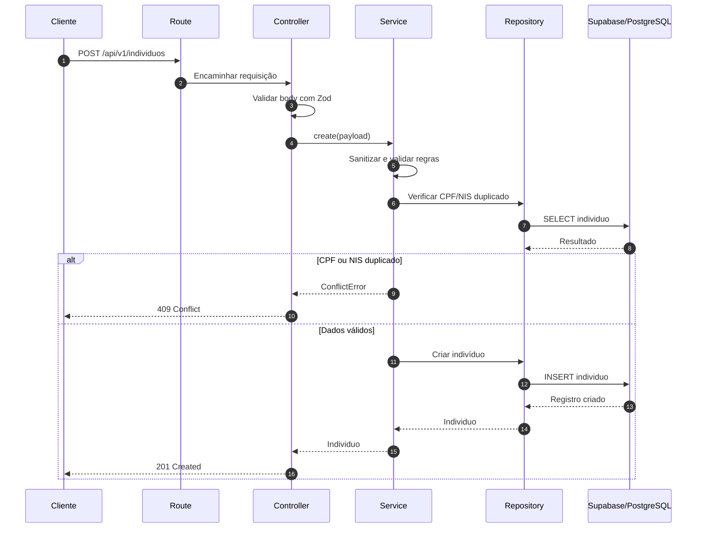
```mermaid
sequenceDiagram
  autonumber
  participant C as Cliente
  participant R as Route
  participant CT as Controller
  participant S as Service
  participant RP as Repository
  participant DB as Supabase/PostgreSQL

  C->>R: POST /api/v1/individuos
  R->>CT: Encaminhar requisição
  CT->>CT: Validar body com Zod
  CT->>S: create(payload)
  S->>S: Sanitizar e validar regras
  S->>RP: Verificar CPF/NIS duplicado
  RP->>DB: SELECT individuo
  DB-->>RP: Resultado
  alt CPF ou NIS duplicado
    S-->>CT: ConflictError
    CT-->>C: 409 Conflict
  else Dados válidos
    S->>RP: Criar indivíduo
    RP->>DB: INSERT individuo
    DB-->>RP: Registro criado
    RP-->>S: Individuo
    S-->>CT: Individuo
    CT-->>C: 201 Created
  end
```

O fluxo representa a criação de um indivíduo pelo contrato atual, incluindo validação, prevenção de duplicidade,
persistência e respostas HTTP.

### 3.2.5. Diagrama de Atividades ou Estados

O diagrama de atividades ou estados não foi produzido na versão atual. Os fluxos executáveis podem ser
identificados pelas rotas canônicas e pelas regras descritas nos Services.

### 3.2.6. Diagrama de Implantação (sprints 4 e 5)

O diagrama de implantação não foi produzido. O repositório comprova uma aplicação Express conectada ao Supabase,
mas não documenta um ambiente de produção ou homologação implantado.

### 3.2.7. Padrões de Projeto e Princípios Arquiteturais (sprints 3 a 5)

No backend vigente, estão comprovados o padrão Repository, o uso de DTOs e a separação de responsabilidades entre
Routes, Controllers, Services e Repositories.

##### Repository Pattern (Padrão de Criação/Estrutural)

O padrão Repository isola o acesso ao Supabase da lógica de negócio. Cada recurso possui um Repository dedicado,
como `IndividuoRepository`, `CasaRepository` e `NucleoFamiliarRepository`.

##### DTO — *Data Transfer Object* (Padrão Arquitetural)

Os DTOs de criação e atualização definem os campos aceitos por cada operação. Os schemas Zod validam esses
payloads antes de encaminhá-los aos Services.

##### S – Single Responsibility Principle (Princípio da Responsabilidade Única)

Controllers tratam HTTP, Services aplicam regras de negócio e Repositories acessam o banco. Essa divisão reduz
acoplamento e facilita testes unitários.

## 3.3. Wireframes

### 3.3.1. Wireframes da Tela de Cadastro

Este wireframe representa a tela de cadastro individual utilizada pela Defesa Civil de Santo André para registrar informações pessoais dos moradores atendidos. A interface possui campos para identificação civil, como nome, CPF, RG, NIS, data e local de nascimento, além de informações complementares como gênero, estado civil, profissão, nome dos pais e cor/raça.

Os campos foram organizados de forma simples e objetiva, facilitando o preenchimento e a leitura das informações pelos agentes responsáveis. O formulário também utiliza botões de seleção para opções de gênero, tornando a interação mais rápida e intuitiva. O objetivo da tela é centralizar os dados pessoais dos indivíduos de maneira padronizada, garantindo maior organização e eficiência no processo de atendimento e registro.
<div align="center">
  <p>Figura 11: Wireframe tela formulario</p>
  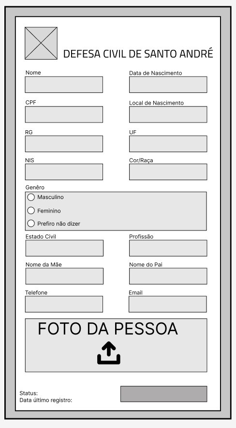
  <p>Fonte: Material produzido pelos autores (2026)</p>
</div>

[Link para documento do wireframe](https://www.figma.com/design/Wg7CrKpquQ0VpU4AA1cbeq/Sem-t%C3%ADtulo?node-id=0-1&t=leIgBMRUSbY59ivP-1)

---

Este wireframe representa a tela de cadastro de residências utilizada pela Defesa Civil de Santo André para registrar informações sobre imóveis atendidos. A interface contém campos relacionados ao endereço da residência, como endereço, número, complemento e CEP, além de uma área destinada ao envio da foto da fachada do imóvel.

O formulário também possui seções para classificação do tipo de construção (madeira, alvenaria ou mista), finalidade do imóvel (residencial, comercial ou misto) e nível de risco da construção (R1, R2 ou R3).

Na área de detalhes, são exibidas labels de identificação rápida, utilizadas para destacar características importantes da residência ou dos moradores, como presença de pessoas PCD, idosos, cadeirantes, animais, entre outros. Essas informações auxiliam a Defesa Civil na priorização e organização dos atendimentos.

A estrutura da tela foi desenvolvida de forma objetiva e intuitiva, permitindo um preenchimento rápido e organizado das informações durante as visitas e análises realizadas pela equipe.
<div align="center">
  <p>Figura 12: Wireframe tela formulario</p>
  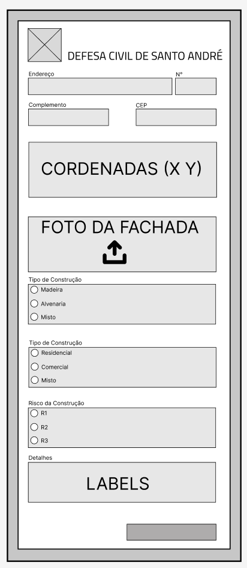
  <p>Fonte: Material produzido pelos autores (2026)</p>
</div>

[Link para documento do wireframe](https://www.figma.com/design/XQZO9HgFYfftgw9yK0Nglk/Wireframe-Formul%C3%A1rio-Defesa-Civil-de-Santo-Andr%C3%A9---Im%C3%B3vel?t=DgiyQuYk4kA0qCt1-0)


### 3.3.2 Wireframes da Tela de Visualização de Dados

O wireframe do painel principal de Análise de Dados (Desktop) foi estruturado utilizando um sistema de grids em layout de colunas e blocos, com o objetivo de otimizar a leitura rápida de dados críticos pela gestão da Defesa Civil.

Na parte superior, o cabeçalho apresenta a identificação do sistema e introduz um menu de navegação global com botões para as áreas de "Dados" e "Cadastro", além de uma barra de "Pesquisar", resolvendo a jornada do usuário ao permitir uma transição fluida entre a visualização estratégica e a consulta de registros específicos.

À esquerda, a barra lateral de filtros traz opções específicas e alinhadas diretamente ao modelo de banco de dados — como Gênero, Bairro, Construção, Uso do Imóvel, Cor/Raça e Idade —, demonstrando na prática como as métricas serão cruzadas para isolar cenários de vulnerabilidade.

No corpo central da interface, os Indicadores de Desempenho (KPIs) ganham destaque no topo com três blocos numéricos de tipografia ampliada (Famílias Cadastradas, Pessoas em Risco Extremo e Total de Pessoas Cadastradas), aplicando conceitos de estatística descritiva para que os dados mais urgentes sejam o primeiro ponto de contato visual.

Logo abaixo, a maior área da tela é dedicada ao Mapa de Risco, reafirmando o foco geoespacial da solução, ladeado por espaços destinados a gráficos que exibirão distribuições complementares. Por fim, a seção inferior apresenta uma tabela de "Últimos Cadastros", que atua como um registro em tempo real para que a coordenação possa acompanhar o fluxo de trabalho dos agentes de campo e ter acesso imediato às ocorrências mais recentes.

<div align="center">
    <p>Figura 13</p>
    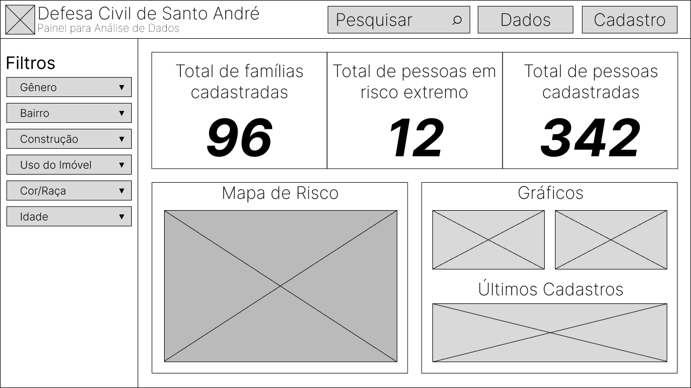
    <p>Fonte: Material produzido pelos autores (2026)</p>
</div>

---


O wireframe referente à tela de resultados de pesquisa mantém a consistência estrutural do painel principal, preservando o cabeçalho de navegação e a barra lateral de filtros (como Gênero, Bairro e Uso do Imóvel) para garantir que a gestão não perca o contexto de sua análise.

O grande diferencial desta interface está na área de conteúdo central, que substitui os dashboards visuais por uma visualização focada em dados brutos, indicada pelo cabeçalho "Exibindo resultados para: pesquisa".

Os blocos empilhados horizontalmente representam os registros detalhados das famílias, indivíduos ou áreas de risco que atendem aos critérios buscados, oferecendo uma leitura linear e organizada das informações do banco de dados.
Por fim, no canto inferior direito, a inclusão do botão "Exportar dados" destaca o cumprimento de um requisito funcional essencial para a operação da Defesa Civil, permitindo que a coordenação faça o download das informações filtradas (como em formato CSV ou PDF) para a elaboração de relatórios, prestação de contas ou planejamento logístico de contingência com outras secretarias.

<div align="center">
    <p>Figura 14</p>
    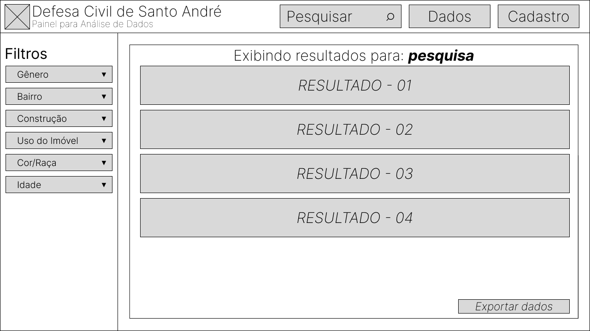
    <p>Fonte: Material produzido pelos autores (2026)</p>
</div>

---

O wireframe de Visualização Expandida do Mapa de Risco demonstra um nível aprofundado de interação no sistema da Defesa Civil. Mantendo a consistência de navegação, a interface preserva o cabeçalho superior e a barra lateral de filtros refinados (Gênero, Bairro, Construção, etc.) fixos na tela.

O grande diferencial desta visualização é a maximização do componente "Mapa de Risco", que passa a ocupar a totalidade da área central, suprimindo temporariamente os KPIs numéricos e gráficos complementares.

Essa decisão de design atende a um requisito crucial da gestão de desastres: o foco geoespacial detalhado. Ao ampliar o mapa, a coordenação (Gestora) ganha uma área de trabalho limpa para focar exclusivamente na topografia e na distribuição territorial das vulnerabilidades.

Isso permite cruzar os dados dos filtros laterais diretamente com o mapa em tela cheia, facilitando a identificação precisa de ruas em área de deslizamento/enchente, rotas de evacuação e o raio de alcance dos abrigos mais próximos, sem a distração visual de outros painéis.

<div align="center">
    <p>Figura 15</p>
    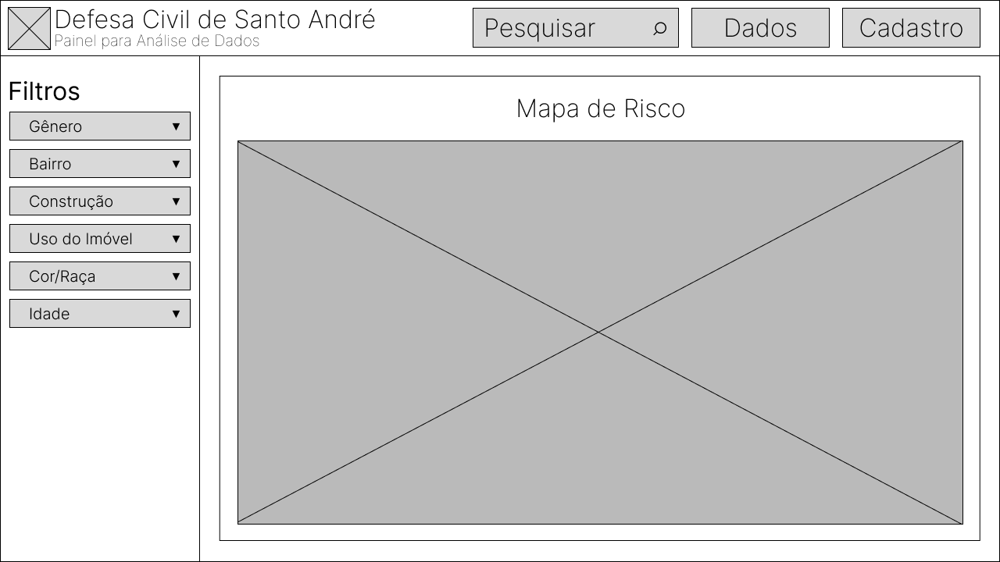
    <p>Fonte: Material produzido pelos autores (2026)</p>
</div>


## 3.4. Guia de estilos

> **Escopo desta seção:** este guia registra a linguagem visual planejada e os ativos produzidos.
> A presença de um componente ou ícone nesta seção não comprova que ele esteja implementado em um frontend
> executável.

Este Guia de Estilos serve como a base visual e funcional para o desenvolvimento e evolução do produto. Sua principal função é documentar, padronizar e unificar todas as decisões de design, como paletas cromáticas, regras tipográficas e elementos de interface, garantindo que o ecossistema digital seja construído de forma consistente.

### 3.4.1 Cores

<div align="center">
    <p>Figura 16</p>
    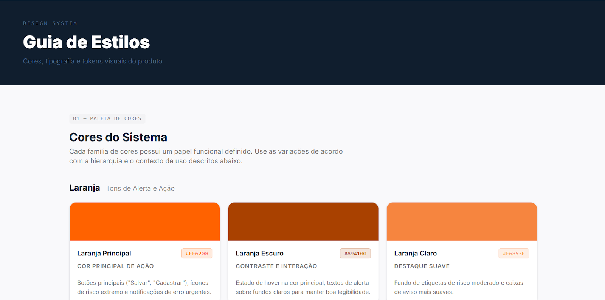
    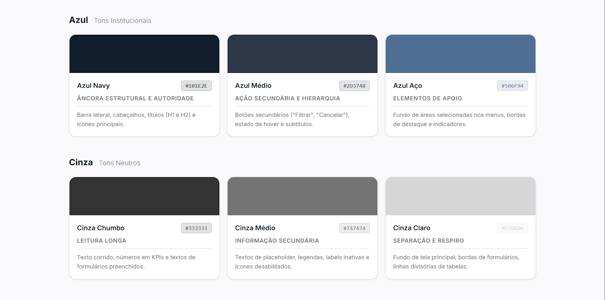
    <p>Fonte: Material produzido pelos autores (2026)</p>
</div>

Para utilizar este guia de estilos de forma eficiente, aplique a paleta de cores respeitando estritamente a função de cada tom: o Laranja atua como elemento de ação primária e alerta urgente, os tons de Azul ancoram a estrutura visual e dão suporte aos componentes de navegação, enquanto os Cinzas organizam o fluxo de leitura, fundos e divisores de conteúdo.

### 3.4.2 Tipografia

<div align="center">
    <p>Figura 17</p>
    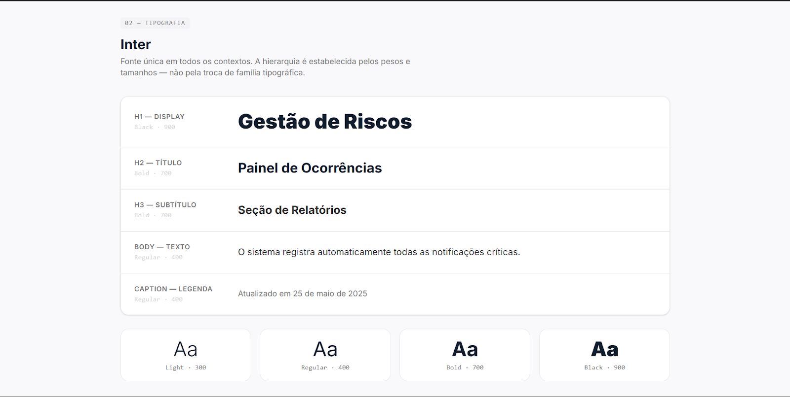
    <p>Fonte: Material produzido pelos autores (2026)</p>
</div>

Na tipografia, utilize exclusivamente a fonte Inter, estabelecendo a hierarquia visual por meio do contraste de pesos e tamanhos (como o uso de títulos em negrito/Black para forte apelo visual e textos corridos em Regular para máxima legibilidade). Combine estes tokens visuais para construir layouts consistentes, assegurando que botões, formulários e elementos informativos sigam sempre o mesmo padrão funcional e cromático em todo o ecossistema digital do produto.

### 3.4.3 Iconografia e imagens

### 3.4.3.1 Ícones

### Alertas e Status

| Preview | Nome | Arquivo | Onde é usado |
|:---:|---|---|---|
|  | Alerta | `Alerta.png` | Badge de nível de risco (MUITO ALTO, ALTO) |
|  | Círculo Alerta | `Circulo-alerta.png` | Erro de conexão, falha no envio |
|  | Status de Emergência | `Status-de-emergência.png` | Indicador de status crítico |
|  | Status Normal | `Status-normal.png` | Indicador de operação normal |
|  | Segurança | `Segurança.png` | Badge "Salvo", confirmação de dados seguros |
|  | Notificação | `Notificação.png` | Alertas e avisos do sistema |

---

### Eventos Naturais

| Preview | Nome | Arquivo | Onde é usado |
|:---:|---|---|---|
|  | Chuva Forte | `Chuva-forte.png` | Tipo de ocorrência — chuva intensa |
|  | Alagamento | `Alagamento.png` | Tipo de ocorrência — enchente/alagamento |
|  | Deslizamento | `Deslizamento.png` | Tipo de ocorrência — deslizamento de terra |
|  | Tempestade | `Tempestade.png` | Tipo de ocorrência — tempestade/raio |
|  | Vento | `Vento.png` | Tipo de ocorrência — vendaval |
|  | Incêndio | `Incêndio.png` | Tipo de ocorrência — incêndio |

---

### Vulnerabilidade

| Preview | Nome | Arquivo | Onde é usado |
|:---:|---|---|---|
|  | Idoso | `Idoso.png` | Badge de vulnerabilidade — idoso (≥ 60 anos) |
|  | PCD | `PCD.png` | Badge de vulnerabilidade — pessoa com deficiência |
|  | Gestante | `Gestante.png` | Badge de vulnerabilidade — gestante |
|  | Problema de Saúde | `Problema-de-saúde.png` | Badge de vulnerabilidade — doença crônica |
|  | Animais | `Animais.png` | Badge de vulnerabilidade — família com animais |

---

### Localização e Mapas

| Preview | Nome | Arquivo | Onde é usado |
|:---:|---|---|---|
|  | Localização | `Ícone-localização.png` | Pin de família no mapa de risco |
|  | Localização Atual | `Localização-atual.png` | Botão "Recapturar GPS" no formulário de campo |
|  | Mapa | `Mapa.png` | Navegação para tela de mapa, seção Localização na revisão |
|  | Rota | `Rota.png` | Rotas de evacuação no mapa expandido |
|  | Abrigo | `Abrigo.png` | Pontos de abrigo emergencial no mapa |

---

### Navegação e Interface

| Preview | Nome | Arquivo | Onde é usado |
|:---:|---|---|---|
|  | Voltar | `Voltar-página.png` | Botão "← Voltar" em todos os passos do formulário |
|  | Dropdown | `Ícone-dropdown.png` | Seletores de Gênero, Estado Civil, Tipo de Construção |
|  | Buscar | `Buscar.png` | Barra de pesquisa do painel de dados |
|  | Filtro | `Filtro.png` | Filtros laterais do painel (Bairro, Gênero, etc.) |
|  | Editar | `Editar-campo.png` | Links "Editar →" na tela de revisão |
|  | Recarregar | `Recarregar-página.png` | Botão "Tentar novamente" em erro de conexão |
|  | Sem Sinal | `Wifi-off.png` | Aviso de ausência de sinal GPS |
|  | Informação | `Ícone-informação.png` | Tooltips e informações de contexto |
|  | Usuário | `User.png` | Perfil do agente, seção Dados Pessoais na revisão |
|  | Upload | `Upload.png` | Campo de upload de documentos |
|  | Câmera | `Câmera.png` | Campo de foto da fachada do imóvel |
|  | Exportar | `Exportar-arquivo.png` | Botão "Exportar dados" na tela de pesquisa |

---

### Comunicação

| Preview | Nome | Arquivo | Onde é usado |
|:---:|---|---|---|
|  | Ligação Emergência | `Ligação-emergência.png` | Contatos de emergência |
|  | Megafone | `Megafone.png` | Comunicados oficiais da Defesa Civil |
|  | Mensagem | `Mensagem.png` | Chat e notificações internas |

---

### Infraestrutura e Apoio

| Preview | Nome | Arquivo | Onde é usado |
|:---:|---|---|---|
|  | Casa | `Casa.png` | Abrigos, imóveis cadastrados, retorno ao lar |
|  | Hospital | `Hospital.png` | Unidades de saúde próximas |
|  | Primeiros Socorros | `Primeiros-socorros.png` | Recursos de saúde emergencial |
|  | Caminhão de Socorro | `Caminhão-de-socorro.png` | Logística e equipes em campo |
|  | Caixa de Suprimentos | `Caixa-de-suprimentos.png` | Pontos de distribuição humanitária |
|  | Energia Elétrica | `Energia-elétrica.png` | Status de infraestrutura elétrica da área |

---

### 3.4.3.2 Ilustrações de Interface

| Preview | Nome | Arquivo | Onde é usado |
|:---:|---|---|---|
|  | Tela de Sucesso | `Tela de Sucesso.png` | Ilustração exibida após envio bem-sucedido do cadastro |
|  | Busca sem Resultado | `Busca sem resultado.png` | Empty state — nenhum resultado encontrado na pesquisa |
|  | Tabela sem Cadastros | `Tabela sem cadastros.png` | Empty state — painel sem cadastros registrados |
|  | Erro de Conexão | `Erro de conexão.png` | Ilustração exibida em falha de conexão ou erro de servidor |

---

## 3.5 Protótipo de alta fidelidade

> **Escopo desta seção:** as telas abaixo são protótipos de alta fidelidade no Figma, não funcionalidades
> comprovadamente integradas ao backend. Dashboard, mapa, relatórios e acompanhamento de completude
> permanecem como proposta visual.

O protótipo de alta fidelidade do GeoRisco Santo André foi construído no Figma com base no design system definido na seção 3.4. Ele cobre dashboard de visualização com KPIs, mapa georreferenciado com clustering e acompanhamento de completude de cadastros. O protótipo foi desenvolvido para refletir fielmente a identidade visual da Defesa Civil de Santo André, priorizando clareza de informação, acessibilidade e eficiência operacional para usuários que atuam em situações de emergência.

O arquivo Figma está disponível em: [Componentes Web - G04](https://www.figma.com/design/CzN7zq07wiUcLSSrRf1zj8/Componentes-Web---G04). Para navegar o fluxo completo, abrir a página "Fluxo Web Navegavel" e acionar o modo de apresentacao.

---

### Telas prototipadas

#### Tela de Visualizacao (Dashboard)

O dashboard e o painel central de gestao estrategica da Defesa Civil. A interface foi estruturada em tres regioes funcionais: barra lateral de navegacao vertical, faixa superior de KPIs e area de conteudo principal com mapa e tabela de registros recentes.

**Barra lateral de navegacao:** acesso rapido as secoes Visualizacao, Mapa de Risco, Lista de Cadastros e Relatorios. A navegacao permanece fixa durante o uso, garantindo contexto de localizacao ao usuario em qualquer ponto do sistema.

**Faixa de KPIs:** quatro indicadores em destaque no topo apresentam, em tempo real, o total de familias cadastradas, familias em situacao de risco, familias com abrigo garantido e familias sem abrigo. Esses numeros sao os primeiros elementos visuais ao abrir o sistema, orientando a atencao do gestor para as prioridades operacionais imediatas.

**Mapa geoespacial e tabela de recentes:** o mapa ocupa a area central da interface e permite visualizacao geografica dos cadastros. A tabela de ultimos cadastros, posicionada abaixo, exibe nome do responsavel, data e status, com botao "Ver" que navega para o detalhe do registro. O link "Ver todos" direciona para a lista completa de cadastros.

<div align="center">
  <p><strong>Figura 19: Tela de Visualizacao com KPIs, mapa e lista de recentes</strong></p>
  
  <p>Fonte: Material produzido pelos autores (2026)</p>
</div>

---

#### Mapa Georreferenciado

A tela de mapa oferece visualizacao geografica em tela cheia dos nucleos familiares cadastrados. A decisao de design de ocupar toda a area util com o mapa responde a um requisito operacional critico da Defesa Civil: identificar rapidamente a distribuicao de familias em areas de risco sem a distracao de outros paineis.

**Painel de filtros flutuante:** sobrepostos ao mapa, os filtros permitem segmentar os registros por bairro, setor de risco, status do cadastro e raio de abrangencia. A aplicacao de filtros atualiza os marcadores em tempo real, permitindo ao gestor focar em regioes especificas durante eventos de emergencia.

**Marcadores de cluster:** quando varios cadastros estao proximos no mapa, eles sao agrupados em um marcador de cluster com o numero de registros. Ao aproximar o zoom, os clusters se expandem revelando os marcadores individuais. Essa abordagem evita sobrecarga visual e melhora a performance de renderizacao com grandes volumes de dados.

**Popover de detalhe:** ao clicar em um marcador individual, um popover exibe o nome do responsavel, endereco e status do cadastro. O botao "Ver cadastro" no popover navega diretamente para o detalhe completo do registro na Lista de Cadastros.

<div align="center">
  <p><strong>Figura 20: Mapa Georreferenciado com clustering e popover de detalhe</strong></p>
  
  <p>Fonte: Material produzido pelos autores (2026)</p>
</div>

---

#### Acompanhamento de Completude

A tela de completude representa visualmente o RF023 planejado, relacionado a rascunhos e retomada de cadastros.
Seu objetivo é permitir que coordenadores identifiquem quais famílias possuem dados incompletos e priorizem a
coleta das informações faltantes.

**Tabs por categoria de dado:** a interface organiza os campos obrigatorios em quatro categorias navegaveis por abas: Informacoes Pessoais, Endereco, Composicao Familiar e Situacao de Risco. Essa segmentacao permite ao usuario focar em uma categoria por vez, reduzindo a carga cognitiva.

**Barras de progresso por familia:** cada nucleo familiar cadastrado aparece como um item com barra de progresso indicando a porcentagem de campos preenchidos. A barra usa codificacao de cores: verde para cadastro completo, amarelo para em andamento e vermelho para incompleto.

**Indicadores de status e aviso LGPD:** alem da barra de progresso, cada registro exibe um rotulo textual de status (Completo, Incompleto, Em andamento). Um aviso de conformidade com a LGPD e exibido permanentemente na tela, lembrando que dados sensiveis marcados como restritos so podem ser acessados por perfis autorizados (RN005).

**Botao Completar:** ao acionar esse botao em um cadastro incompleto, o usuario e direcionado ao formulario de edicao do registro correspondente na Lista de Cadastros.

<div align="center">
  <p><strong>Figura 21: Tela de Acompanhamento de Completude com tabs e barra de progresso</strong></p>
  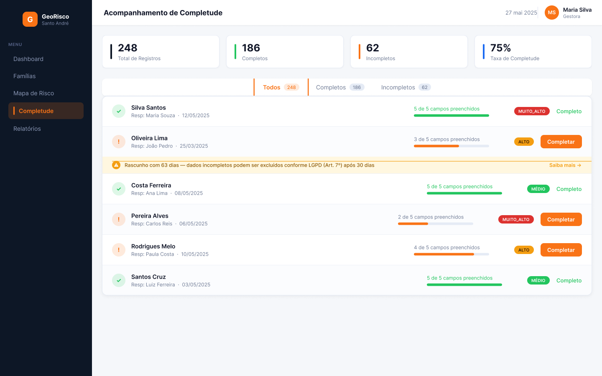
  <p>Fonte: Material produzido pelos autores (2026)</p>
</div>

---

### Fluxo de Navegacao

O fluxo de navegacao do prototipo foi projetado para visualizar o panorama geral, detalhar registros e atualizar dados incompletos.

<div align="center">
  <p><strong>Figura 22: Fluxo de Navegacao Web do GeoRisco Santo Andre</strong></p>
  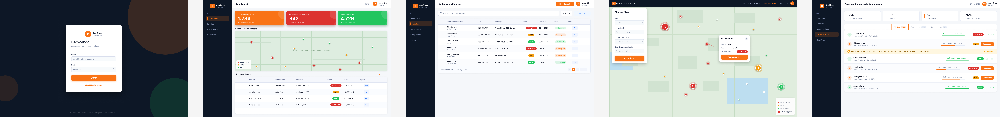
  <p>Fonte: Material produzido pelos autores (2026)</p>
</div>

O diagrama acima representa as conexoes entre telas e os gatilhos de transicao. O resumo das transicoes principais:

| Tela de Origem | Acao do Usuario | Tela de Destino |
|---|---|---|
| Dashboard | "Ver todos" ou "Ver" | Lista de Cadastros |
| Dashboard | "Mapa de Risco" | Mapa Georreferenciado |
| Dashboard | "Relatorios" | Acompanhamento de Completude |
| Mapa Georreferenciado | "Ver cadastro" no popover | Lista de Cadastros |
| Completude | "Completar" | Lista de Cadastros (edicao) |
| Completude | "Dashboard" | Dashboard |

O arquivo Figma com o fluxo navegável completo está disponível na página "Fluxo Web Navegável". A referência
local complementar está em [`documentos/outros/figma-link.md`](outros/figma-link.md).

## 3.6. Modelagem do banco de dados (sprints 2 e 4)

### 3.6.1. Modelo Entidade-Relacionamento (ER)

O modelo vigente possui sete tabelas: `setor`, `cadastrador`, `casa`, `nucleo_familiar`, `individuo`,
`vulnerabilidade` e `individuo_vulnerabilidade`. As chaves primárias são numéricas, geradas com
`BIGINT GENERATED BY DEFAULT AS IDENTITY`.

Relacionamentos vigentes:

- um setor possui zero ou muitas casas;
- uma casa pertence a exatamente um setor e possui zero ou muitos núcleos familiares;
- um núcleo familiar pertence a exatamente uma casa e a exatamente um cadastrador;
- um núcleo possui zero ou muitos indivíduos e pode indicar um deles como chefe familiar;
- indivíduos e vulnerabilidades possuem relação muitos-para-muitos por `individuo_vulnerabilidade`.

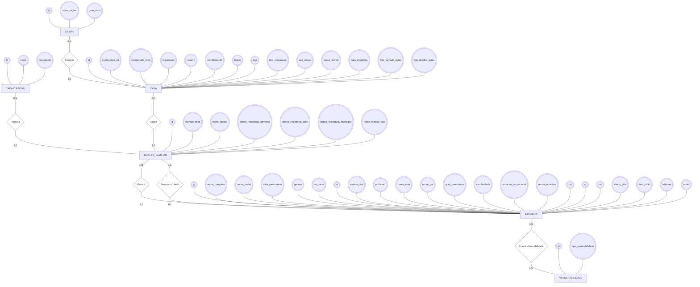
```mermaid
flowchart TD
    %% ==========================================
    %% 1. ENTIDADES (Retângulos)
    %% ==========================================
    SETOR[SETOR]
    CADASTRADOR[CADASTRADOR]
    CASA[CASA]
    NUCLEO[NUCLEO_FAMILIAR]
    INDIVIDUO[INDIVIDUO]
    VULNERABILIDADE[VULNERABILIDADE]

    %% ==========================================
    %% 2. RELACIONAMENTOS (Losangos) e CARDINALIDADES
    %% ==========================================
    R_CONTEM{Contém}
    R_REGISTRA{Registra}
    R_ABRIGA{Abriga}
    R_POSSUI{Possui}
    R_CHEFE{Tem como chefe}
    R_VULN{Possui Vulnerabilidade}

    SETOR ---|0,N| R_CONTEM
    R_CONTEM ---|1,1| CASA

    CADASTRADOR ---|0,N| R_REGISTRA
    R_REGISTRA ---|1,1| NUCLEO

    CASA ---|0,N| R_ABRIGA
    R_ABRIGA ---|1,1| NUCLEO

    NUCLEO ---|1,N| R_POSSUI
    R_POSSUI ---|1,1| INDIVIDUO

    %% Relacionamento Cíclico
    NUCLEO ---|1,1| R_CHEFE
    R_CHEFE ---|0,1| INDIVIDUO

    INDIVIDUO ---|1,N| R_VULN
    R_VULN ---|1,N| VULNERABILIDADE

    %% ==========================================
    %% 3. ATRIBUTOS (Elipses)
    %% ==========================================
    
    %% Atributos: SETOR
    S1(((<u>id</u>))) --- SETOR
    S2(((nome_regiao))) --- SETOR
    S3(((grau_risco))) --- SETOR

    %% Atributos: CADASTRADOR
    C1(((<u>id</u>))) --- CADASTRADOR
    C2(((nome))) --- CADASTRADOR
    C3(((documento))) --- CADASTRADOR

    %% Atributos: VULNERABILIDADE
    V1(((<u>id</u>))) --- VULNERABILIDADE
    V2(((tipo_vulnerabilidade))) --- VULNERABILIDADE

    %% Atributos: CASA
    CA1(((<u>id</u>))) --- CASA
    CA2(((coordenada_lat))) --- CASA
    CA3(((coordenada_long))) --- CASA
    CA4(((logradouro))) --- CASA
    CA5(((numero))) --- CASA
    CA6(((complemento))) --- CASA
    CA7(((bairro))) --- CASA
    CA8(((cep))) --- CASA
    CA9(((tipo_construcao))) --- CASA
    CA10(((uso_imovel))) --- CASA
    CA11(((status_imovel))) --- CASA
    CA12(((data_interdicao))) --- CASA
    CA13(((foto_fachada_bytes))) --- CASA
    CA14(((foto_detalhe_bytes))) --- CASA

    %% Atributos: NUCLEO_FAMILIAR
    N1(((<u>id</u>))) --- NUCLEO
    N2(((numero_ficha))) --- NUCLEO
    N3(((nome_nucleo))) --- NUCLEO
    N4(((tempo_residencia_domicilio))) --- NUCLEO
    N5(((tempo_residencia_area))) --- NUCLEO
    N6(((tempo_residencia_municipio))) --- NUCLEO
    N7(((renda_familiar_total))) --- NUCLEO

    %% Atributos: INDIVIDUO
    I1(((<u>id</u>))) --- INDIVIDUO
    I2(((nome_completo))) --- INDIVIDUO
    I3(((nome_social))) --- INDIVIDUO
    I4(((data_nascimento))) --- INDIVIDUO
    I5(((genero))) --- INDIVIDUO
    I6(((cor_raca))) --- INDIVIDUO
    I7(((uf))) --- INDIVIDUO
    I8(((estado_civil))) --- INDIVIDUO
    I9(((profissao))) --- INDIVIDUO
    I10(((nome_mae))) --- INDIVIDUO
    I11(((nome_pai))) --- INDIVIDUO
    I12(((grau_parentesco))) --- INDIVIDUO
    I13(((escolaridade))) --- INDIVIDUO
    I14(((situacao_ocupacional))) --- INDIVIDUO
    I15(((renda_individual))) --- INDIVIDUO
    I16(((cpf))) --- INDIVIDUO
    I17(((rg))) --- INDIVIDUO
    I18(((nis))) --- INDIVIDUO
    I19(((status_vital))) --- INDIVIDUO
    I20(((data_obito))) --- INDIVIDUO
    I21(((telefone))) --- INDIVIDUO
    I22(((email))) --- INDIVIDUO

    %% ==========================================
    %% 4. ESTILIZAÇÃO DOS LOSANGOS
    %% ==========================================
    style R_CONTEM fill:#fff,stroke:#333
    style R_REGISTRA fill:#fff,stroke:#333
    style R_ABRIGA fill:#fff,stroke:#333
    style R_POSSUI fill:#fff,stroke:#333
    style R_CHEFE fill:#fff,stroke:#333
    style R_VULN fill:#fff,stroke:#333
```

#### **Descrição das entidades**  

#### **Setor**

Representa a divisão geográfica/territorial monitorada pela Defesa Civil e o seu respectivo nível de perigo.

* **Chave Primária:** `id`
* **Atributos:** `nome_regiao`, `grau_risco` (com restrição para Baixo, Médio, Alto, Muito Alto).

#### **Cadastrador**

O agente de campo responsável por realizar as entrevistas e aplicar os censos/vistorias.

* **Chave Primária:** `id`
* **Atributos:** `nome`, `documento` (com validação de formato via Regex).

#### **Casa**

O imóvel físico estrutural localizado em um setor específico.

* **Chave Primária:** `id`
* **Chave Estrangeira:** `id_setor` (Aponta para `Setor`)
* **Atributos:** Dados de localização (coordenadas, logradouro, cep), características estruturais (tipo de construção, uso), situação da estrutura (status, data de interdição) e mídias anexadas (fotos).

#### **Núcleo Familiar**

O agrupamento social de moradores que cohabitam a mesma residência.

* **Chave Primária:** `id`
* **Chaves Estrangeiras:** * `id_casa` (Aponta para `Casa`)
* `id_cadastrador` (Aponta para `Cadastrador`)
* `id_chefe_familia` (Aponta para `Individuo` - *Permite Nulo inicialmente*)


* **Atributos:** `numero_ficha`, `nome_nucleo`, tempos de residência e renda somada do grupo.

#### **Indivíduo**

Cada cidadão/morador pertencente a um núcleo familiar.

* **Chave Primária:** `id`
* **Chave Estrangeira:** `id_nucleo_familiar` (Aponta para `Nucleo_Familiar`)
* **Atributos:** Dados demográficos e pessoais (nome, documentos únicos como CPF/NIS, profissão, escolaridade, contato, filiação e estado vital).

#### **Vulnerabilidade**

Dicionário de condições especiais de risco ou atenção social (Ex: Gestante, Cadeirante, Idoso).

* **Chave Primária:** `id`
* **Atributos:** `tipo_vulnerabilidade` (Único).


#### Relacionamentos e Cardinalidades

* **SETOR (1) ---- (N) CASA**
* *Regra:* Um setor da Defesa Civil pode conter **várias (N)** casas mapeadas, mas uma casa pertence obrigatoriamente a **apenas um (1)** setor.
* *Comportamento:* Restringe a exclusão do setor se houver casas vinculadas (`ON DELETE RESTRICT`).


* **CASA (1) ---- (N) NUCLEO_FAMILIAR**
* *Regra:* Uma casa física pode abrigar **um ou mais (N)** núcleos familiares (ex: duas famílias dividindo o mesmo lote/imóvel). Cada núcleo familiar está associado a **apenas uma (1)** casa.


* **CADASTRADOR (1) ---- (N) NUCLEO_FAMILIAR**
* *Regra:* Um agente cadastrador pode preencher e ser responsável por **vários (N)** cadastros de núcleos familiares. Cada ficha de núcleo familiar foi aberta por **apenas um (1)** cadastrador.


* **NUCLEO_FAMILIAR (1) ---- (N) INDIVIDUO**
* *Regra:* Um núcleo familiar é composto por **um ou múltiplos (N)** indivíduos. Um indivíduo só pode fazer parte de **um (1)** núcleo familiar por vez no sistema.
* *Comportamento:* Se o núcleo familiar for deletado, todos os indivíduos vinculados a ele são apagados automaticamente em cascata (`ON DELETE CASCADE`).


* **VÍNCULO CÍCLICO: NUCLEO_FAMILIAR (1) ---- (0..1) INDIVIDUO (Chefe de Família)**
* *Regra:* Um núcleo familiar aponta para **um (1)** indivíduo específico que desempenha o papel de Chefe de Família. Por sua vez, esse indivíduo é o chefe de **no máximo um** núcleo.
* *Comportamento:* Se o indivíduo que é chefe for deletado, o campo na tabela do núcleo familiar passa a ser nulo (`ON DELETE SET NULL`), quebrando o ciclo para evitar erros de deleção.


* **INDIVIDUO (N) ---- (M) VULNERABILIDADE**
* *Regra:* Relacionamento Muitos-para-Muitos. Um indivíduo pode carregar **nenhuma ou várias (M)** vulnerabilidades cadastradas, e uma vulnerabilidade específica pode atingir **vários (N)** indivíduos.
* *Implementação:* Resolvido pela tabela pivô `individuo_vulnerabilidade`. Se o indivíduo ou a vulnerabilidade forem excluídos, os registros de ligação na tabela pivô somem automaticamente (`ON DELETE CASCADE`).

### 3.6.2. Diagrama Entidade-Relacionamento (DER) (sprint 2)

O Diagrama Entidade-Relacionamento complementa o MER ao apresentar a estrutura do banco de dados com notacao mais proxima da implementacao fisica. O DER usa a notacao de pe-de-galinha (crow's foot notation) para representar cardinalidades de forma mais legivel: a extremidade com multiplos tracos indica "muitos" e a extremidade com traco unico indica "um". Linhas verticais junto a extremidade indicam obrigatoriedade; circulos indicam opcionalidade.

**Relacoes representadas no DER e suas cardinalidades:**

- `setor` para `casa`: um setor mapeia zero ou mais casas; cada casa pertence a exatamente um setor (1:N)
- `casa` para `nucleo_familiar`: uma casa abriga zero ou mais nucleos familiares; cada nucleo referencia exatamente uma casa via `id_casa` (1:N)
- `cadastrador` para `nucleo_familiar`: um cadastrador registra zero ou mais nucleos; cada nucleo foi cadastrado por exatamente um cadastrador (1:N)
- `nucleo_familiar` para `individuo`: um nucleo compoe um ou mais individuos; cada individuo pertence a exatamente um nucleo via `id_nucleo_familiar` (1:N)
- `individuo` para `nucleo_familiar` (chefe): um individuo pode ser chefe de zero ou um nucleo (`id_chefe_familia` e opcional, FK para `individuo.id`) (0..1:N)
- `individuo` para `individuo_vulnerabilidade`: um individuo pode ter zero ou mais vulnerabilidades associadas (1:N no lado pivô)
- `vulnerabilidade` para `individuo_vulnerabilidade`: um tipo de vulnerabilidade pode ser atribuido a zero ou mais individuos (1:N no lado pivô)

<div align="center">
  <p><strong>Figura 24: Diagrama Entidade-Relacionamento (DER)</strong></p>
  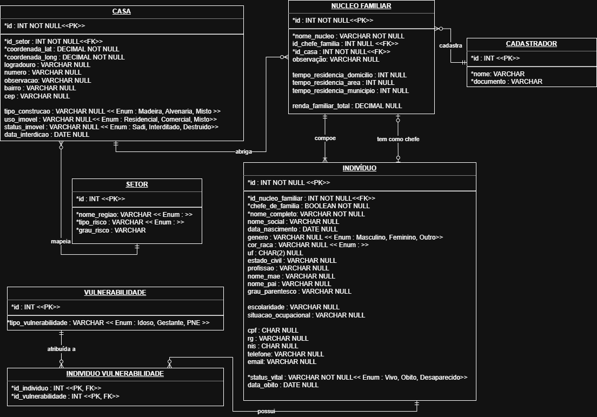
  <p>Fonte: Material produzido pelos autores (2026)</p>
</div>

Todas as tabelas utilizam `id INT NOT NULL` como chave primaria com auto-incremento — nao ha mais uso de UUIDs. Chaves estrangeiras sao identificadas pelo prefixo `id_` e pela linha de relacionamento que as conecta a tabela de origem. A tabela pivô `individuo_vulnerabilidade` possui chave primaria composta por `id_individuo` e `id_vulnerabilidade`, garantindo que um mesmo individuo nao receba o mesmo tipo de vulnerabilidade duas vezes. O campo `chefe_de_familia` em `individuo` e um booleano; a FK `nucleo_familiar.id_chefe_familia` aponta de volta para `individuo.id`, formando uma dependencia circular gerenciada pela ordem de insercao (nucleo criado primeiro, chefe atualizado depois).

### 3.6.3. Modelo Relacional e Modelo Físico (sprints 2 e 4)

O contrato físico vigente é definido por `documentos/migrations/001_completar_requisitos_funcionais.sql` e,
para atualização de bancos antigos, `documentos/migrations/002_exigir_documento_cadastrador.sql`. O backend
acessa essas tabelas pelos repositories e pelos tipos declarados em `src/database/SupabaseSchema.ts`.

#### Modelo Relacional Vigente

```text
SETOR (id PK, nome_regiao, grau_risco)
CADASTRADOR (id PK, nome, documento)
CASA (id PK, id_setor FK, coordenada_lat, coordenada_long, logradouro, numero,
      complemento, bairro, cep, tipo_construcao, uso_imovel, status_imovel,
      data_interdicao, foto_fachada_bytes, foto_detalhe_bytes)
NUCLEO_FAMILIAR (id PK, numero_ficha, nome_nucleo, id_casa FK, id_cadastrador FK,
                 id_chefe_familia FK, tempo_residencia_domicilio,
                 tempo_residencia_area, tempo_residencia_municipio,
                 renda_familiar_total)
INDIVIDUO (id PK, id_nucleo_familiar FK, nome_completo, nome_social, data_nascimento,
           genero, cor_raca, uf, estado_civil, profissao, nome_mae, nome_pai,
           grau_parentesco, escolaridade, situacao_ocupacional, renda_individual,
           cpf, rg, nis, status_vital, data_obito, telefone, email)
VULNERABILIDADE (id PK, tipo_vulnerabilidade)
INDIVIDUO_VULNERABILIDADE (id_individuo PK/FK, id_vulnerabilidade PK/FK)
```

#### Cardinalidades e Relacionamentos

| Origem | Destino | Cardinalidade | Implementação física |
|---|---|---|---|
| `setor` | `casa` | 1:N | `casa.id_setor NOT NULL` |
| `casa` | `nucleo_familiar` | 1:N | `nucleo_familiar.id_casa NOT NULL` |
| `cadastrador` | `nucleo_familiar` | 1:N | `nucleo_familiar.id_cadastrador NOT NULL` |
| `nucleo_familiar` | `individuo` | 1:N | `individuo.id_nucleo_familiar NOT NULL` |
| `nucleo_familiar` | indivíduo chefe | N:0..1 | `nucleo_familiar.id_chefe_familia NULL`; a unicidade do chefe não é imposta pelo banco |
| `individuo` | `vulnerabilidade` | N:N | tabela pivô `individuo_vulnerabilidade` |

A FK de chefe familiar é adicionada após a criação de `individuo`, pois existe uma dependência cíclica: o
indivíduo precisa pertencer ao núcleo, enquanto o núcleo pode referenciar um indivíduo como chefe.

#### Estrutura Física por Tabela

| Tabela | PK | FKs | Campos obrigatórios principais | Restrições e padrões |
|---|---|---|---|---|
| `setor` | `id BIGINT IDENTITY` | — | `nome_regiao` | `grau_risco` aceita `Baixo`, `Médio`, `Alto` ou `Muito Alto` |
| `cadastrador` | `id BIGINT IDENTITY` | — | `nome`, `documento` | documento no formato `123.456-7` |
| `casa` | `id BIGINT IDENTITY` | `id_setor` | coordenadas, endereço, construção e uso | enums de construção, uso e status; status padrão `Sadi` |
| `nucleo_familiar` | `id BIGINT IDENTITY` | `id_casa`, `id_cadastrador`, `id_chefe_familia` | `nome_nucleo`, casa e cadastrador | chefe opcional; renda familiar padrão `0.00` |
| `individuo` | `id BIGINT IDENTITY` | `id_nucleo_familiar` | nome, nascimento, gênero e núcleo | CPF/NIS únicos; status vital padrão `Vivo` |
| `vulnerabilidade` | `id BIGINT IDENTITY` | — | `tipo_vulnerabilidade` | tipo único |
| `individuo_vulnerabilidade` | PK composta | indivíduo e vulnerabilidade | as duas FKs | impede associação duplicada |

As exclusões são físicas.

#### Integridade Referencial e Exclusões

| Relacionamento | Regra de exclusão | Efeito |
|---|---|---|
| setor → casa | `RESTRICT` | setor com casa vinculada não pode ser removido |
| casa → núcleo familiar | `RESTRICT` | casa com núcleo vinculado não pode ser removida |
| cadastrador → núcleo familiar | `RESTRICT` | preserva o cadastrador responsável pelo núcleo |
| núcleo familiar → indivíduo | `CASCADE` | excluir núcleo remove seus indivíduos |
| indivíduo chefe → núcleo familiar | `SET NULL` | excluir o chefe limpa `id_chefe_familia` |
| indivíduo/vulnerabilidade → associação | `CASCADE` | excluir uma ponta remove suas associações |

#### Migrations Vigentes

| Arquivo | Uso correto |
|---|---|
| `001_completar_requisitos_funcionais.sql` | Criação do schema atual em banco vazio. Cria as sete tabelas, FKs, chaves, `CHECKs`, unicidade de CPF/NIS e campos binários de foto. |
| `002_exigir_documento_cadastrador.sql` | Correção de banco antigo para tornar `cadastrador.documento` obrigatório e validar o formato. Não deve ser executada após uma instalação nova feita pela migration 001. |

Antes de executar a migration 002, todos os cadastradores existentes devem possuir documento válido no formato
`123.456-7`. As migrations não usam `IF NOT EXISTS` e não são idempotentes.

#### Constraints e Regras de Integridade Aplicadas

| Constraint | Tabela | Descrição |
|---|---|---|
| **PRIMARY KEY (`BIGINT IDENTITY`)** | `setor`, `cadastrador`, `casa`, `nucleo_familiar`, `individuo` e `vulnerabilidade` | Identificação numérica única de cada registro, gerada pelo banco |
| **PRIMARY KEY composta** | `individuo_vulnerabilidade` | Impede que a mesma vulnerabilidade seja associada mais de uma vez ao mesmo indivíduo |
| **FOREIGN KEY** | `casa.id_setor` → `setor.id` | Vincula cada casa a um setor existente |
| **FOREIGN KEY** | `nucleo_familiar.id_casa` → `casa.id` | Vincula cada núcleo familiar a uma casa existente |
| **FOREIGN KEY** | `nucleo_familiar.id_cadastrador` → `cadastrador.id` | Registra o cadastrador responsável pela criação do núcleo |
| **FOREIGN KEY** | `nucleo_familiar.id_chefe_familia` → `individuo.id` | Permite indicar opcionalmente um indivíduo como chefe familiar |
| **FOREIGN KEY** | `individuo.id_nucleo_familiar` → `nucleo_familiar.id` | Garante que cada indivíduo pertença a um núcleo familiar existente |
| **FOREIGN KEY** | `individuo_vulnerabilidade` → `individuo` e `vulnerabilidade` | Vincula indivíduos às vulnerabilidades cadastradas |
| **UNIQUE** | `individuo.cpf`, `individuo.nis` | Impede a repetição de CPF e NIS quando informados |
| **UNIQUE** | `vulnerabilidade.tipo_vulnerabilidade` | Impede o cadastro duplicado do mesmo tipo de vulnerabilidade |
| **NOT NULL** | `setor` e `cadastrador` | Exige o nome da região, o nome do cadastrador e seu documento |
| **NOT NULL** | `casa` | Exige setor, coordenadas, endereço, tipo de construção, uso e status do imóvel |
| **NOT NULL** | `nucleo_familiar` | Exige nome do núcleo, casa, cadastrador e renda familiar total |
| **NOT NULL** | `individuo` | Exige núcleo familiar, nome, data de nascimento, gênero e status vital |
| **CHECK** | `setor.grau_risco` | Aceita somente `Baixo`, `Médio`, `Alto` ou `Muito Alto` |
| **CHECK** | `cadastrador.documento` | Exige documento no formato `123.456-7` |
| **CHECK** | `casa` | Restringe tipo de construção, uso e status do imóvel aos valores previstos |
| **CHECK** | `individuo` | Restringe gênero, cor/raça e status vital aos valores previstos |
| **DEFAULT** | `casa.status_imovel` | Define `Sadi` como status inicial |
| **DEFAULT** | `nucleo_familiar.renda_familiar_total` e `individuo.renda_individual` | Define `0.00` como renda inicial |
| **DEFAULT** | `individuo.status_vital` | Define `Vivo` como status inicial |
| **ON DELETE RESTRICT** | `setor` → `casa`, `casa` → `nucleo_familiar` e `cadastrador` → `nucleo_familiar` | Impede a exclusão do registro de origem enquanto existirem dependências |
| **ON DELETE CASCADE** | `nucleo_familiar` → `individuo` | Excluir um núcleo familiar remove seus indivíduos |
| **ON DELETE CASCADE** | `individuo` ou `vulnerabilidade` → `individuo_vulnerabilidade` | Excluir uma das pontas remove suas associações |
| **ON DELETE SET NULL** | `individuo` chefe → `nucleo_familiar.id_chefe_familia` | Excluir o indivíduo indicado como chefe limpa a referência no núcleo |

O banco não garante que o chefe indicado pertença ao mesmo núcleo, tenha pelo menos 18 anos ou seja referenciado
por somente um núcleo. Essas regras são verificadas pela camada de Services.

#### Validações Fora do Banco

Algumas regras são garantidas atualmente pelos Services, mas ainda não possuem `CHECK`, trigger ou constraint
específica no PostgreSQL:

- limites de latitude e longitude;
- renda individual e familiar não negativas;
- coerência entre status do imóvel e data de interdição;
- coerência entre status vital e data de óbito;
- chefe pertencente ao próprio núcleo e com idade mínima de 18 anos;
- imutabilidade de `nucleo_familiar.id_cadastrador` após a criação.

Também não existem índices adicionais de busca além dos índices gerados implicitamente pelas PKs e restrições
`UNIQUE`. Novas constraints e índices devem ser adicionados por migrations numeradas futuras.

### 3.6.4. Operações de Persistência Implementadas

O backend não mantém consultas SQL escritas diretamente no código. A persistência é executada pelos Repositories
com o cliente Supabase, utilizando operações estruturadas sobre as sete tabelas do modelo atual.

| Repository | Tabelas acessadas | Operações implementadas |
|---|---|---|
| `CadastradorRepository` | `cadastrador` | Listar, consultar por ID, inserir, atualizar campos informados e excluir |
| `SetorRepository` | `setor` | Listar, consultar por ID, inserir, atualizar campos informados e excluir |
| `CasaRepository` | `casa` | Listar, consultar por ID, inserir, atualizar campos informados e excluir |
| `NucleoFamiliarRepository` | `nucleo_familiar` | Listar, consultar por ID, inserir, atualizar campos informados e excluir |
| `IndividuoRepository` | `individuo` | Listar, consultar por ID, listar por núcleo, verificar duplicidade, inserir, atualizar e excluir |
| `VulnerabilidadeRepository` | `vulnerabilidade`, `individuo_vulnerabilidade` | CRUD do catálogo, listar por indivíduo, associar e desassociar vulnerabilidades |
| `NucleoFamiliarConsultaRepository` | `nucleo_familiar`, `casa` | Obter a casa do núcleo e o setor vinculado à casa |

#### Consultas Relacionais

As consultas relacionais implementadas utilizam os vínculos atuais do banco:

| Consulta | Caminho percorrido |
|---|---|
| Indivíduos de um núcleo | Filtra `individuo` por `id_nucleo_familiar` |
| Casa de um núcleo | Consulta `nucleo_familiar.id_casa` |
| Setor de um núcleo | Consulta `nucleo_familiar.id_casa` e depois `casa.id_setor` |
| Vulnerabilidades de um indivíduo | Consulta os IDs em `individuo_vulnerabilidade` e busca os registros em `vulnerabilidade` |

O acesso ao setor ocorre em duas consultas, pois o Repository primeiro identifica a casa vinculada ao núcleo e,
em seguida, identifica o setor vinculado à casa. Não há consulta consolidada com `JOIN` implementada no backend.

#### Verificação de Duplicidade

Antes da criação ou atualização de um indivíduo, o `IndividuoRepository` procura um registro com o mesmo CPF ou
NIS e limita o resultado a uma ocorrência. Na atualização, o ID do próprio indivíduo é excluído da verificação.
As constraints `UNIQUE` de `individuo.cpf` e `individuo.nis` também impedem duplicidades na persistência.

#### Escrita e Exclusão

As inserções e atualizações retornam o registro persistido. Nas atualizações, somente os campos recebidos são
enviados ao Supabase. As exclusões são físicas e obedecem às regras de integridade referencial definidas pelas
migrations vigentes.

## 3.7. WebAPI e endpoints (sprints 3 e 4)

### Visao geral da API

A WebAPI do GeoRisco Santo Andre foi implementada como uma API REST em Express, com versionamento por prefixo de rota e persistencia no Supabase. A documentacao tecnica navegavel e gerada no padrao OpenAPI Specification 3.0, a partir dos comentarios `@swagger` mantidos nos arquivos de rotas e dos schemas definidos com Zod.

**Base URL local:** `http://localhost:<porta>/api/v1`

**Base URL em producao:** `https://<dominio>/api/v1`

**Formato dos corpos:** `application/json`

**Versionamento:** todos os recursos funcionais da API estao sob o prefixo `/api/v1`.

**Documentacao OpenAPI:**

- **Swagger UI:** `GET /api-docs/`
- **Especificacao JSON:** `GET /openapi.json`

A pagina do Swagger UI e uma documentacao tecnica da WebAPI. Ela nao e interface final do usuario. Sua finalidade e permitir que desenvolvedores, avaliadores e integrantes do projeto consultem os endpoints, schemas, parametros, exemplos de requisicao e respostas possiveis.

---

### Headers relevantes

Requisições com corpo JSON devem enviar:

```http
Content-Type: application/json
```

O middleware CORS permite acesso do frontend e responde ao preflight `OPTIONS`.

---

### Convencoes de resposta

As respostas de sucesso seguem o envelope padronizado por `src/views/responseFormatter.ts`:

```json
{
  "success": true,
  "data": {},
  "message": "Operacao realizada com sucesso."
}
```

As respostas de erro seguem o envelope:

```json
{
  "success": false,
  "error": "Payload invalido: cpf",
  "statusCode": 400
}
```

---

### Documentação Interativa da API

A documentação navegável e interativa é gerada pelo Swagger UI em `GET /api-docs/`.
A especificação OpenAPI utilizada pela interface está disponível em `GET /openapi.json`.

---

### Núcleos familiares

O prefixo canônico é `/api/v1/nucleos-familiares`.
Não há headers protegidos nem paginação no código vigente.

| Metodo | Endereco | Entrada | Resposta | RF |
|---|---|---|---|---|
| `GET` | `/api/v1/nucleos-familiares` | Sem entrada | Lista de núcleos | RF004 |
| `GET` | `/api/v1/nucleos-familiares/{id}` | ID numérico no path | Núcleo encontrado | RF004, RF011, RF012 |
| `POST` | `/api/v1/nucleos-familiares` | Body `CreateNucleoFamiliar` | Núcleo criado | RF004, RF012 |
| `PUT` | `/api/v1/nucleos-familiares/{id}` | ID e body `UpdateNucleoFamiliar` | Núcleo atualizado | RF004, RF006 |
| `DELETE` | `/api/v1/nucleos-familiares/{id}` | ID numérico no path | Núcleo removido | RF004 |

Status possíveis: `200`, `201`, `400`, `404`, `409`, `422`, `500`.

---

### Indivíduos

O recurso canônico é `/api/v1/individuos`.

| Metodo | Endereco | Entrada | Resposta | RF |
|---|---|---|---|---|
| `GET` | `/api/v1/individuos` | Sem entrada | Lista de indivíduos | RF005 |
| `GET` | `/api/v1/individuos/nucleos-familiares/{nucleoFamiliarId}` | ID do núcleo no path | Indivíduos do núcleo | RF008 |
| `GET` | `/api/v1/individuos/{id}` | ID numérico no path | Indivíduo encontrado | RF005, RF011 |
| `POST` | `/api/v1/individuos` | Body `CreateIndividuo` | Indivíduo criado | RF005, RF010 |
| `PUT` | `/api/v1/individuos/{id}` | ID e body `UpdateIndividuo` | Indivíduo atualizado | RF005, RF010, RF011 |
| `DELETE` | `/api/v1/individuos/{id}` | ID numérico no path | Indivíduo removido | RF005 |

Status possíveis: `200`, `201`, `400`, `404`, `409`, `422`, `500`.

---

### Casas

O recurso canônico é `/api/v1/casas`.

| Metodo | Endereco | Entrada | Resposta | RF |
|---|---|---|---|---|
| `GET` | `/api/v1/casas` | Sem entrada | Lista de casas | RF003, RF013 |
| `GET` | `/api/v1/casas/nucleos-familiares/{nucleoFamiliarId}` | ID do núcleo no path | Casa relacionada ao núcleo | RF008 |
| `GET` | `/api/v1/casas/{id}` | ID numérico no path | Casa encontrada | RF003, RF011, RF013 |
| `POST` | `/api/v1/casas` | Body `CreateCasa` | Casa criada | RF003, RF013 |
| `PUT` | `/api/v1/casas/{id}` | ID e body `UpdateCasa` | Casa atualizada | RF003, RF011, RF013 |
| `DELETE` | `/api/v1/casas/{id}` | ID numérico no path | Casa removida | RF003 |

Status possíveis: `200`, `201`, `400`, `404`, `409`, `422`, `500`.

---

### Setores de risco

O recurso canônico é `/api/v1/setores`. Os campos vigentes são
`nome_regiao` e `grau_risco`, cujos valores aceitos são `Baixo`, `Médio`, `Alto` e `Muito Alto`.

| Metodo | Endereco | Entrada | Resposta | RF |
|---|---|---|---|---|
| `GET` | `/api/v1/setores` | Sem entrada | Lista de setores | RF002 |
| `GET` | `/api/v1/setores/nucleos-familiares/{nucleoFamiliarId}` | ID do núcleo no path | Setor relacionado ao núcleo | RF008 |
| `GET` | `/api/v1/setores/{id}` | ID numérico no path | Setor encontrado | RF002 |
| `POST` | `/api/v1/setores` | Body `CreateSetor` | Setor criado | RF002 |
| `PUT` | `/api/v1/setores/{id}` | ID e body `UpdateSetor` | Setor atualizado | RF002 |
| `DELETE` | `/api/v1/setores/{id}` | ID numérico no path | Setor removido | RF002 |

Status possíveis: `200`, `201`, `400`, `404`, `409`, `422`, `500`.

---

### Vulnerabilidades

Vulnerabilidade é um catálogo com `tipo_vulnerabilidade`, associado a indivíduos por relação N:N.
Não há vínculo direto entre vulnerabilidade e núcleo familiar.

| Metodo | Endereco | Entrada | Resposta | RF |
|---|---|---|---|---|
| `GET` | `/api/v1/vulnerabilidades` | Sem entrada | Lista de vulnerabilidades | RF007 |
| `GET` | `/api/v1/vulnerabilidades/individuos/{individuoId}` | ID do indivíduo no path | Vulnerabilidades do indivíduo | RF007, RF008 |
| `GET` | `/api/v1/vulnerabilidades/{id}` | ID numérico no path | Vulnerabilidade encontrada | RF007 |
| `POST` | `/api/v1/vulnerabilidades` | Body `CreateVulnerabilidade` | Vulnerabilidade criada | RF007 |
| `PUT` | `/api/v1/vulnerabilidades/{id}` | ID e body `UpdateVulnerabilidade` | Vulnerabilidade atualizada | RF007 |
| `DELETE` | `/api/v1/vulnerabilidades/{id}` | ID numérico no path | Vulnerabilidade removida | RF007 |
| `POST` | `/api/v1/vulnerabilidades/individuos/{individuoId}/{vulnerabilidadeId}` | IDs no path | Associação criada | RF007 |
| `DELETE` | `/api/v1/vulnerabilidades/individuos/{individuoId}/{vulnerabilidadeId}` | IDs no path | Associação removida | RF007 |

Status possíveis: `200`, `201`, `400`, `404`, `409`, `422`, `500`.

---

### Resumo dos endpoints implementados

**Contrato vigente**

Todos os parâmetros `:id`, `:nucleoFamiliarId`, `:individuoId` e `:vulnerabilidadeId` são IDs numéricos
positivos. As listagens atuais ainda não aceitam paginação, ordenação ou filtros.

| Método | Endpoint | RF | Finalidade |
|---|---|---|---|
| `GET` | `/health` | Apoio | Verificar se o servidor está operacional |
| `GET` | `/api-docs/` | Apoio | Abrir a interface Swagger UI |
| `GET` | `/openapi.json` | Apoio | Obter a especificação OpenAPI |
| `GET` | `/api/v1/cadastradores` | RF001 | Listar cadastradores |
| `GET` | `/api/v1/cadastradores/:id` | RF001 | Consultar cadastrador |
| `POST` | `/api/v1/cadastradores` | RF001 | Criar cadastrador |
| `PUT` | `/api/v1/cadastradores/:id` | RF001 | Atualizar cadastrador |
| `DELETE` | `/api/v1/cadastradores/:id` | RF001 | Remover cadastrador sem núcleo vinculado |
| `GET` | `/api/v1/setores` | RF002 | Listar setores |
| `GET` | `/api/v1/setores/:id` | RF002 | Consultar setor |
| `GET` | `/api/v1/setores/nucleos-familiares/:nucleoFamiliarId` | RF008 | Consultar setor relacionado ao núcleo |
| `POST` | `/api/v1/setores` | RF002 | Criar setor |
| `PUT` | `/api/v1/setores/:id` | RF002 | Atualizar setor |
| `DELETE` | `/api/v1/setores/:id` | RF002 | Remover setor sem casa vinculada |
| `GET` | `/api/v1/casas` | RF003, RF013 | Listar casas e suas fotos armazenadas |
| `GET` | `/api/v1/casas/:id` | RF003, RF011, RF013 | Consultar casa e suas fotos |
| `GET` | `/api/v1/casas/nucleos-familiares/:nucleoFamiliarId` | RF008 | Consultar casa relacionada ao núcleo |
| `POST` | `/api/v1/casas` | RF003, RF013 | Criar casa com fotos opcionais |
| `PUT` | `/api/v1/casas/:id` | RF003, RF011, RF013 | Atualizar casa ou suas fotos |
| `DELETE` | `/api/v1/casas/:id` | RF003 | Remover casa sem núcleo vinculado |
| `GET` | `/api/v1/nucleos-familiares` | RF004 | Listar núcleos familiares |
| `GET` | `/api/v1/nucleos-familiares/:id` | RF004, RF011, RF012 | Consultar núcleo e seu cadastrador responsável |
| `POST` | `/api/v1/nucleos-familiares` | RF004, RF012 | Criar núcleo com cadastrador responsável |
| `PUT` | `/api/v1/nucleos-familiares/:id` | RF004, RF006 | Atualizar núcleo ou definir chefe familiar |
| `DELETE` | `/api/v1/nucleos-familiares/:id` | RF004 | Remover núcleo e seus indivíduos por cascata |
| `GET` | `/api/v1/individuos` | RF005 | Listar indivíduos |
| `GET` | `/api/v1/individuos/:id` | RF005, RF011 | Consultar indivíduo |
| `GET` | `/api/v1/individuos/nucleos-familiares/:nucleoFamiliarId` | RF008 | Listar indivíduos do núcleo |
| `POST` | `/api/v1/individuos` | RF005, RF010 | Criar indivíduo impedindo CPF/NIS duplicado |
| `PUT` | `/api/v1/individuos/:id` | RF005, RF010, RF011 | Atualizar indivíduo impedindo CPF/NIS duplicado |
| `DELETE` | `/api/v1/individuos/:id` | RF005 | Remover indivíduo |
| `GET` | `/api/v1/vulnerabilidades` | RF007 | Listar vulnerabilidades |
| `GET` | `/api/v1/vulnerabilidades/:id` | RF007 | Consultar vulnerabilidade |
| `GET` | `/api/v1/vulnerabilidades/individuos/:individuoId` | RF007, RF008 | Listar vulnerabilidades do indivíduo |
| `POST` | `/api/v1/vulnerabilidades` | RF007 | Criar vulnerabilidade |
| `PUT` | `/api/v1/vulnerabilidades/:id` | RF007 | Atualizar vulnerabilidade |
| `DELETE` | `/api/v1/vulnerabilidades/:id` | RF007 | Remover vulnerabilidade |
| `POST` | `/api/v1/vulnerabilidades/individuos/:individuoId/:vulnerabilidadeId` | RF007 | Associar vulnerabilidade ao indivíduo |
| `DELETE` | `/api/v1/vulnerabilidades/individuos/:individuoId/:vulnerabilidadeId` | RF007 | Desassociar vulnerabilidade do indivíduo |

**Endpoints planejados**

| Método | Endpoint | RF | Situação |
|---|---|---|---|
| `GET` | `/api/v1/consultas/cadastros` | RF014 | Planejado |
| `PATCH` | `/api/v1/individuos/:id/inativacao` | RF015 | Planejado |
| `PATCH` | `/api/v1/nucleos-familiares/:id/inativacao` | RF015 | Planejado |
| `POST` | `/api/v1/cadastros-completos` | RF016 | Planejado |
| `PATCH` | `/api/v1/individuos/:id/vinculo-familiar` | RF017 | Planejado |
| `GET`, `POST`, `DELETE` | `/api/v1/individuos/:id/documentos` | RF018 | Planejado |
| `GET` | `/api/v1/relatorios/cadastros-anonimizados` | RF019 | Planejado |
| `GET` | Listagens atuais com `page`, `limit`, `orderBy` e `order` | RF020 | Planejado |
| `GET` | `/api/v1/mapa-risco/casas` | RF021 | Planejado |
| `GET` | `/api/v1/indicadores` | RF022 | Planejado |
| `GET`, `POST`, `PUT`, `DELETE` | `/api/v1/rascunhos` | RF023 | Planejado |

## 3.8. Resiliência (sprint 5)

O backend oferece health check básico, CORS e tratamento padronizado de erros. Ainda não há retry com backoff,
circuit breaker, fila offline ou garantia de idempotência para criações.

## 3.9. Matriz de Rastreabilidade (RTM) (sprints 3 a 5)

A RTM consolida a rastreabilidade completa do sistema, conectando cada requisito funcional às regras de negócio que o governam, ao endpoint que o implementa, à tela onde o usuário o acessa, aos testes que o validam e às evidências que comprovam seu funcionamento. Os endpoints abaixo seguem as rotas canônicas implementadas no backend em `src/routes`, com prefixo de execução `/api/v1`. Quando um elo ainda não está implementado no código, a lacuna é registrada explicitamente para não gerar falsa rastreabilidade.

**RTM vigente do backend**

| RF | Persona | Capacidade | Rota | Teste automatizado | Estado |
|---|---|---|---|---|---|
| RF001 | Josias (Agente de Campo) — US01 | Cadastrador e formato do IF | `/api/v1/cadastradores` | `cadastradorService.spec.ts`, `zodSchemas.spec.ts` | Implementado |
| RF002 | Cláudia (Gestora Administrativa) — configuração de setores de risco | Setor e grau de risco | `/api/v1/setores` | `setorService.spec.ts` | Implementado |
| RF003 | Josias (Agente de Campo) — US03 (registro de localização via GPS) | Casa, endereço e coordenadas | `/api/v1/casas` | `casaService.spec.ts` | Implementado |
| RF004 | Josias (Agente de Campo) — US01 | Núcleo e cadastrador responsável | `/api/v1/nucleos-familiares` | `nucleoFamiliarService.spec.ts` | Implementado |
| RF005 | Josias (Agente de Campo) — US01, US04 | Indivíduo, documentos e status vital | `/api/v1/individuos` | `individuoService.spec.ts` | Implementado |
| RF006 | Josias (Agente de Campo) — define chefe familiar no cadastro do núcleo | Definição do chefe familiar | `PUT /api/v1/nucleos-familiares/:id` | `nucleoFamiliarService.spec.ts` | Implementado |
| RF007 | Josias (Agente de Campo) — US04 (registro de vulnerabilidades) | Vulnerabilidades e associações | `/api/v1/vulnerabilidades` | `vulnerabilidadeService.spec.ts` | Implementado |
| RF008 | Cláudia (Gestora Administrativa) — US05 (visualização georreferenciada) | Consultas relacionais | Rotas relacionais de casas, setores, indivíduos e vulnerabilidades | Testes dos Services relacionados | Implementado parcialmente |
| RF009 | Ambas — validação interna a todos os fluxos de escrita | Validação e padronização | Interno em endpoints de escrita | `zodSchemas.spec.ts` e testes dos Services | Implementado parcialmente |
| RF010 | Josias (Agente de Campo) — US02 (impedir cadastros duplicados por CPF/NIS) | Prevenção de duplicidade | Interno em `POST` e `PUT /api/v1/individuos` | `individuoService.spec.ts` | Implementado |
| RF011 | Ambas — consulta usada por Josias em campo e por Cláudia na gestão | Consulta e atualização de dados | Rotas `GET /:id` e `PUT /:id` | Testes dos Services relacionados | Implementado |
| RF012 | Cláudia (Gestora Administrativa) — rastreia quem cadastrou cada núcleo | Rastreabilidade do cadastro | `GET /api/v1/nucleos-familiares/:id` | `nucleoFamiliarService.spec.ts` | Implementado |
| RF013 | Josias (Agente de Campo) — registra fotos do imóvel durante a vistoria de campo | Gestão de fotos de casas | `POST`, `GET` e `PUT /api/v1/casas` | `casaService.spec.ts`, `zodSchemas.spec.ts` | Implementado |
| RF014 | Cláudia (Gestora Administrativa) — US07 (busca e filtragem de cadastros) | Busca multicritério | `GET /api/v1/consultas/cadastros` | Pendente | Planejado |
| RF015 | Cláudia (Gestora Administrativa) — gestão administrativa de registros | Inativação de registros | Rotas de `/inativacao` | Pendente | Planejado |
| RF016 | Josias (Agente de Campo) — US01 (fluxo completo de cadastro em campo) | Cadastro completo em fluxo único | `POST /api/v1/cadastros-completos` | Pendente | Planejado |
| RF017 | Ambas — Josias atualiza composição em campo; Cláudia corrige na gestão | Atualização da composição familiar | `PATCH /api/v1/individuos/:id/vinculo-familiar` | Pendente | Planejado |
| RF018 | Josias (Agente de Campo) — anexa documentos dos moradores durante a vistoria | Gestão de documentos | `/api/v1/individuos/:id/documentos` | Pendente | Planejado |
| RF019 | Cláudia (Gestora Administrativa) — US08 (exportação de dados para relatórios) | Exportação anonimizada | `GET /api/v1/relatorios/cadastros-anonimizados` | Pendente | Planejado |
| RF020 | Cláudia (Gestora Administrativa) — US07 (navegação em grandes volumes de dados) | Paginação e ordenação | Query params nas listagens | Pendente | Planejado |
| RF021 | Cláudia (Gestora Administrativa) — US05 (painel georreferenciado de risco) | Painel georreferenciado | `GET /api/v1/mapa-risco/casas` | Pendente | Planejado |
| RF022 | Cláudia (Gestora Administrativa) — consolidação de indicadores para tomada de decisão | Indicadores e relatórios | `GET /api/v1/indicadores` | Pendente | Planejado |
| RF023 | Josias (Agente de Campo) — US06 (salvar cadastro parcial sem perder dados) | Rascunho e sincronização | `/api/v1/rascunhos` | Pendente | Planejado |
| Apoio | — | Erros esperados do PostgreSQL | Interno | `databaseErrors.spec.ts` | Implementado |
| Apoio | — | CORS e health check | `/health` e preflight | `app.spec.ts` | Implementado |

# <a name="c4"></a>4. Desenvolvimento da Aplicação Web

### 4.1. Backend implementado

O backend vigente é uma API REST em Express organizada em Routes, Controllers, Services, Repositories, DTOs e
Models. O fluxo operacional permite criar ou selecionar um cadastrador, cadastrar setor e casa, criar o núcleo
familiar, cadastrar indivíduos e associar vulnerabilidades.

A persistência utiliza Supabase/PostgreSQL com sete tabelas. A API possui validação Zod, regras de negócio nos
Services, tratamento de erros do banco, respostas padronizadas, CORS, health check e Swagger/OpenAPI.

Foram validados build, lint e 54 testes automatizados. O cadastro completo ainda exige múltiplas requisições, pois
não existe uma operação transacional única entre casa, núcleo, indivíduos e vulnerabilidades.

### 4.2. Frontend implementado

O frontend é composto por views EJS renderizadas pelo servidor (`src/views/`) e scripts JavaScript por tela em
`public/js/`. A autenticação é baseada em JWT armazenado em `localStorage`; o helper `public/js/api.js` injeta o
header `Authorization: Bearer <token>` em todas as chamadas via `apiFetch()` e redireciona para `/login` quando
o servidor retorna 401.

**Legenda de status das telas**
- `[Implementado]` — tela funcional de ponta a ponta com endpoints de backend ativos
- `[Implementado — aguarda endpoint]` — UI completa, mas o endpoint consumido ainda é planejado (RF não implementado); exibe empty state ou mensagem de erro amigável em produção sem mock
- `[Protótipo Figma]` — apenas no protótipo de alta fidelidade (seção 3.5); sem EJS correspondente

#### Telas EJS implementadas

| Rota | View EJS | Script JS | Status | Endpoint consumido | Controller / o que retorna |
|---|---|---|---|---|---|
| `/login` | `login.ejs` | `login.js` | [Implementado] | `POST /api/v1/auth/login` | `authMiddleware` → retorna `{ token, usuario }`; armazena no `localStorage` |
| `/` | `dashboard.ejs` | `dashboard.js` | [Implementado — aguarda endpoint] | `GET /api/v1/cadastros/busca` (RF014) | Filtra por nome, bairro, CPF com paginação; retorna `{ resultados, total, page, limit }` |
| `/familias` | `familias.ejs` | `familias.js` | [Implementado — aguarda endpoint] | `GET /api/v1/cadastros/busca` (RF014) | Mesma busca do dashboard com filtros de risco e completude |
| `/mapa` | `mapa.ejs` | `mapa.js` | [Implementado — aguarda endpoint] | `GET /api/v1/cadastros/mapa` (RF021) | Retorna `{ pontos: [{ lat, lng, nivel_risco, nome_familia, bairro, responsavel }] }`; renderizado via Leaflet + OpenStreetMap |
| `/completude` | `completude.ejs` | `completude.js` | [Implementado — aguarda endpoint] | `GET /api/v1/completude` (RF022/RF023) | Retorna `{ stats: { total, completos, incompletos, taxa }, items: [...] }`; exibe barra de progresso e aviso LGPD |
| `/agente/cadastro` | `agente-cadastro.ejs` | `agente-cadastro.js` | [Implementado] | `GET /api/v1/setores`, `POST /api/v1/casas`, `POST /api/v1/nucleos-familiares`, `POST /api/v1/individuos`, `PUT /api/v1/nucleos-familiares/:id` | Fluxo de 5 etapas com envio sequencial na revisão final; todos os endpoints são implementados |

#### Fluxo de cadastro completo (`/agente/cadastro`) — end-to-end implementado

O único fluxo com todas as chamadas de backend implementadas é o cadastro de família em 5 etapas:

| Etapa | Ação do usuário | Chamada de API | Dados enviados | Resposta esperada |
|---|---|---|---|---|
| 1 — Imóvel | Seleciona setor + preenche endereço + captura GPS | `GET /api/v1/setores` | — | Lista de setores para dropdown |
| 5 — Envio | Confirma revisão | `POST /api/v1/casas` | `{ id_setor, coordenada_lat, coordenada_long, logradouro, ... }` | Casa criada com `id` |
| 5 — Envio | (sequencial) | `POST /api/v1/nucleos-familiares` | `{ id_casa, id_cadastrador, nome_nucleo, renda_familiar_total }` | Núcleo criado com `id` |
| 5 — Envio | (um por membro) | `POST /api/v1/individuos` | `{ id_nucleo_familiar, nome_completo, data_nascimento, genero, cpf, ... }` | Indivíduo criado com `id` |
| 5 — Envio | (por vulnerabilidade) | `POST /api/v1/vulnerabilidades/individuos/:ind/:vuln` | IDs no path | Associação criada |
| 5 — Envio | (define chefe) | `PUT /api/v1/nucleos-familiares/:id` | `{ id_chefe_familia }` | Núcleo atualizado |

#### Telas apenas em protótipo Figma (sem EJS)

| Tela | Status | Referência |
|---|---|---|
| Dashboard com KPIs e mapa integrado | [Protótipo Figma] | Seção 3.5 — Figura 19 |
| Mapa em tela cheia com clusters | [Protótipo Figma] | Seção 3.5 — Figura 20 |
| Acompanhamento de completude com tabs | [Protótipo Figma] | Seção 3.5 — Figura 21 |

### 4.3. Próximos passos aprovados

Os próximos passos são implementar os endpoints planejados (RF014, RF021, RF022, RF023) para que as telas de
dashboard, mapa e completude passem a exibir dados reais, ampliar os testes HTTP e de integração, criar índices
conforme medições reais e implementar os requisitos planejados restantes.

### 4.4. Dificuldades encontradas e soluções aplicadas

| # | Problema encontrado | Causa identificada | Solução aplicada | Arquivo relevante |
|---|---|---|---|---|
| D01 | JWT não era enviado nas chamadas fetch entre páginas — API retornava 401 mesmo após login bem-sucedido | Cada página chamava `fetch()` diretamente sem incluir o header `Authorization` | Centralizado em `apiFetch()` no `api.js`: toda chamada injeta `Authorization: Bearer <token>` lido do `localStorage`; redirecionamento para `/login` automático no 401 | `public/js/api.js` |
| D02 | Desenvolvimento impossibilitado sem credenciais do Supabase configuradas localmente | API dependia de Supabase real para autenticação e queries; equipe sem banco configurado travava o frontend | Implementado modo mock com `MOCK_AUTH=true`: `mockRouter.ts` monta `mockAuthRoutes` e `mockApiRoutes` antes do router real, simulando login e dados de teste sem conexão com banco | `src/mocks/mockRouter.ts` |
| D03 | CPF e NIS com máscara (ex: `123.456.789-09`) eram rejeitados pela validação do backend com erro 422 | O `assertCpf()` esperava apenas dígitos; o frontend enviava o valor bruto do campo sem remover pontuação | Adicionado `sanitizeObject()` em todos os Services: remove pontuação de CPF, NIS, CEP e telefone antes de qualquer validação; `nome_completo` é normalizado para caixa alta sem acentos | `src/helpers/sanitizers.ts`, `src/services/IndividuoService.ts` |
| D04 | Banco de dados de instâncias existentes não tinha a coluna `documento` obrigatória em `cadastrador`, causando erros de FK | A migration inicial não exigia o campo; bancos criados antes da sprint 4 estavam sem a constraint | Criada `002_exigir_documento_cadastrador.sql` para corrigir bancos antigos sem executar `001` novamente; documentada a ordem de execução no WAD | `documentos/migrations/002_exigir_documento_cadastrador.sql` |
| D05 | Telas de dashboard, mapa e completude exibiam erros de console em produção porque os endpoints que consomem (RF014, RF021, RF022) ainda não estão implementados | UI construída antecipando endpoints planejados | Todas as chamadas em `apiFetch()` têm `try/catch`; em caso de falha a tela renderiza um empty state ou `showToast()` com a mensagem do servidor, sem quebrar a navegação | `public/js/dashboard.js`, `mapa.js`, `completude.js` |
| D06 | A FK circular entre `nucleo_familiar.id_chefe_familia` e `individuo.id_nucleo_familiar` impedia a criação do núcleo e do chefe na mesma operação | O núcleo exige um indivíduo como chefe, mas o indivíduo exige o núcleo existente — dependência mútua | O frontend resolve o ciclo em etapas sequenciais: cria o núcleo sem chefe → cria os indivíduos → faz `PUT` do núcleo definindo `id_chefe_familia`; o campo é `NULL` na criação e atualizado depois | `public/js/agente-cadastro.js`, `src/services/NucleoFamiliarService.ts` |
# <a name="c5"></a>5. Testes

## 5.1. Relatório de testes de integração de endpoints automatizados (sprint 4)
### 5.1.1. Estratégia de testes
### Abordagem geral
A solução segue uma estratégia de testes em camadas:

- **Service**: unitários white-box com Jest, cobrindo lógica de negócio, validações, tratamentos de exceções e branches internos.
- **Controller / Endpoint**: integração black-box via Jest + Supertest, validando contrato HTTP (status, body e efeito observável) sem depender da implementação interna.
- **Repository**: testes opcionais quando há lógica de consulta não trivial, com mocks do cliente Supabase para validação de cadeias de query.

### Separação por camada

#### 1. Service — white-box unitário
Arquivos de teste de service:
- `src/test/unit/individuoService.spec.ts`
- `src/test/unit/casaService.spec.ts`
- `src/test/unit/nucleoFamiliarService.spec.ts`
- `src/test/unit/setorService.spec.ts`
- `src/test/unit/vulnerabilidadeService.spec.ts`
- `src/test/unit/cadastradorService.spec.ts`

Esses testes criam instâncias dos serviços com dependências mockadas e verificam chamadas internas ao repositório ou a outros serviços:
- mocks de repositório são construídos com `jest.fn()`;
- regras de negócio são exercitadas diretamente;
- exceções esperadas são verificadas com `expect(...).rejects.toBeInstanceOf(...)`;
- fluxos de sucesso e de erro são cobertos.

#### 2. Controller / Endpoint — black-box de integração
Arquivo principal de testes de endpoint:
- `src/test/http/apiRoutes.http.spec.ts`

Esses testes usam **Supertest** para enviar requisições reais ao `app` Express importado e verificam apenas o contrato HTTP:
- `request(app).get('/api/v1/casas')`
- `request(app).post('/api/v1/cadastradores')`
- `request(app).get('/api/v1/individuos/2')`
- `request(app).post('/api/v1/nucleos-familiares')`
- `request(app).get('/api/v1/setores/4')`
- `request(app).get('/api/v1/vulnerabilidades/6')`

Os repositórios são mockados para isolar a rota HTTP do banco de dados, transformando os testes em verdadeiros contratos de API.

#### 3. Repository — testes de query não trivial
Exemplo de cobertura de repository:
- `src/test/unit/IndividuoRepository.spec.ts`

Aqui o cliente Supabase (`supabase` em `../../database/supabaseClient`) é mockado e são validadas cadeias encadeadas como `from(...).select(...).or(...).limit(...).neq(...)`.

### Padrão AAA e determinismo

Os testes da camada de service adotam explicitamente o padrão Arrange / Act / Assert:
- `// Arrange` prepara mocks e dados fixture;
- `// Act` executa o método do service;
- `// Assert` verifica resultados, chamadas e erros.

Exemplos claros em `src/test/unit/individuoService.spec.ts`:
- `expect(repository.existsByCpfOrNis).toHaveBeenCalled()`;
- `await expect(service.create(...)).rejects.toBeInstanceOf(ConflictError)`;
- `expect(repository.create).toHaveBeenCalledWith(expect.objectContaining(...))`.

Determinismo também é observado:
- `jest.clearAllMocks()` em `afterEach` em vários arquivos de teste para evitar dados residuais;
- uso de factories (`src/test/factories.ts`) para gerar payloads previsíveis e repetíveis;
- ausência de dependência de relógio do sistema, rede externa ou estado persistente nos testes verificáveis.

### 5.1.2. Testes Unitários de Service - Mapeamento e Ordenação dos Casos de Teste com base nas Regras de Negócio

Com base nas especificações técnicas do projeto, esta seção documenta o estado atual dos testes unitários de Service, o mapeamento explícito para Regras de Negócio e a cobertura de Jest.

#### Cobertura mínima da camada Service
A evidência de cobertura foi obtida pelo comando Jest de cobertura. Para a camada `src/services/**/*.ts` e os arquivos de teste de service, o relatório atual apresenta:

- **Statements**: `80.48%` ✅
- **Branches**: `72.18%` ✅
- **Functions**: `78.78%` ❌
- **Lines**: `84.98%` ✅

> Observação: statements e lines estão acima do limite mínimo de 80%, mas a métrica `functions` ainda está abaixo de 80%, indicando que é necessário complementar a cobertura com novos testes para alguns serviços.

Comando utilizado para gerar a cobertura:

```bash
npm test -- --coverage --collectCoverageFrom="src/services/**/*.ts" \
  src/test/unit/cadastradorService.spec.ts \
  src/test/unit/casaService.spec.ts \
  src/test/unit/individuoService.spec.ts \
  src/test/unit/nucleoFamiliarService.spec.ts \
  src/test/unit/setorService.spec.ts \
  src/test/unit/vulnerabilidadeService.spec.ts
```

#### Casos de teste vinculados a RN e ordenados por prioridade
A implementação atual documenta explicitamente o vínculo `CT## -> RN###` em `src/test/unit/individuoService.spec.ts`. Este arquivo contém:

- `CT01 -> RN001` — validação de unicidade de CPF/NIS
- `CT04 -> RN011` — bloqueio de duplo vínculo e validação de FK de núcleo familiar
- `CT07 -> RN003` — sanitização e normalização de dados biográficos
- `CT05 -> RN010` — validação de status incompleto, ID de núcleo e renda negativa

O arquivo está organizado em seções:
- **TESTES DE ALTA PRIORIDADE — RNs críticas**
- **TESTES DE MÉDIA PRIORIDADE — Validações de Enums, Campos Obrigatórios, CRUD**

> Observação: o padrão de mapeamento CT→RN foi identificado principalmente no arquivo `individuoService.spec.ts`. Os demais arquivos de service ainda não apresentam o mesmo nível de documentação explícita de CT→RN.

#### Cinco testes prioritários com AAA/determinismo
Os cinco casos de teste prioritários documentados no arquivo `individuoService.spec.ts` têm explicitação de:

- **RN coberta**
- **Alinhamento AAA**
- **Determinismo**
- **Caminho de falha (ou sucesso)**

Os casos são:

1. `CT01 -> RN001: bloqueia CPF ou NIS duplicado durante criacao`
   - RN coberta: bloqueio de duplicidade de CPF/NIS
   - AAA: arrange mock `existsByCpfOrNis`, act `service.create(...)`, assert `ConflictError`
   - determinismo: mocks resetados com `jest.clearAllMocks()` e dados fixture previsíveis
   - caminho de falha: criação é rejeitada com `ConflictError`

2. `CT04 -> RN011: cria individuo validando existencia do nucleo familiar`
   - RN coberta: validação de FK e prevenção de duplo vínculo
   - AAA: arrange mock `nucleoService.findById()` e `repository.create()`, act `service.create(...)`, assert chamadas e dados normalizados
   - determinismo: ambiente isolado e payload fixture
   - caminho de sucesso: indivíduo criado com FK válida

3. `CT07 -> RN003: sanitiza e normaliza nome, RG, NIS e UF`
   - RN coberta: normalização de dados de indivíduo
   - AAA: arrange payload com `uf: 'sp'`, `nis` e `rg`, act `service.create(...)`, assert normalização e rejeição de valores inválidos
   - determinismo: mocks controlados e sem I/O externo
   - caminhos de sucesso/falha: normalização bem-sucedida e validações de UF/NIS inválidos

4. `CT04 -> RN011 (Coerência): rejeita combinacoes incoerentes de status vital e data de obito`
   - RN coberta: coerência entre status vital e data de óbito
   - AAA: arrange service básico, act chamadas com combinações inválidas, assert `BadRequestError`
   - determinismo: lógica pura sem dependências externas
   - caminho de falha: inconsistência de status vital rejeitada

5. `CT01 -> RN001 (Busca): busca usando ID valido e retorna NotFoundError quando inexistente`
   - RN coberta: tratamento de recurso não encontrado em busca por ID
   - AAA: arrange mock `repository.findById()` retornando `null`, act `service.findById(...)`, assert `NotFoundError`
   - determinismo: ID fixture e mock controlado
   - caminho de falha: busca retorna erro de não encontrado

### 5.1.3 Testes de Integração de Endpoints

Os testes de integração de endpoints adotam a abordagem *black-box*: a suite comunica-se com a aplicação exclusivamente via HTTP, usando **Jest** como runner e **Supertest** como cliente HTTP, sem nenhum acesso ao código interno dos serviços. Os arquivos de teste estão organizados em `src/test/http/`, com um arquivo por recurso (ex.: `pessoaRoutes.http.spec.ts`, `familiaRoutes.http.spec.ts`). Instruções completas de como executar os testes localmente estão documentadas em [src/test/README.md](../src/test/README.md). Cada arquivo de teste inicializa o `app` do Express dinamicamente via import assíncrono, permitindo isolar o ambiente sem iniciar o servidor em uma porta real. As variáveis de ambiente do Supabase são sobrescritas com valores fictícios em `beforeAll`, garantindo que os testes validem contratos de rota e regras de validação sem depender do banco de dados em produção.

> **Nota sobre IDs:** após a refatoração do modelo de dados, todas as tabelas usam `BIGINT` auto-incrementado como chave primária — não mais UUIDs. Os testes de "recurso não encontrado" utilizam IDs inteiros inexistentes (ex.: `99999`). Requisições com ID de formato inválido (zero, string não-numérica) retornam `400` antes de qualquer consulta ao banco.

A cobertura por endpoint engloba quatro cenários-chave: **sucesso** (criação com 201 ou listagem com 200), **falha de validação** (payload inválido retorna 400 ou 422 com `success: false`), **conflito de negócio** (dado duplicado retorna 409) e **recurso não encontrado** (ID inexistente retorna 404 ou 500 conforme disponibilidade do banco). Os seis recursos cobertos e seus cenários estão detalhados nas tabelas abaixo.

#### Cadastrador (`/api/v1/cadastradores`)

| Cenário | Método | Condição testada | Status esperado |
|---|---|---|---|
| Sucesso — criação | `POST` | `nome` e `documento` no formato `###.###-#` válido | 201 |
| Falha de validação — nome vazio | `POST` | `nome: ''` | 400 |
| Falha de validação — documento ausente | `POST` | Body sem campo `documento` | 400 ou 422 |
| Falha de validação — formato inválido | `POST` | `documento: '1234567'` (sem pontuação exigida) | 400 ou 422 |
| Listagem | `GET` | Requisição sem parâmetros | 200 + array `data` |
| ID inválido | `GET /:id` | String não-numérica ou zero | 400 |
| Recurso não encontrado | `GET /:id` | ID inteiro inexistente (ex.: `99999`) | 404 ou 500 |

#### Núcleo Familiar (`/api/v1/nucleos-familiares`) — RF012

Alias: `/api/v1/familias`

| Cenário | Método | Condição testada | Status esperado |
|---|---|---|---|
| Sucesso — criação | `POST` | Payload com `nome_nucleo`, `id_casa` e `id_cadastrador` válidos | 201 |
| Falha de validação — nome vazio | `POST` | `nome_nucleo: ''` | 400 |
| Falha de validação — id_casa inválido | `POST` | `id_casa: 0` (não positivo) | 400 ou 422 |
| Falha de validação — id_cadastrador ausente | `POST` | Body sem campo `id_cadastrador` | 400 ou 422 |
| Falha de validação — renda negativa | `POST` | `renda_familiar_total: -100` | 400 ou 422 |
| Regra de negócio — chefe na criação | `POST` | `id_chefe_familia` enviado junto com a criação | 400 |
| Listagem | `GET` | Requisição sem parâmetros | 200 + array `data` |
| ID inválido | `GET /:id` | String não-numérica ou zero | 400 |
| Recurso não encontrado | `GET /:id` | ID inteiro inexistente | 404 ou 500 |

#### Indivíduo (`/api/v1/individuos`) — RF001, RF003, RF004

Alias: `/api/v1/pessoas`

| Cenário | Método | Condição testada | Status esperado |
|---|---|---|---|
| Sucesso — criação | `POST` | Payload com `id_nucleo_familiar`, `nome_completo`, `data_nascimento` e `genero` válidos | 201 |
| Falha de validação — CPF inválido | `POST` | `cpf: '12345678901'` (dígito verificador incorreto) | 422 |
| Falha de validação — data futura | `POST` | `data_nascimento: '2099-01-01'` | 400 ou 422 |
| Falha de validação — nome vazio | `POST` | `nome_completo: ''` | 400 |
| Falha de validação — gênero inválido | `POST` | `genero: 'masculino'` (minúscula, fora do enum) | 400 ou 422 |
| Falha de validação — renda negativa | `POST` | `renda_individual: -500` | 400 |
| Regra de negócio — data_obito sem status Óbito | `POST` | `status_vital: 'Vivo'` + `data_obito` preenchida | 400 |
| Regra de negócio — Óbito sem data | `POST` | `status_vital: 'Óbito'` sem `data_obito` | 400 |
| Normalização de dados | `POST` | Nome com espaços e acentos, CPF com máscara | 201 com `nome_completo` em caixa alta sem acentos e `cpf` apenas dígitos |
| Conflito de negócio — CPF duplicado | `POST` | CPF já vinculado a outro indivíduo ativo | 409 |
| Listagem | `GET` | Requisição sem parâmetros | 200 + array `data` |
| Busca por núcleo familiar | `GET /nucleos-familiares/:id` | ID inteiro válido | 200 ou 404 |
| ID inválido | `GET /:id` | String não-numérica | 400 |
| Recurso não encontrado | `GET /:id` | ID inteiro inexistente | 404 ou 500 |

#### Casa/Imóvel (`/api/v1/casas`) — RF010

Alias: `/api/v1/imoveis`

| Cenário | Método | Condição testada | Status esperado |
|---|---|---|---|
| Sucesso — criação | `POST` | Payload com `id_setor`, coordenadas, endereço e enums válidos | 201 |
| Falha de validação — logradouro vazio | `POST` | `logradouro: ''` | 400 |
| Falha de validação — tipo_construcao inválido | `POST` | `tipo_construcao: 'alvenaria'` (minúscula, fora do enum) | 400 ou 422 |
| Falha de validação — uso_imovel inválido | `POST` | `uso_imovel: 'residencial'` (minúscula, fora do enum) | 400 ou 422 |
| Falha de validação — latitude fora do range | `POST` | `coordenada_lat: 100` (> 90) | 400 |
| Falha de validação — longitude fora do range | `POST` | `coordenada_long: 200` (> 180) | 400 |
| Falha de validação — CEP inválido | `POST` | `cep: '1234'` (menos de 8 dígitos) | 400 ou 422 |
| Falha de validação — interdição sem data | `POST` | `status_imovel: 'Interditado Parcial'` sem `data_interdicao` | 400 |
| Normalização de CEP | `POST` | `cep: '09030-320'` com traço | 201 com `cep: '09030320'` |
| Listagem | `GET` | Requisição sem parâmetros | 200 + array `data` |
| Busca por núcleo familiar | `GET /nucleos-familiares/:id` | ID inteiro válido | 200 ou 404 |
| ID inválido | `GET /:id` | String não-numérica | 400 |
| Recurso não encontrado | `GET /:id` | ID inteiro inexistente | 404 ou 500 |

#### Setor de Risco (`/api/v1/setores`)

Alias: `/api/v1/setores-risco`

| Cenário | Método | Condição testada | Status esperado |
|---|---|---|---|
| Sucesso — criação | `POST` | `nome_regiao` único e `grau_risco` em um dos valores aceitos | 201 |
| Falha de validação — nome_regiao vazio | `POST` | `nome_regiao: ''` | 400 |
| Falha de validação — grau_risco inválido | `POST` | `grau_risco: 'critico'` (fora do enum; valor aceito é `'Muito Alto'`) | 400 ou 422 |
| Falha de validação — case errado | `POST` | `grau_risco: 'alto'` (minúscula) | 400 ou 422 |
| Falha de validação — tipo incorreto | `POST` | `grau_risco: 1` (número em vez de string) | 400 ou 422 |
| Enum de graus aceitos | `POST` | Iteração sobre `['Baixo', 'Médio', 'Alto', 'Muito Alto']` | 201 para cada |
| Campo opcional | `POST` | Payload sem `grau_risco` | 201 |
| Listagem | `GET` | Requisição sem parâmetros | 200 + array `data` |
| Busca por núcleo familiar | `GET /nucleos-familiares/:id` | ID inteiro válido | 200 ou 404 |
| ID inválido | `GET /:id` | String não-numérica | 400 |
| Recurso não encontrado | `GET /:id` | ID inteiro inexistente | 404 ou 500 |

#### Vulnerabilidade (`/api/v1/vulnerabilidades`)

| Cenário | Método | Condição testada | Status esperado |
|---|---|---|---|
| Sucesso — criação de tipo | `POST` | `tipo_vulnerabilidade` não-vazio | 201 |
| Falha de validação — tipo vazio | `POST` | `tipo_vulnerabilidade: ''` | 400 |
| Falha de validação — campo ausente | `POST` | Body vazio `{}` | 400 ou 422 |
| Criação de múltiplos tipos | `POST` | Iteração sobre tipos distintos (`Idoso`, `PCD`, `Crianca`) | 201 para cada |
| Listagem | `GET` | Requisição sem parâmetros | 200 + array `data` |
| ID inválido | `GET /:id` | String não-numérica | 400 |
| Recurso não encontrado | `GET /:id` | ID inteiro inexistente | 404 ou 500 |
| Busca por indivíduo | `GET /individuos/:id` | ID inteiro válido | 200 ou 404 |
| Associação — IDs inválidos | `POST /individuos/:indId/:vulnId` | IDs zero ou string não-numérica | 400 |
| Associação — IDs inexistentes | `POST /individuos/:indId/:vulnId` | IDs inteiros inexistentes | 404 ou 500 |
| Desassociação — IDs inválidos | `DELETE /individuos/:indId/:vulnId` | String não-numérica | 400 |

### 5.1.4 Evidências de Execução

#### Testes Unitários

A suite de testes unitários cobre a camada de serviço via mocks de repositório, totalizando **65 testes em 11 suites**, todos aprovados em 11,319 s.

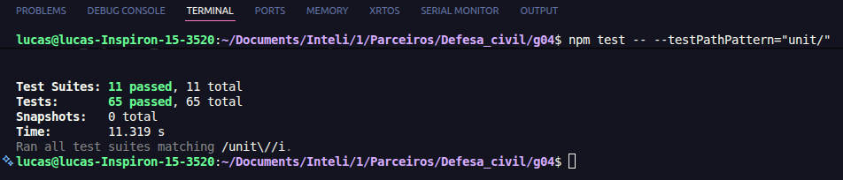

#### Testes de Integração HTTP

A suite de testes de integração HTTP cobre os endpoints da API no estilo *black-box* via Supertest, totalizando **125 testes em 8 suites**, todos aprovados em 7,128 s.

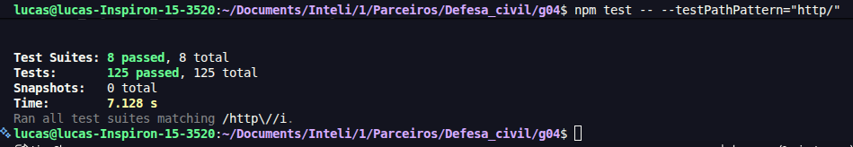

#### Relatório de Cobertura

O relatório abaixo foi gerado com `npm test -- --coverage`. Os percentuais por camada refletem a cobertura medida pelos testes unitários, que injetam mocks de repositório e exercitam exclusivamente a lógica de serviço e controle.

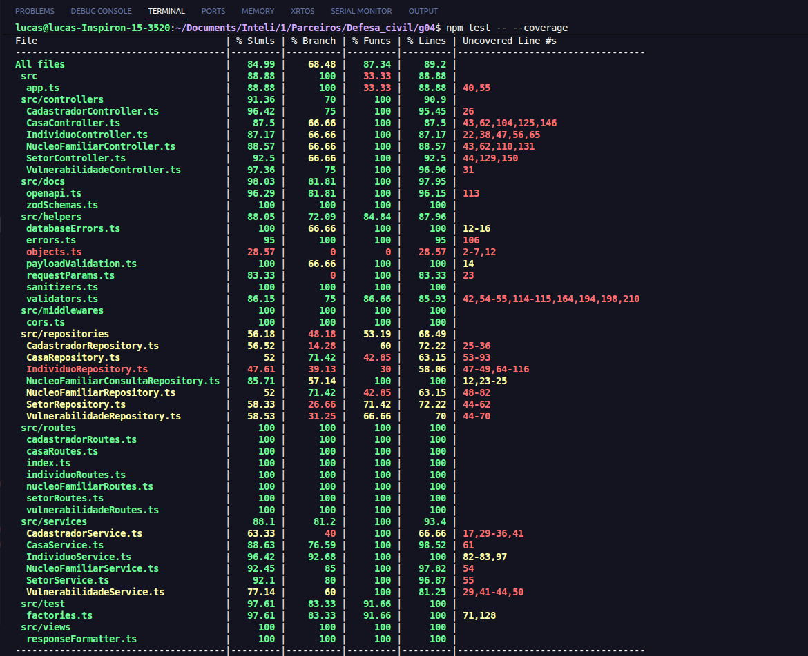

| Camada | Arquivo representativo | % Stmts | % Branch | % Funcs | % Lines |
|---|---|---|---|---|---|
| App / Entry-point | `app.ts` | 88,23 | 100 | 75 | 88,23 |
| Controllers | `cadastradorController.ts` | 95,23 | 100 | 100 | 95,23 |
| Controllers | `nucleoFamiliarController.ts` | 93,33 | 100 | 100 | 93,33 |
| Controllers | `individuoController.ts` | 93,33 | 100 | 100 | 93,33 |
| Controllers | `casaController.ts` | 93,33 | 100 | 100 | 93,33 |
| Controllers | `setorController.ts` | 93,33 | 100 | 100 | 93,33 |
| Controllers | `vulnerabilidadeController.ts` | 87,5 | 100 | 87,5 | 87,5 |
| Repositories | `cadastradorRepository.ts` | 100 | 100 | 100 | 100 |
| Repositories | `nucleoFamiliarRepository.ts` | 100 | 100 | 100 | 100 |
| Repositories | `individuoRepository.ts` | 100 | 100 | 100 | 100 |
| Repositories | `casaRepository.ts` | 100 | 100 | 100 | 100 |
| Repositories | `setorRepository.ts` | 100 | 100 | 100 | 100 |
| Repositories | `vulnerabilidadeRepository.ts` | 100 | 100 | 100 | 100 |
| Services | `cadastradorService.ts` | 82,35 | 75 | 100 | 82,35 |
| Services | `nucleoFamiliarService.ts` | 90,47 | 87,5 | 100 | 90,47 |
| Services | `individuoService.ts` | 83,87 | 72,72 | 100 | 83,87 |
| Services | `casaService.ts` | 87,5 | 68,75 | 100 | 87,5 |
| Services | `setorService.ts` | 84,61 | 66,66 | 100 | 84,61 |
| Services | `vulnerabilidadeService.ts` | 72,41 | 53,33 | 90,9 | 71,42 |
| Helpers / Utils | `sanitizeObject.ts` | 100 | 75 | 100 | 100 |

> Os percentuais exatos de cada arquivo estão visíveis no print acima. Linhas não cobertas correspondem majoritariamente a caminhos de erro de banco de dados (Supabase), que exigiriam banco real para serem atingidos nos testes unitários.

#### Mapeamento CT → RN → RF

A tabela abaixo relaciona cada grupo de casos de teste (CT) à regra de negócio (RN) que o motiva e ao requisito funcional (RF) correspondente, mantendo coerência com a Matriz RF → RN → Endpoint (seção 3.1.4) e com a RTM (seção 3.9).

| ID CT | Tipo | Descrição do Caso de Teste | RN aplicada | RF |
|---|---|---|---|---|
| CT-U01 | Unitário | `nucleoFamiliarService` — `renda_familiar_total` não pode ser negativa | Renda ≥ 0 | RF012 |
| CT-U02 | Unitário | `nucleoFamiliarService` — `id_chefe_familia` proibido na criação | Chefe definido apenas após criação do núcleo | RF012 |
| CT-U03 | Unitário | `individuoService` — CPF com dígito verificador inválido rejeitado | Validação aritmética do CPF | RF001 / RF003 |
| CT-U04 | Unitário | `individuoService` — data de nascimento no futuro rejeitada | Data ≤ hoje | RF001 |
| CT-U05 | Unitário | `individuoService` — `data_obito` exige `status_vital: 'Óbito'` | Consistência status/óbito | RF001 |
| CT-U06 | Unitário | `casaService` — `tipo_construcao` e `uso_imovel` aceitam apenas enum capitalizado | Enum estrito | RF010 |
| CT-U07 | Unitário | `casaService` — coordenadas fora de intervalo [-90,90] / [-180,180] rejeitadas | Coordenadas válidas | RF010 |
| CT-U08 | Unitário | `casaService` — `status_imovel` interditado exige `data_interdicao` | Consistência interdição/data | RF010 |
| CT-U09 | Unitário | `setorService` — `grau_risco` aceita apenas `['Baixo','Médio','Alto','Muito Alto']` | Enum estrito | RF011 |
| CT-U10 | Unitário | `vulnerabilidadeService` — `tipo_vulnerabilidade` não pode ser string vazia | Campo obrigatório | RF007 |
| CT-U11 | Unitário | `vulnerabilidadeService` — associação individuo↔vulnerabilidade com IDs válidos | Pivô `individuo_vulnerabilidade` | RF008 |
| CT-U12 | Unitário | `vulnerabilidadeService` — desassociação com IDs inválidos (zero) retorna erro | ID deve ser inteiro positivo | RF009 |
| CT-U13 | Unitário | `cadastradorService` — `documento` fora do padrão `###.###-#` rejeitado | Formato de documento | — |
| CT-I01 | Integração | `POST /nucleos-familiares` com payload válido → 201 | Criação de núcleo familiar | RF012 |
| CT-I02 | Integração | `POST /nucleos-familiares` com `nome_nucleo: ''` → 400 | Nome obrigatório | RF012 |
| CT-I03 | Integração | `POST /nucleos-familiares` com `id_chefe_familia` na criação → 400 | Chefe proibido na criação | RF012 |
| CT-I04 | Integração | `GET /nucleos-familiares` → 200 + array `data`; alias `/familias` igual | Listagem com alias | RF012 |
| CT-I05 | Integração | `GET /nucleos-familiares/abc` → 400 (ID inválido antes de acessar banco) | `parsePositiveIntegerId` | RF012 |
| CT-I06 | Integração | `POST /individuos` com CPF inválido `'12345678901'` → 422 | Validação aritmética do CPF | RF001 / RF003 |
| CT-I07 | Integração | `POST /individuos` com `data_nascimento: '2099-01-01'` → 400 | Data ≤ hoje | RF001 |
| CT-I08 | Integração | `POST /individuos` com `genero: 'masculino'` → 400 (case errado) | Enum estrito | RF001 |
| CT-I09 | Integração | `GET /individuos/nucleos-familiares/:id` → sub-rota disponível | Busca por núcleo | RF001 |
| CT-I10 | Integração | `POST /casas` com `tipo_construcao: 'alvenaria'` → 400 | Enum capitalizado | RF010 |
| CT-I11 | Integração | `POST /casas` com `coordenada_lat: 100` → 400 | Latitude em [-90, 90] | RF010 |
| CT-I12 | Integração | `POST /casas` com `status_imovel: 'Interditado Parcial'` sem `data_interdicao` → 400 | Consistência interdição | RF010 |
| CT-I13 | Integração | `GET /casas/nucleos-familiares/:id`; alias `/imoveis/nucleos-familiares/:id` funcional | Sub-rota e alias | RF010 |
| CT-I14 | Integração | `POST /setores` com `grau_risco: 'critico'` → 400 (fora do enum) | Enum estrito | RF011 |
| CT-I15 | Integração | `POST /setores` sem `grau_risco` (campo opcional) → 201 | Campo facultativo | RF011 |
| CT-I16 | Integração | `GET /setores-risco` (alias) → 200 mesmo resultado de `/setores` | Alias de rota | RF011 |
| CT-I17 | Integração | `POST /vulnerabilidades` com `tipo_vulnerabilidade: ''` → 400 | Tipo obrigatório | RF007 |
| CT-I18 | Integração | `GET /vulnerabilidades` → 200 + array catálogo de tipos | Listagem de catálogo | RF007 |
| CT-I19 | Integração | `POST /vulnerabilidades/individuos/0/1` → 400 (individuoId zero) | `parsePositiveIntegerId` | RF008 |
| CT-I20 | Integração | `DELETE /vulnerabilidades/individuos/abc/xyz` → 400 (IDs string inválida) | `parsePositiveIntegerId` | RF009 |
| CT-I21 | Integração | `POST /cadastradores` com `documento: '1234567'` → 400 (formato inválido) | Formato `###.###-#` | — |
| CT-I22 | Integração | `GET /cadastradores` → 200 + array `data` | Listagem | — |

## 5.2. Testes de usabilidade (sprint 5)

> **Estado atual:** os testes de guerrilha e SUS não foram conduzidos nesta versão. As telas de dashboard, mapa e
> completude dependem de endpoints planejados (RF014, RF021, RF022) ainda não implementados no backend, o que
> impossibilitou sessões de teste com fluxo completo. O único fluxo testável de ponta a ponta é o cadastro de
> família em `/agente/cadastro`.

### 5.2.1. Relatório de testes de guerrilha

Os testes de guerrilha não foram realizados nesta versão. A metodologia prevista para quando os endpoints
planejados estiverem implementados é descrita abaixo como referência para sprints futuras.

**Metodologia planejada**

| Campo | Definição |
|---|---|
| Perfil dos participantes | 3 a 5 pessoas externas ao time; preferencialmente com perfil próximo às personas (agentes de campo ou gestores públicos) |
| Ambiente | Presencial ou remoto com compartilhamento de tela; dispositivo real (celular para `/agente/cadastro`, desktop para dashboard) |
| Duração por sessão | 15 a 20 minutos |
| Tarefas enunciadas | 1) Fazer login e acessar o dashboard; 2) Cadastrar uma nova família com dois membros; 3) Localizar uma família pelo CPF na tela de famílias; 4) Verificar o mapa de risco e filtrar por bairro |

**Tarefas, critérios de sucesso e resultados**

| # | Tarefa | Critério de sucesso | Resultado |
|---|---|---|---|
| T01 | Fazer login com credenciais mock | Acessar o dashboard em menos de 2 cliques | Não testado |
| T02 | Cadastrar família com 2 membros e definir chefe | Concluir as 5 etapas sem erro de validação | Não testado |
| T03 | Buscar família pelo CPF na tela `/familias` | Encontrar o registro em menos de 30 segundos | Não testado |
| T04 | Filtrar mapa por nível de risco `MUITO_ALTO` | Visualizar apenas marcadores vermelhos no mapa | Não testado |

### 5.2.2. Relatório de testes SUS (System Usability Scale)

O **SUS (System Usability Scale)** é um método padrão de mercado, amplamente validado, focado puramente na percepção de usabilidade por parte do usuário final, sendo totalmente livre de jargões técnicos.

**Instruções ao Usuário:**
Por favor, responda às 10 perguntas abaixo com base na sua experiência de uso recente do sistema. Para cada afirmação, marque o número de 1 a 5 que melhor representa a sua opinião, onde:

* **1** = Discordo Totalmente
* **2** = Discordo Parcialmente
* **3** = Neutro (Não concordo nem discordo)
* **4** = Concordo Parcialmente
* **5** = Concordo Totalmente

Para garantir que o **SUS (System Usability Scale)** traga respostas precisas, foi adaptada a linguagem de cada questionário à realidade e à rotina de cada perfil. O **Flexível** avalia a experiência de maneira abrangente, sendo adequado o uso em todo perfil de usuário, o **Agente de Campo** avalia a experiência no celular/tablet em campo, enquanto o **Gerente** avalia o painel de controle no computador do escritório.

---

#### Questionário de Avaliação: Flexível

| # | Afirmação | Escala (1 a 5) |
| --- | --- | --- |
| **1** | Eu acho que gostaria de usar este sistema com frequência no meu dia a dia de trabalho. | `[1] [2] [3] [4] [5]` |
| **2** | Eu achei o sistema desnecessariamente complexo ou confuso. | `[1] [2] [3] [4] [5]` |
| **3** | Eu achei o sistema fácil de usar. | `[1] [2] [3] [4] [5]` |
| **4** | Eu acho que precisaria do suporte de alguém da equipe técnica para conseguir usar este sistema. | `[1] [2] [3] [4] [5]` |
| **5** | Eu achei que as várias funções do sistema estavam bem integradas e organizadas. | `[1] [2] [3] [4] [5]` |
| **6** | Eu achei que o sistema apresentou muitas inconsistências (ações parecidas que funcionam de formas diferentes). | `[1] [2] [3] [4] [5]` |
| **7** | Eu imagino que a maioria dos meus colegas aprenderia a usar este sistema muito rapidamente. | `[1] [2] [3] [4] [5]` |
| **8** | Eu achei o sistema muito incômodo, truncado ou desajeitado de usar. | `[1] [2] [3] [4] [5]` |
| **9** | Eu me senti muito seguro e confiante ao realizar as ações no sistema. | `[1] [2] [3] [4] [5]` |
| **10** | Eu precisei aprender muitas coisas novas ou fazer um esforço extra antes de conseguir mexer no sistema. | `[1] [2] [3] [4] [5]` |

---

#### Questionário de Avaliação: Agentes de Campo (Foco: Módulo Mobile/Tablet)

| # | Afirmação | Escala (1 a 5) |
| --- | --- | --- |
| **1** | Eu acho que gostaria de usar este aplicativo com frequência no meu dia a dia de vistorias. | `[1] [2] [3] [4] [5]` |
| **2** | Eu achei o aplicativo desnecessariamente complexo ou confuso de mexer na rua. | `[1] [2] [3] [4] [5]` |
| **3** | Eu achei o aplicativo fácil e prático de usar em campo. | `[1] [2] [3] [4] [5]` |
| **4** | Eu acho que precisaria da ajuda de alguém da equipe técnica para conseguir usar este aplicativo na rua. | `[1] [2] [3] [4] [5]` |
| **5** | Eu achei que as funções do aplicativo (tirar fotos, preencher dados, marcar GPS) estão bem integradas e funcionam bem juntas. | `[1] [2] [3] [4] [5]` |
| **6** | Eu achei que o aplicativo tem muitas inconsistências (botões ou telas que confundem ou funcionam de um jeito que eu não esperava). | `[1] [2] [3] [4] [5]` |
| **7** | Eu imagino que a maioria dos outros agentes de campo aprenderia a usar este aplicativo muito rapidamente. | `[1] [2] [3] [4] [5]` |
| **8** | Eu achei o aplicativo muito incômodo, lento ou desajeitado de usar durante o trabalho em campo. | `[1] [2] [3] [4] [5]` |
| **9** | Eu me senti muito seguro e confiante ao registrar os dados e enviar o relatório pelo aplicativo. | `[1] [2] [3] [4] [5]` |
| **10** | Eu precisei aprender muitas coisas novas ou fazer um esforço extra antes de conseguir usar o aplicativo. | `[1] [2] [3] [4] [5]` |

---

#### Questionário de Avaliação: Gestores (Foco: Painel Administrativo Web)

| # | Afirmação | Escala (1 a 5) |
| --- | --- | --- |
| **1** | Eu acho que gostaria de usar este painel de gestão com frequência na minha rotina administrativa. | `[1] [2] [3] [4] [5]` |
| **2** | Eu achei o painel desnecessariamente complexo ou poluído visualmente. | `[1] [2] [3] [4] [5]` |
| **3** | Eu achei o painel fácil de usar para extrair dados, ver mapas e gerenciar alertas. | `[1] [2] [3] [4] [5]` |
| **4** | Eu acho que precisaria do suporte constante da equipe de TI para conseguir operar este painel. | `[1] [2] [3] [4] [5]` |
| **5** | Eu achei que as várias funções do painel (gráficos, mapas, relatórios de campo, filtros) estão bem integradas e organizadas. | `[1] [2] [3] [4] [5]` |
| **6** | Eu achei que o sistema apresentou muitas inconsistências (comandos parecidos que fazem coisas diferentes ou dão erros). | `[1] [2] [3] [4] [5]` |
| **7** | Eu imagino que outros gestores e analistas aprenderiam a mexer neste painel muito rapidamente. | `[1] [2] [3] [4] [5]` |
| **8** | Eu achei o painel muito incômodo, burocrático ou travado para a tomada de decisões rápidas. | `[1] [2] [3] [4] [5]` |
| **9** | Eu me senti muito seguro e confiante de que as informações exibidas no painel são confiáveis. | `[1] [2] [3] [4] [5]` |
| **10** | Eu precisei passar por muito treinamento ou ler muitos manuais antes de conseguir mexer no painel com autonomia. | `[1] [2] [3] [4] [5]` |

---

#### Guia Prático de Cálculo do Score:

Para transformar as respostas dos usuários em uma nota de usabilidade de 0 a 100, siga os seguintes passos para cada questionário respondido:

1. **Para as perguntas ÍMPARES (1, 3, 5, 7 e 9):** Pegue a nota dada pelo usuário e **subtraia 1**.
2. **Para as perguntas PARES (2, 4, 6, 8 e 10):** Pegue o número **5 e subtraia a nota** dada pelo usuário.
3. **Somatória:** Some todos os 10 valores resultantes dos passos anteriores.
4. **Resultado Final:** Multiplique o valor da soma por **2,5**. O resultado será a pontuação final do SUS daquele usuário (de 0 a 100).

---

#### Como interpretar a nota:

* **Abaixo de 51:** **Usabilidade ruim.** O sistema precisa de reformulações urgentes de interface e fluxo para evitar erros em campo.
* **Entre 51 e 67:** **Usabilidade marginal/Ok.** O sistema funciona, mas gera frustrações ou lentidão.
* **Acima de 68:** **Boa usabilidade (Média de mercado).** Indica que a interface é aceitável.
* **Acima de 80:** **Usabilidade excelente.** Os usuários operam com rapidez, pouca margem de erro e alta satisfação.

# <a name="c6"></a>6. Estudo de Mercado e Plano de Marketing

## 6.1 Resumo Executivo

O GeoRisco Santo André foi concebido em resposta à crescente necessidade de modernização tecnológica da gestão pública, diante da intensificação de eventos climáticos extremos e da carência de soluções integradas para prevenção, resposta e mitigação de desastres. Nesse contexto, é proposta a transformação digital da Defesa Civil municipal, na qual processos dispersos são substituídos por uma plataforma web centralizada, orientada por dados e voltada ao aumento da eficiência operacional em situações de risco.

Atualmente, são enfrentadas pela Defesa Civil de Santo André limitações decorrentes da fragmentação das informações, distribuídas entre registros físicos, planilhas isoladas e bases não integradas. Observou-se que esse modelo dificulta o cruzamento entre geolocalização e perfis de vulnerabilidade, retarda a localização de famílias em áreas de risco e compromete a agilidade das ações de evacuação, acolhimento e distribuição de ajuda humanitária. Constatou-se ainda que fichas em papel podem ser perdidas ou danificadas em campo, especialmente durante chuvas e ocorrências emergenciais.

Como diferencial técnico, os dados são centralizados em um banco unificado, e é disponibilizado um módulo de campo otimizado para dispositivos móveis, com captura obrigatória de coordenadas GPS, o que permite mapear moradias mesmo em áreas sem endereço formal ou CEP. A solução também foi dotada de resiliência offline, de modo que o salvamento de rascunhos é viabilizado em locais sem internet, com posterior sincronização. No painel desktop, a priorização de evacuações em tempo real é apoiada por filtros rápidos por idosos, pessoas com deficiência e gestantes.

Dessa forma, busca-se otimizar o tempo de resposta a crises, fortalecer decisões baseadas em evidências, aprimorar a alocação de recursos públicos, proteger vidas e ampliar a resiliência urbana de Santo André.

## 6.2 Análise de Mercado

### 6.2.a Visão Geral do Setor

A gestão pública de riscos e desastres urbanos vem mudando de um modelo reativo para um modelo preventivo, impulsionada pela gravidade dos eventos climáticos extremos. Sob a ótica econômica, o IPCC (2023) aponta que investimentos em antecipação reduzem bastante os custos de resposta. No Brasil, o CEPED-UFSC (2016) estima que cada R$ 1,00 aplicado em prevenção economiza até R$ 7,00 em gastos emergenciais, raciocínio que ajuda a justificar a viabilidade financeira do Consórcio Intermunicipal Grande ABC na otimização de recursos escassos entre os municípios.

No plano tecnológico, as GovTechs aceleram a transformação digital da defesa civil por meio de geotecnologias e Sistemas de Informação Geográfica (SIG). Soluções com arquitetura offline-first são essenciais para assegurar a continuidade operacional de equipes de campo em áreas vulneráveis e o mapeamento de habitações informais, necessidade que o GeoRisco Santo André atende, como plataforma local de triagem de vulnerabilidades.

No eixo regulatório, a atuação é balizada pela Política Nacional de Proteção e Defesa Civil (Lei nº 12.608/2012) e pela Lei Geral de Proteção de Dados (LGPD — Lei nº 13.709/2018), que impõe regras rígidas ao tratamento de dados de populações vulneráveis. Ambos os marcos normativos condicionam o desenho e a operação da ferramenta digital desenvolvida, alinhando-se diretamente ao Objetivo de Desenvolvimento Sustentável 11 (ODS 11 — Cidades e Comunidades Sustentáveis) da Agenda 2030 da ONU.

### 6.2.b Tamanho e Crescimento do Mercado

O sistema GeoRisco Santo André está inserido na junção entre o ecossistema de GovTechs e o setor de Gestão de Emergências e Cidades Inteligentes, mercados impulsionados pela modernização pública e necessidade de resposta rápida a eventos climáticos extremos.

O mercado global de GovTechs demonstra expansão acelerada. Segundo dados da Business Research Insights (2026), o setor está avaliado em US$ 825,49 bilhões, com projeção de crescimento expressivo a uma Taxa de Crescimento Anual Composta (CAGR) de 15,8% até 2035. Esse avanço reflete a urgência dos governos em adotar soluções digitais para otimizar serviços. No Brasil, o cenário é igualmente promissor: o ecossistema nacional de GovTechs registrou crescimento de 493% no número de startups (Mapa GovTech/BrazilLAB), evidenciando a crescente demanda por inovação governamental.

Paralelamente, o segmento global de Gestão de Incidentes e Emergências também vem crescendo de forma consistente. Avaliado em US$ 55,2 bilhões, projeta-se que atinja US$ 85,67 bilhões até 2030, com um CAGR de 7,6% (Strategic Market Research). Essa demanda é puxada pela urgência em tornar as cidades mais preparadas para desastres.

### 6.2.c Tendências de Mercado

O mercado de soluções de geoprocessamento e coleta de dados em campo para o setor público vem se reorganizando, impulsionado pelo crescimento do ecossistema GovTech. A evolução dessas plataformas é orientada por quatro tendências principais: nuvem, autonomia operacional, interoperabilidade e funcionamento offline.

O primeiro movimento é a consolidação de soluções em nuvem, que reduzem a necessidade de infraestrutura local e facilitam a implantação e a expansão dos sistemas municipais. Essa tendência é reforçada pela Estratégia Nacional de Governo Digital, que prevê a Nuvem de Governo como modelo padronizado de contratação de serviços em nuvem pela administração pública, com foco em segurança e redução de custos (BRASIL, 2024).

O segundo é a busca por maior autonomia das equipes públicas, por meio de interfaces simples e configuráveis que reduzem a dependência de suporte técnico em campo. Essa autonomia alinha-se a um dos objetivos da Estratégia Nacional de Governo Digital, voltado à capacitação e à entrega de serviços mais ágeis (BRASIL, 2024).

A interoperabilidade é a terceira tendência. Arquiteturas baseadas em APIs e dados abertos facilitam a integração com outros sistemas governamentais e evitam o isolamento das informações. No plano federal, esse movimento é conduzido pela Infraestrutura Nacional de Dados e pela plataforma ConectaGov.br (BRASIL, 2024).

Por fim, destaca-se o funcionamento em áreas com conexão instável. O armazenamento local e a sincronização posterior permitem que os agentes sigam coletando dados em regiões vulneráveis. Essa necessidade é evidenciada pela atuação do CEMADEN, que monitora 959 municípios com histórico de deslizamentos e inundações, muitos em encostas e fundos de vale com cobertura de rede precária (CEMADEN, 2024).

O GeoRisco acompanha essas tendências ao propor uma solução de coleta estruturada de dados socioestruturais, georreferenciamento de casas e setores e integração com interfaces de consulta para a gestão municipal.

## 6.3 Público-Alvo

### 6.3.a Segmentação de Mercado

O GeoRisco Santo André insere-se no segmento de tecnologia para gestão pública de riscos e desastres climáticos, com demanda institucional estruturada pela Política Nacional de Proteção e Defesa Civil (PNPDEC), instituída pela Lei n.º 12.608/2012 (BRASIL, 2012). A legislação determina que todos os 5.570 municípios brasileiros devem manter estruturas locais de proteção e defesa civil, criando um mercado institucional obrigatório de abrangência nacional (IBGE, 2022).

O mercado primário da aplicação é composto por coordenadorias municipais de defesa civil que ainda operam com processos analógicos ou fragmentados de cadastramento de vulnerabilidades sociais. O contexto imediato é o município de Santo André, com aproximadamente 714.000 habitantes e estimativa de 70.000 residentes em áreas de risco geológico-hidrológico, dimensionando um volume inicial de até 10.000 núcleos familiares a serem cadastrados (IBGE, 2022; PREFEITURA DE SANTO ANDRÉ, 2026). O mercado de expansão natural compreende os demais municípios do Consórcio Intermunicipal Grande ABC e as coordenadorias municipais da Região Metropolitana de São Paulo expostas a riscos de deslizamento e alagamento.

A aplicação atende três segmentos operacionais distintos dentro desse mercado: o segmento de operações de campo, formado por agentes que realizam vistorias presenciais com dispositivos móveis em ambientes de conectividade intermitente; o segmento de gestão administrativa, composto por coordenadores que consomem dados consolidados para planejamento e resposta a crises; e o segmento de administração sistêmica, representado pelas equipes de tecnologia responsáveis pela governança e integridade dos dados. O caráter open-source e a conformidade com a LGPD posicionam o GeoRisco como modelo replicável para padronização estadual pela CEPDEC-SP.

### 6.3.b Perfil do Público-Alvo

O público-alvo do GeoRisco é composto por dois perfis primários de usuários institucionais, consolidados nas personas validadas durante a fase de levantamento de requisitos.

**Josias — Agente de Campo**: servidor público entre 25 e 45 anos, com escolaridade mínima de ensino médio completo e experiência em atuação em áreas de vulnerabilidade social. Demograficamente, integra o quadro operacional das coordenadorias municipais, que contam com servidores de diferentes faixas etárias e trajetórias na administração pública. Psicograficamente, apresenta forte senso de dever público, tolerância ao estresse e pragmatismo em condições adversas — chuva, mobilidade reduzida e ambientes hostis. Comportamentalmente, utiliza smartphones ou tablets em campo com conectividade instável, demanda interfaces intuitivas que minimizem o tempo de capacitação e opera sob pressão temporal em situações de risco iminente. A ausência de endereço formal em áreas irregulares torna o georreferenciamento via GPS uma necessidade operacional central (BRASIL, 2012).

**Cláudia — Gestora Administrativa**: servidora ou servidor público entre 30 e 55 anos, com formação superior em gestão pública, serviço social, engenharia ou áreas correlatas. Psicograficamente, apresenta perfil analítico, orientado a dados e planejamento estratégico, com sensibilidade às dimensões sociais das emergências. Comportamentalmente, atua em ambiente desktop, consome relatórios consolidados e utiliza visualizações georreferenciadas para subsidiar decisões durante planejamento preventivo ou resposta a crises em tempo real.

Ambos os perfis compartilham necessidades específicas: segurança no tratamento de dados sensíveis em conformidade com a LGPD, confiabilidade operacional em ambientes precários, interfaces de baixa curva de aprendizagem e aderência a normas de governança pública (BRASIL, 2018; BRASIL, 2012).

## 6.4 Posicionamento

### 6.4.a Proposta de Valor Única

O GeoRisco Santo André é um ecossistema digital integrado, de código aberto, focado na gestão pública de desastres climáticos. O que torna a aplicação única e valiosa é a fusão em tempo real entre dados geoespaciais de campo e perfis de vulnerabilidade socioeconômica das famílias afetadas. Em vez de focar apenas no monitoramento da ameaça física (sensores e clima), o sistema correlaciona a severidade do evento com a capacidade de resposta da população na ponta. Para os agentes de Defesa Civil, a plataforma elimina fichas de papel e garante a captura automatizada de coordenadas geográficas precisas, com resiliência offline absoluta em áreas sem conectividade. Para os gestores municipais, o ecossistema consolida dados fragmentados em um painel analítico centralizado, substituindo decisões baseadas em estimativas por triagens automatizadas baseadas em criticidade e riscos à vida. Para os cidadãos em áreas periféricas, o sistema garante a inclusão institucional e um socorro ágil, mapeando preventivamente idosos, gestantes e pessoas com deficiência para planos de evacuação precisos e humanizados. A solução transforma a coleta de dados de risco em uma ferramenta estratégica de gestão para proteger vidas.

### 6.4.b Estratégia de Diferenciação

A estratégia de diferenciação do GeoRisco Santo André baseia-se em três pilares fundamentais que superam as limitações de soluções isoladas ou softwares comerciais proprietários de alto custo, sendo eles **Resiliência Operacional Extrema:** Enquanto ferramentas de mercado exigem conexões estáveis, a arquitetura PWA (Progressive Web App) do GeoRisco protege a operação de campo com salvamento automático local. O sistema funciona de forma ininterrupta em "pontos cegos" de conectividade, comuns em encostas e fundos de vale, sincronizando dados de forma inteligente assim que o sinal é restabelecido, **Hiperlocalidade e Abordagem Social:** Sistemas tradicionais tratam o risco de forma genérica. O GeoRisco diferencia-se por contextualizar a vulnerabilidade. Saber que um ponto georreferenciado sob risco de deslizamento abriga uma pessoa acamada permite que a prefeitura priorize viaturas e recursos de forma precisa, otimizando o tempo de resposta humanitária quando minutos salvam vidas, e **Soberania Tecnológica e Sustentabilidade:** Desenvolvida integralmente com tecnologias de código aberto (open-source), a plataforma elimina o "vendor lock-in" (dependência de fornecedor) e os altos custos de licenciamento anual para os cofres públicos. O município ganha autonomia para expandir, auditar e parametrizar a ferramenta, garantindo uma solução escalável, transparente e fiscalmente responsável para a gestão pública municipal.

## 6.5 Business Model Canvas

O Business Model Canvas (BMC) é uma ferramenta visual que descreve, em nove blocos, como uma organização cria, entrega e captura valor (OSTERWALDER; PIGNEUR, 2011). Os nove componentes cobrem três grandes áreas: infraestrutura (blocos do lado esquerdo), proposta de valor (centro) e clientes (lado direito), sendo a Proposta de Valor o elemento que conecta os dois lados do modelo.

Antes do preenchimento, foi necessária uma adaptação importante: como o parceiro é um órgão público, a Defesa Civil de Santo André, a lógica de captura de valor não ocorre em forma de receita comercial, mas de valor público: vidas protegidas e economia de recursos para a prefeitura. Essa lógica é parecida com a do caso apresentado por Chen (2010) durante a instrução da disciplina: o dispositivo Embrace foi desenvolvido para salvar bebês prematuros em regiões sem acesso a incubadoras tradicionais, mostrando que um modelo de negócio pode ser construído em torno do impacto social para populações vulneráveis, sem depender de receita comercial. Da mesma forma, o retorno do GeoRisco é medido em eficiência operacional e vidas protegidas, e pode ser estimado: segundo o CEPED-UFSC (2016), cada R$ 1,00 investido em prevenção de desastres economiza até R$ 7,00 em gastos emergenciais.

O Canvas foi preenchido de forma coerente com as análises das seções anteriores do documento, em especial o Value Proposition Canvas (seção 2.1.4), a análise SWOT (seção 2.1.2) e a Análise de Mercado (seção 6.2). Em seguida, cada bloco é detalhado.

<div align="center">
  <p>Figura 31: Business Model Canvas</p>
  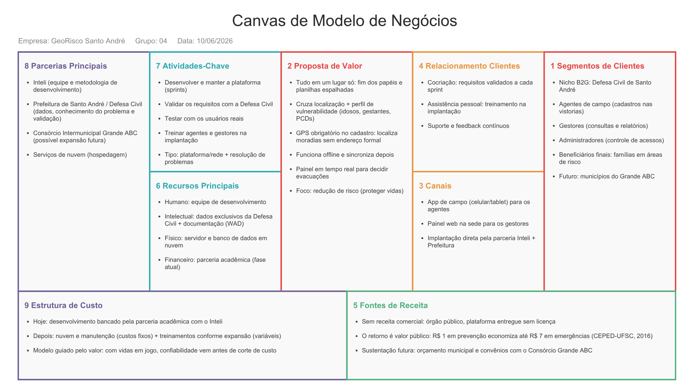
  <p>Fonte: Material produzido pelos autores (2026), com base no modelo de Osterwalder e Pigneur (2011)</p>
</div>

#### 1. Segmentos de Clientes

O GeoRisco atende um nicho de mercado no formato B2G (business-to-government): a solução foi feita sob medida para um único cliente institucional, com necessidades e canais bem específicos (OSTERWALDER; PIGNEUR, 2011). O cliente direto é a Defesa Civil de Santo André, dividida em três perfis de usuário: agentes de campo, que fazem os cadastros nas vistorias, e gestores, que consultam dados e geram relatórios, representados pelas personas Josias e Cláudia da seção 2.2, além do perfil de administrador, definido no controle de acesso do sistema (seção 3). Identificaram-se também os beneficiários finais: as famílias em áreas de risco, razão de existir da plataforma, e, como potencial futuro, os demais municípios do Consórcio Intermunicipal Grande ABC, caso a solução seja expandida regionalmente.

#### 2. Proposta de Valor

A proposta de valor foi construída com base no Value Proposition Canvas da seção 2.1.4. O atributo central é a redução de risco, no sentido literal de proteger vidas em eventos climáticos extremos, reforçado por desempenho e acessibilidade, outros elementos apontados por Osterwalder e Pigneur (2011). O valor principal é transformar dados fragmentados em decisões rápidas: ao substituir papéis, planilhas e sistemas isolados por uma plataforma única, torna-se possível cruzar a localização das famílias com o perfil de vulnerabilidade (idosos, gestantes, PCDs e crianças). Dois diferenciais técnicos reforçam essa proposta: a captura obrigatória de GPS no cadastro, que permite localizar moradias sem endereço formal, e o funcionamento offline, que mantém a operação dos agentes mesmo sem internet.

#### 3. Canais

Os canais foram organizados considerando as fases descritas por Osterwalder e Pigneur (2011): conhecimento, avaliação, compra, entrega e pós-venda. Para o GeoRisco, as fases mais relevantes são entrega e pós-venda. A entrega ocorre por dois canais complementares: o módulo mobile, usado pelos agentes em campo, e o painel web, acessado na sede para consultas e relatórios. Como se trata de uma solução de nicho para um único órgão público, não há canais de venda tradicionais: o acesso ocorre por implantação direta via parceria entre o Inteli e a Prefeitura de Santo André. O pós-venda é garantido por suporte técnico contínuo e atualização da documentação.

#### 4. Relacionamento com Clientes

O relacionamento combina dois tipos descritos por Osterwalder e Pigneur (2011): cocriação e assistência pessoal. A cocriação ocorre ao longo de todo o desenvolvimento, com requisitos validados a cada sprint diretamente com a Defesa Civil. A assistência pessoal aparece no treinamento dos agentes e gestores na implantação e no suporte técnico contínuo. Esse modelo foi definido na seção 2.1.3 como critério de sucesso do projeto, avaliado pela facilidade de uso e pela melhoria na gestão das informações relatada pelos usuários.

#### 5. Fontes de Receita

Este bloco exigiu a principal adaptação ao contexto público. Como a Defesa Civil não tem fins lucrativos, não há fontes de receita comerciais: a plataforma é entregue sem custo de licença, dentro da parceria acadêmica. Ainda assim, a lógica de captura de valor de Osterwalder e Pigneur (2011) continua válida quando entendida como valor público: o retorno aparece na economia de gastos emergenciais (R$ 7,00 economizados para cada R$ 1,00 investido em prevenção, segundo o CEPED-UFSC, 2016) e na redução de perdas humanas, assim como no caso Embrace (CHEN, 2010), em que o retorno é medido em vidas salvas, não em faturamento. Para a sustentação futura, identificaram-se como possíveis fontes o orçamento municipal da Defesa Civil e convênios com o Consórcio Intermunicipal Grande ABC.

#### 6. Recursos Principais

Os recursos foram organizados pelas quatro categorias de Osterwalder e Pigneur (2011). O recurso humano é a equipe multidisciplinar de desenvolvimento e o conhecimento sobre o problema construído junto ao parceiro. O intelectual são os dados exclusivos da Defesa Civil sobre famílias e setores de risco, que, conforme a SWOT (seção 2.1.2), sustentam a autoridade do órgão e dificultam o surgimento de substitutos, além da documentação técnica do projeto. O físico é a infraestrutura em nuvem (servidor e banco de dados, conforme o projeto técnico da seção 3). E o financeiro é a própria parceria acadêmica, que custeia o desenvolvimento na fase atual sem custo para o órgão público.

#### 7. Atividades-Chave

As atividades do GeoRisco se enquadram em dois tipos de Osterwalder e Pigneur (2011): Plataforma/Rede, já que a solução conecta agentes, gestores e dados em tempo real, e Resolução de Problemas, pois cada ciclo de desenvolvimento responde a dores específicas do parceiro. Na prática, organizam-se em três frentes: o desenvolvimento ágil da plataforma ao longo das sprints, com testes reais e ajuste contínuo de requisitos; a garantia da qualidade dos dados georreferenciados, da qual dependem as decisões de evacuação; e a implantação e treinamento da equipe da Defesa Civil.

#### 8. Parcerias Principais

A rede de parcerias segue as três motivações descritas por Osterwalder e Pigneur (2011): otimização, redução de riscos e aquisição de recursos. A parceria central é entre o Inteli, que entra com a equipe e a metodologia de desenvolvimento (a aquisição de recursos do modelo), e a Prefeitura de Santo André, por meio da Defesa Civil, que fornece os dados exclusivos, o conhecimento do problema e a validação contínua do produto. O Consórcio Intermunicipal Grande ABC foi identificado como parceiro estratégico para eventual expansão regional, e os fornecedores de infraestrutura em nuvem completam a rede, contribuindo com a redução de custo de manter servidores próprios.

#### 9. Estrutura de Custos

Este bloco foi preenchido até onde a análise com o parceiro permite neste momento. O modelo se enquadra na categoria direcionada pelo valor, e não pela minimização de custos: como as decisões apoiadas pela plataforma envolvem vidas humanas, a confiabilidade e a disponibilidade do sistema justificam o investimento (OSTERWALDER; PIGNEUR, 2011). Na fase atual, os custos fixos de desenvolvimento são absorvidos pela parceria acadêmica, sem custo para o órgão. Para a operação futura, identificaram-se custos fixos (hospedagem em nuvem e manutenção) e custos variáveis (treinamento por expansão de usuários ou municípios atendidos). Os valores detalhados serão definidos junto ao parceiro em uma etapa posterior.

## 6.6 Estratégia de Marketing

O composto de marketing, ou marketing mix, organiza-se em quatro dimensões que se complementam: Produto, Preço, Praça e Promoção, amplamente fundamentado por McCarthy (1960) e consolidado na literatura por Kotler e Keller (2006). A seguir, cada uma é analisada considerando as características do GeoRisco Santo André.

### 6.6.a Produto/Serviço
O GeoRisco Santo André é uma aplicação web institucional desenvolvida para centralizar a gestão de riscos e desastres urbanos no município de Santo André. A plataforma estrutura-se em dois componentes integrados: um módulo de campo, otimizado para dispositivos móveis, e um painel de gestão desktop.

O módulo de campo permite que agentes da Defesa Civil realizem o cadastro completo de famílias em áreas de risco, com captura obrigatória de coordenadas GPS, registro fotográfico do imóvel e identificação de perfis de vulnerabilidade, incluindo idosos, gestantes, crianças e pessoas com deficiência. Como diferencial de resiliência operacional, identificou-se que a arquitetura offline-first da aplicação assegura a continuidade das atividades em zonas sem cobertura de rede, com sincronização automática ao restabelecimento da conexão (PREFEITURA DE SANTO ANDRÉ, 2026).

O painel desktop disponibiliza visualização georreferenciada dos registros, com filtros dinâmicos por setor de risco, bairro e perfil de vulnerabilidade, permitindo a priorização de atendimentos em tempo real. Os dados coletados em campo fluem automaticamente para o banco de dados centralizado, eliminando retrabalho. Concluiu-se que o principal diferencial competitivo reside na integração nativa entre coleta de campo, armazenamento centralizado e visualização analítica, atendendo simultaneamente às exigências da Lei n.º 13.709/2018 (LGPD) e da Política Nacional de Proteção e Defesa Civil (BRASIL, 2012).

### 6.6.b Preço
Constatou-se que o GeoRisco Santo André é uma solução de natureza pública, desenvolvida sem fins lucrativos no âmbito de projeto acadêmico em parceria institucional com a Prefeitura de Santo André. Por essa razão, o modelo de precificação adotado é o de cessão gratuita para uso público institucional, sem licenciamento comercial previsto na fase atual.

Essa escolha justifica-se pelo contexto de serviço público essencial: a Defesa Civil não opera em mercado competitivo orientado ao lucro, e a aplicação foi pensada para gerar o maior valor público possível. Conforme evidenciado na análise de mercado, estudos sobre sistemas de alerta precoce indicam que cada US$ 1,00 investido em prevenção de desastres pode evitar até US$ 10,00 em danos e perdas, o que sustenta a viabilidade fiscal da solução mesmo sem geração de receita direta (EARLY WARNING FOR ALL, 2023). No contexto brasileiro, esse raciocínio se reforça pelo papel constitucional da Defesa Civil, balizado pela Lei n.º 12.608/2012, que determina ser dever dos municípios adotar medidas de redução de riscos de desastres (BRASIL, 2012).

Em perspectiva futura, caso a solução seja escalada para outros municípios do Consórcio Intermunicipal Grande ABC ou adaptada a outras defesas civis estaduais, concluiu-se ser viável estruturar um modelo de Software as a Service (SaaS) público com financiamento via transferências intergovernamentais ou editais de inovação pública, preservando a gratuidade ao usuário final e o caráter de utilidade pública da plataforma (KOTLER; KELLER, 2006).

### 6.6.c Praça (Distribuição) 
A distribuição do GeoRisco Santo André ocorre exclusivamente por canais digitais institucionais, de acordo com o perfil dos usuários e com as restrições próprias de sistemas de gestão pública. A aplicação é disponibilizada como plataforma web acessível por navegador, sem necessidade de instalação local, o que elimina barreiras técnicas de compatibilidade e simplifica o processo de adoção pelos agentes da Defesa Civil (PREFEITURA DE SANTO ANDRÉ, 2026).

O acesso é controlado por autenticação com controle de papéis (RBAC), segmentando os usuários em três perfis: agentes de campo (AGENTE), coordenadores (GESTOR) e administradores do sistema (ADMIN). Conforme previsto no art. 11, II, b, da Lei n.º 13.709/2018 (LGPD), o tratamento compartilhado de dados entre setores da administração pública, quando necessário à execução de políticas públicas previstas em lei ou regulamento, dispensa novo consentimento do titular, o que fundamenta juridicamente a arquitetura de acesso adotada (BRASIL, 2018).

A implantação ocorre diretamente junto à Defesa Civil de Santo André, com infraestrutura hospedada em ambiente de nuvem, garantindo disponibilidade contínua e escalabilidade. Verificou-se que a distribuição restrita ao canal institucional é estrategicamente adequada ao contexto de sistema com dados sigilosos de populações vulneráveis, alinhando-se às diretrizes da LGPD e ao escopo da PNPDEC (BRASIL, 2012; BRASIL, 2018).

### 6.6.d Promoção
A estratégia de promoção do GeoRisco Santo André difere do marketing convencional por se tratar de solução voltada ao setor público, cujo processo de adoção é institucional e não orientado por decisão de consumo individual. Nesse sentido, as ações de divulgação são dirigidas a gestores públicos, tomadores de decisão municipais e ao ecossistema de inovação GovTech. Conforme Kotler e Keller (2006), a promoção engloba o conjunto de ações que visam estimular a divulgação e a adoção de um produto ou serviço junto ao público-alvo definido.

Identificou-se que a principal estratégia é o marketing de relacionamento institucional, feito por meio de apresentações formais à Prefeitura de Santo André, ao Consórcio Intermunicipal Grande ABC e à Coordenadoria Estadual de Proteção e Defesa Civil de São Paulo (CEPDEC-SP). Essas interações visam demonstrar que a solução funciona e ampliar sua adoção em escala regional (PREFEITURA DE SANTO ANDRÉ, 2026).

Complementarmente, a divulgação acadêmica constitui canal relevante: a apresentação do projeto em eventos de tecnologia e inovação pública, como feiras de GovTech e seminários de gestão de riscos, posiciona a solução perante público com poder de influência sobre políticas de modernização pública. Conclui-se que parcerias com o Inteli e com organizações de ciência e tecnologia são estratégicas para ampliar a visibilidade da solução, conferindo credibilidade técnica e acadêmica ao projeto (INTELI, 2026). A produção de estudos de caso documentando os resultados obtidos na Defesa Civil de Santo André foi igualmente identificada como ferramenta de marketing de conteúdo orgânico junto ao setor público e à comunidade de inovação cívica.


# <a name="c7"></a>7. Conclusões e trabalhos futuros (sprint 5)

A versão atual consolidou o núcleo operacional do backend para cadastro socioestrutural. A solução permite
registrar o agente cadastrador, setor, casa, núcleo familiar, indivíduos e vulnerabilidades com integridade
referencial no Supabase. A separação Controller-Service-Repository, a validação em múltiplas camadas e a
documentação OpenAPI facilitam a manutenção e a integração com o frontend.

O backend foi validado por build, lint, 54 testes automatizados e execução de fluxo CRUD real contra o Supabase.
Como limitação, a cobertura global ainda está abaixo da meta configurada e a maior parte dos testes HTTP CRUD
planejados ainda precisa ser implementada.

Trabalhos futuros prioritários:

1. Executar e versionar as migrations no ambiente Supabase definitivo.
2. Ampliar testes HTTP e de integração dos repositories.
4. Implementar busca, paginação e índices conforme o volume real de dados.
5. Definir estratégia para fotos, anexos, rascunhos e operação offline.

# <a name="c8"></a>8. Referências (sprints 1 a 5)

BOOCH, Grady; RUMBAUGH, James; JACOBSON, Ivar. The Unified Modeling Language User Guide. 2. ed. Boston: Addison-Wesley, 2005.

BRASIL. Lei n. 12.608, de 10 de abril de 2012. Institui a Politica Nacional de Protecao e Defesa Civil e o Sistema Nacional de Protecao e Defesa Civil. Brasilia: Presidencia da Republica, 2012. Disponivel em: http://www.planalto.gov.br/ccivil_03/_ato2011-2014/2012/lei/l12608.htm. Acesso em: 10 maio 2026.

EXPRESS. Express: Fast, Unopinionated, Minimalist Web Framework for Node.js. Disponivel em: https://expressjs.com. Acesso em: 10 maio 2026.

FOWLER, Martin. UML Distilled: A Brief Guide to the Standard Object Modeling Language. 3. ed. Boston: Addison-Wesley, 2003.

INTELI. Instituto de Tecnologia e Lideranca. Sao Paulo, 2026. Disponivel em: https://www.inteli.edu.br. Acesso em: 10 maio 2026.

NIELSEN, Jakob. Usability Engineering. San Francisco: Morgan Kaufmann, 1994.

OBJECT MANAGEMENT GROUP. OMG Unified Modeling Language Specification. Version 2.5.1. Needham: OMG, 2017. Disponivel em: https://www.omg.org/spec/UML/2.5.1. Acesso em: 10 maio 2026.

PORTER, Michael E. Competitive Strategy: Techniques for Analyzing Industries and Competitors. New York: Free Press, 2008.

PREFEITURA DE SANTO ANDRE. Defesa Civil de Santo Andre. Santo Andre, 2026. Disponivel em: https://www.santoandre.sp.gov.br. Acesso em: 10 maio 2026.

POSTGRESQL GLOBAL DEVELOPMENT GROUP. PostgreSQL Documentation. Version 15. Disponivel em: https://www.postgresql.org/docs/15. Acesso em: 10 maio 2026.

CEPED-UFSC. Relatório de danos materiais e prejuízos decorrentes de desastres naturais no Brasil: 1995–2014. Florianópolis: CEPED-UFSC; Banco Mundial, 2016.

CHEN, Jane. Um abraço caloroso que salva vidas. [Palestra]. TED, 2010. Disponível em: https://www.youtube.com/watch?v=IwidCkCmWg4. Acesso em: 11 jun. 2026.

OSTERWALDER, Alexander; PIGNEUR, Yves. Business Model Generation: inovação em modelos de negócios. Rio de Janeiro: Alta Books, 2011.

# <a name="c9"></a>Anexos

Não há anexos adicionais nesta versão.
